# Coronavirus/COVID-19 Timseries Forecasting

# Business Problem

- Covid-19 and the various strains that have since emerged has upended modern life and fundamental changed how we function as a society.
- Part of what has made it difficult to tackle the pandemic is due to differences between states, state laws/policies, and a lack of public understanding about the predictability of the surges in cases. 


### Goal

- The goal of this notebook is to produce a workflow for producing forecasts of the following metrics at least 1 week ahead of time. 
    - Confirmed Cases
    - Number of Deaths
    - ICU Capacity
    
- The stretch goal for the project is to create a streamlit dashboard for getting state-level forecasts for any state in the US, using fresh daily data.
    

### Methodology

- To select 3-5 prototypical states representing very different time courses/
- Initial Thoughts:
    - NY
    - TX
    - FL
    - MD
    - LA

- See `data_acquisition.py`> `FULL_WORKFLOW()` and `1_Replacing Covid Tracking Project - Simplified Workflow.ipynb` for details (for now)


# OBTAIN

## Imports


```python
# !pip install fsds
# !pip install pmdarima

from fsds.imports import *

import os,glob,sys,joblib,zipfile,json
import re

import plotly.express as px
import plotly.graph_objects as go
import plotly.io as pio
pio.templates.default = "plotly_dark"

plt.rcParams['figure.figsize'] = (12,6)
pd.set_option('display.max_columns',0)


```python
### FORECAST SPECIFIC FUNCTIONS
import statsmodels.api as sms
import statsmodels.tsa.api as tsa
from pmdarima import auto_arima
```


```python
import statsmodels
print(f"Statsmodels version: {statsmodels.__version__}")

import pmdarima
print(f"pmdarima version: {pmdarima.__version__}")
```

    Statsmodels version: 0.12.2
    pmdarima version: 1.8.2


```python
## Custom Functions and Classes
%load_ext autoreload
%autoreload 2
import project_functions as fn
```


<script type="text/javascript">
window.PlotlyConfig = {MathJaxConfig: 'local'};
if (window.MathJax) {MathJax.Hub.Config({SVG: {font: "STIX-Web"}});}
if (typeof require !== 'undefined') {
require.undef("plotly");
requirejs.config({
    paths: {
        'plotly': ['https://cdn.plot.ly/plotly-2.4.2.min']
    }
});
require(['plotly'], function(Plotly) {
    window._Plotly = Plotly;
});
}
</script>


<script type="text/javascript">
window.PlotlyConfig = {MathJaxConfig: 'local'};
if (window.MathJax) {MathJax.Hub.Config({SVG: {font: "STIX-Web"}});}
if (typeof require !== 'undefined') {
require.undef("plotly");
requirejs.config({
    paths: {
        'plotly': ['https://cdn.plot.ly/plotly-2.4.2.min']
    }
});
require(['plotly'], function(Plotly) {
    window._Plotly = Plotly;
});
}
</script>


<script type="text/javascript">
window.PlotlyConfig = {MathJaxConfig: 'local'};
if (window.MathJax) {MathJax.Hub.Config({SVG: {font: "STIX-Web"}});}
if (typeof require !== 'undefined') {
require.undef("plotly");
requirejs.config({
    paths: {
        'plotly': ['https://cdn.plot.ly/plotly-2.4.2.min']
    }
});
require(['plotly'], function(Plotly) {
    window._Plotly = Plotly;
});
}
</script>


## Data


```python
## Using new savedd FILE_DIRECTORIES
import os,json,glob

with open("FILE_DIRECTORY.json") as f:
    FPATHS = json.load(f)
FPATHS
```


    {'fpath_raw': './data_raw/',
     'fpath_clean': './data/',
     'fpath_reference': './reference_data/',
     'fpath_state_data': './data/state_data/',
     'fpath_final_df_csv': './data/FINAL_STATES.csv.gz',
     'fpath_final_df_pickle': './data/FINAL_STATES.pickle',
     'name_of_fpath_vars': ['fpath_raw',
      'fpath_clean',
      'fpath_reference',
      'fpath_state_data',
      'fpath_final_df_csv',
      'fpath_final_df_pickle',
      'name_of_fpath_vars',
      'fpath_final_states'],
     'fpath_final_states': './data/FINAL_STATES.joblib'}


```python
for path_name,fpath in FPATHS.items():
    try:
        
        found_files =  sorted(os.listdir(fpath))
        print(f"\n[i] Files stored in {path_name}:")
        [print("\t",i,x) for i,x in enumerate(found_files)]
    except:
        pass

```

    
    [i] Files stored in fpath_raw:
    	 0 .ipynb_checkpoints
    	 1 CONVENIENT_us_metadata.csv
    	 2 RAW_us_confirmed_cases.csv
    	 3 RAW_us_deaths.csv
    	 4 covid19-data-from-john-hopkins-university.zip
    	 5 hospital_data.csv
    
    [i] Files stored in fpath_clean:
    	 0 COLUMNS.joblib
    	 1 FINAL_STATES.csv.gz
    	 2 FINAL_STATES.joblib
    	 3 FINAL_STATES.pickle
    	 4 STATE_DICT.joblib
    	 5 combined_us_states_full_data.csv
    	 6 state_data
    	 7 us_states_cases_deaths.csv
    	 8 us_states_daily_cases_deaths.csv
    
    [i] Files stored in fpath_reference:
    	 0 COLUMNS.joblib
    	 1 population-by-country-2020.zip
    	 2 state_codes_to_names_map.joblib
    	 3 state_names_to_codes_map.joblib
    	 4 united_states_abbreviations.csv
    	 5 us_metadata_counties.csv
    	 6 us_metadata_states.csv
    
    [i] Files stored in fpath_state_data:


### Project Control Booleans


```python
RUN_FULL_WORKFLOW=True
```


```python
# ## making mapper dict to rename new columns
# new_to_match_old_map = {
#     'Deaths':'death',
#     'Cases':'positive',
#     'total_adult_patients_hospitalized_confirmed_covid':'hospitalizedCurrently',
# 'adult_icu_bed_covid_utilization_numerator':'inIcuCurrently'}
# ## making mapper dict to rename new columns
# new_to_final_names = {
#     'Deaths':'Deaths',
#     'Cases':'Cases',
#     'total_adult_patients_hospitalized_confirmed_covid':'Hospitalized Currently',
# 'adult_icu_bed_covid_utilization_numerator':'ICU-Covid Currently'}
# list(new_to_final_names.keys())
```


```python
FPATHS
```


    {'fpath_raw': './data_raw/',
     'fpath_clean': './data/',
     'fpath_reference': './reference_data/',
     'fpath_state_data': './data/state_data/',
     'fpath_final_df_csv': './data/FINAL_STATES.csv.gz',
     'fpath_final_df_pickle': './data/FINAL_STATES.pickle',
     'name_of_fpath_vars': ['fpath_raw',
      'fpath_clean',
      'fpath_reference',
      'fpath_state_data',
      'fpath_final_df_csv',
      'fpath_final_df_pickle',
      'name_of_fpath_vars',
      'fpath_final_states'],
     'fpath_final_states': './data/FINAL_STATES.joblib'}


```python
os.listdir(FPATHS['fpath_clean'])
```


    ['us_states_daily_cases_deaths.csv',
     'state_data',
     'combined_us_states_full_data.csv',
     'us_states_cases_deaths.csv',
     'STATE_DICT.joblib',
     'FINAL_STATES.joblib',
     'FINAL_STATES.csv.gz',
     'COLUMNS.joblib',
     'FINAL_STATES.pickle']


```python
## temporary override
RUN_FULL_WORKFLOW=False
```


```python
## Uncomment Cell to acquire new data
if RUN_FULL_WORKFLOW:
    df_states,STATES = fn.data.FULL_WORKFLOW(merge_hospital_data=True)
    ## renaming since merge_hofspital_data=True
#     DF = df_states.copy()
#     print(STATES.keys())    
    
else:
    print(f"[i] Using previously downloaded data...")
    df_states = pd.read_pickle(FPATHS['fpath_final_df_pickle'])
    
#     with open(FPATHS['fpath_final_states']) as f:
    STATES = joblib.load(FPATHS['fpath_final_states'])
#     df_states = pd.read_csv(os.path.join(fpath_clean,
#                                          'combined_us_states_full_data.csv'))
#     STATES = joblib.load(os.path.join(fpath_clean,'STATE_DICT.joblib'))

display(df_states.head())
print(STATES.keys())
```

    [i] Using previously downloaded data...


<div>
<style scoped>
    .dataframe tbody tr th:only-of-type {
        vertical-align: middle;
    }

    .dataframe tbody tr th {
        vertical-align: top;
    }

    .dataframe thead th {
        text-align: right;
    }
</style>
<table border="1" class="dataframe">
  <thead>
    <tr style="text-align: right;">
      <th></th>
      <th></th>
      <th>Deaths</th>
      <th>Cases</th>
      <th>Hospitalized Currently</th>
      <th>ICU-Covid Currently</th>
      <th>Deaths-New</th>
      <th>Cases-New</th>
    </tr>
    <tr>
      <th></th>
      <th>Date</th>
      <th></th>
      <th></th>
      <th></th>
      <th></th>
      <th></th>
      <th></th>
    </tr>
  </thead>
  <tbody>
    <tr>
      <th rowspan="5" valign="top">AK</th>
      <th>2020-03-23</th>
      <td>0</td>
      <td>39</td>
      <td>0.0</td>
      <td>0.0</td>
      <td>0.0</td>
      <td>0.0</td>
    </tr>
    <tr>
      <th>2020-03-24</th>
      <td>0</td>
      <td>43</td>
      <td>0.0</td>
      <td>0.0</td>
      <td>0.0</td>
      <td>4.0</td>
    </tr>
    <tr>
      <th>2020-03-25</th>
      <td>1</td>
      <td>50</td>
      <td>0.0</td>
      <td>0.0</td>
      <td>1.0</td>
      <td>7.0</td>
    </tr>
    <tr>
      <th>2020-03-26</th>
      <td>1</td>
      <td>64</td>
      <td>0.0</td>
      <td>0.0</td>
      <td>0.0</td>
      <td>14.0</td>
    </tr>
    <tr>
      <th>2020-03-27</th>
      <td>1</td>
      <td>75</td>
      <td>0.0</td>
      <td>0.0</td>
      <td>0.0</td>
      <td>11.0</td>
    </tr>
  </tbody>
</table>
</div>


    dict_keys(['AK', 'AL', 'AR', 'AZ', 'CA', 'CO', 'CT', 'DC', 'DE', 'FL', 'GA', 'HI', 'IA', 'ID', 'IL', 'IN', 'KS', 'KY', 'LA', 'MA', 'MD', 'ME', 'MI', 'MN', 'MO', 'MS', 'MT', 'NC', 'ND', 'NE', 'NH', 'NJ', 'NM', 'NV', 'NY', 'OH', 'OK', 'OR', 'PA', 'PR', 'RI', 'SC', 'SD', 'TN', 'TX', 'UT', 'VA', 'VT', 'WA', 'WI', 'WV', 'WY'])


# [To Be Updated] COPIED legacy book 2 on  09/06/21

# EDA - Comparing States

## FL


```python
FL = STATES['FL'].copy()
FL
```


<div>
<style scoped>
    .dataframe tbody tr th:only-of-type {
        vertical-align: middle;
    }

    .dataframe tbody tr th {
        vertical-align: top;
    }

    .dataframe thead th {
        text-align: right;
    }
</style>
<table border="1" class="dataframe">
  <thead>
    <tr style="text-align: right;">
      <th></th>
      <th>Deaths</th>
      <th>Cases</th>
      <th>Hospitalized Currently</th>
      <th>ICU-Covid Currently</th>
      <th>Deaths-New</th>
      <th>Cases-New</th>
    </tr>
    <tr>
      <th>Date</th>
      <th></th>
      <th></th>
      <th></th>
      <th></th>
      <th></th>
      <th></th>
    </tr>
  </thead>
  <tbody>
    <tr>
      <th>2020-03-12</th>
      <td>2</td>
      <td>30</td>
      <td>0.0</td>
      <td>0.0</td>
      <td>0.0</td>
      <td>0.0</td>
    </tr>
    <tr>
      <th>2020-03-13</th>
      <td>2</td>
      <td>50</td>
      <td>0.0</td>
      <td>0.0</td>
      <td>0.0</td>
      <td>20.0</td>
    </tr>
    <tr>
      <th>2020-03-14</th>
      <td>2</td>
      <td>76</td>
      <td>0.0</td>
      <td>0.0</td>
      <td>0.0</td>
      <td>26.0</td>
    </tr>
    <tr>
      <th>2020-03-15</th>
      <td>3</td>
      <td>100</td>
      <td>0.0</td>
      <td>0.0</td>
      <td>1.0</td>
      <td>24.0</td>
    </tr>
    <tr>
      <th>2020-03-16</th>
      <td>3</td>
      <td>101</td>
      <td>0.0</td>
      <td>0.0</td>
      <td>0.0</td>
      <td>1.0</td>
    </tr>
    <tr>
      <th>...</th>
      <td>...</td>
      <td>...</td>
      <td>...</td>
      <td>...</td>
      <td>...</td>
      <td>...</td>
    </tr>
    <tr>
      <th>2021-08-31</th>
      <td>43979</td>
      <td>3223249</td>
      <td>14995.0</td>
      <td>3375.0</td>
      <td>0.0</td>
      <td>0.0</td>
    </tr>
    <tr>
      <th>2021-09-02</th>
      <td>43979</td>
      <td>3223249</td>
      <td>14267.0</td>
      <td>3281.0</td>
      <td>0.0</td>
      <td>0.0</td>
    </tr>
    <tr>
      <th>2021-09-03</th>
      <td>46324</td>
      <td>3352451</td>
      <td>13666.0</td>
      <td>3230.0</td>
      <td>2345.0</td>
      <td>129202.0</td>
    </tr>
    <tr>
      <th>2021-09-04</th>
      <td>46324</td>
      <td>3352451</td>
      <td>13329.0</td>
      <td>3195.0</td>
      <td>0.0</td>
      <td>0.0</td>
    </tr>
    <tr>
      <th>2021-09-05</th>
      <td>46324</td>
      <td>3352451</td>
      <td>13346.0</td>
      <td>3185.0</td>
      <td>0.0</td>
      <td>0.0</td>
    </tr>
  </tbody>
</table>
<p>546 rows × 6 columns</p>
</div>


```python
## first non-null hospital timestamps
first_ts = FL[FL['Hospitalized Currently'].notna()].index[0]
first_ts
```


    Timestamp('2020-03-12 00:00:00')


### Calc Delta Cases/Deaths


```python
FL.columns
```


    Index(['Deaths', 'Cases', 'Hospitalized Currently', 'ICU-Covid Currently',
           'Deaths-New', 'Cases-New'],
          dtype='object')


```python
## Plot deaths/cases
cumulative_cols = [c for c in FL.columns for name in ['Daths','Cases']if name in c]
FL[cumulative_cols].plot(subplots=True)
```


    array([<AxesSubplot:xlabel='Date'>, <AxesSubplot:xlabel='Date'>],
          dtype=object)


    
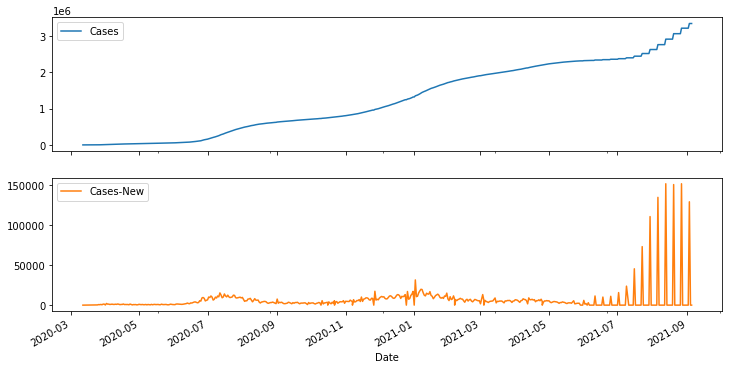
    


```python
import plotly
plotly.__version__
```


    '5.3.1'


```python
import missingno
missingno.matrix(FL)
```


    <AxesSubplot:>


    
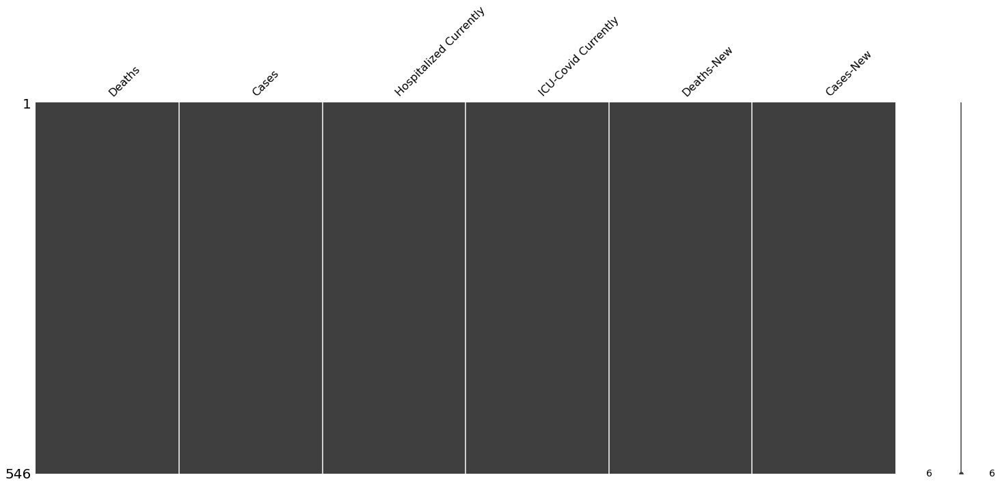
    


```python
# px.imshow(FL.isna(),template='plotly_dark',color_continuous_scale="Reds")
```


```python
plot_cols = FL.drop(columns=cumulative_cols).columns
plot_cols
```


    Index(['Deaths', 'Hospitalized Currently', 'ICU-Covid Currently',
           'Deaths-New'],
          dtype='object')


```python
pfig = px.line(FL,y=plot_cols,width=1000,title="FL Data")
pfig.add_vline(first_ts,line_width=3,line_dash="dash",name='Start')
pfig.show()
```


<div>                            <div id="8705aa33-440e-4a9d-8be9-03d0b12a5b7b" class="plotly-graph-div" style="height:525px; width:1000px;"></div>            <script type="text/javascript">                require(["plotly"], function(Plotly) {                    window.PLOTLYENV=window.PLOTLYENV || {};                                    if (document.getElementById("8705aa33-440e-4a9d-8be9-03d0b12a5b7b")) {                    Plotly.newPlot(                        "8705aa33-440e-4a9d-8be9-03d0b12a5b7b",                        [{"hovertemplate":"variable=Deaths<br>Date=%{x}<br>value=%{y}<extra></extra>","legendgroup":"Deaths","line":{"color":"#636efa","dash":"solid"},"marker":{"symbol":"circle"},"mode":"lines","name":"Deaths","showlegend":true,"type":"scattergl","x":["2020-03-12T00:00:00","2020-03-13T00:00:00","2020-03-14T00:00:00","2020-03-15T00:00:00","2020-03-16T00:00:00","2020-03-17T00:00:00","2020-03-18T00:00:00","2020-03-19T00:00:00","2020-03-20T00:00:00","2020-03-21T00:00:00","2020-03-22T00:00:00","2020-03-23T00:00:00","2020-03-24T00:00:00","2020-03-25T00:00:00","2020-03-26T00:00:00","2020-03-27T00:00:00","2020-03-28T00:00:00","2020-03-29T00:00:00","2020-03-30T00:00:00","2020-03-31T00:00:00","2020-04-01T00:00:00","2020-04-02T00:00:00","2020-04-03T00:00:00","2020-04-04T00:00:00","2020-04-05T00:00:00","2020-04-06T00:00:00","2020-04-07T00:00:00","2020-04-08T00:00:00","2020-04-09T00:00:00","2020-04-10T00:00:00","2020-04-11T00:00:00","2020-04-12T00:00:00","2020-04-13T00:00:00","2020-04-14T00:00:00","2020-04-15T00:00:00","2020-04-16T00:00:00","2020-04-17T00:00:00","2020-04-18T00:00:00","2020-04-19T00:00:00","2020-04-20T00:00:00","2020-04-21T00:00:00","2020-04-22T00:00:00","2020-04-23T00:00:00","2020-04-24T00:00:00","2020-04-25T00:00:00","2020-04-26T00:00:00","2020-04-27T00:00:00","2020-04-28T00:00:00","2020-04-29T00:00:00","2020-04-30T00:00:00","2020-05-01T00:00:00","2020-05-02T00:00:00","2020-05-03T00:00:00","2020-05-04T00:00:00","2020-05-05T00:00:00","2020-05-06T00:00:00","2020-05-07T00:00:00","2020-05-08T00:00:00","2020-05-09T00:00:00","2020-05-10T00:00:00","2020-05-11T00:00:00","2020-05-12T00:00:00","2020-05-13T00:00:00","2020-05-14T00:00:00","2020-05-15T00:00:00","2020-05-16T00:00:00","2020-05-17T00:00:00","2020-05-18T00:00:00","2020-05-19T00:00:00","2020-05-20T00:00:00","2020-05-21T00:00:00","2020-05-22T00:00:00","2020-05-23T00:00:00","2020-05-24T00:00:00","2020-05-25T00:00:00","2020-05-26T00:00:00","2020-05-27T00:00:00","2020-05-28T00:00:00","2020-05-29T00:00:00","2020-05-30T00:00:00","2020-05-31T00:00:00","2020-06-01T00:00:00","2020-06-02T00:00:00","2020-06-03T00:00:00","2020-06-04T00:00:00","2020-06-05T00:00:00","2020-06-06T00:00:00","2020-06-07T00:00:00","2020-06-08T00:00:00","2020-06-09T00:00:00","2020-06-10T00:00:00","2020-06-11T00:00:00","2020-06-12T00:00:00","2020-06-13T00:00:00","2020-06-14T00:00:00","2020-06-15T00:00:00","2020-06-16T00:00:00","2020-06-17T00:00:00","2020-06-18T00:00:00","2020-06-19T00:00:00","2020-06-20T00:00:00","2020-06-21T00:00:00","2020-06-22T00:00:00","2020-06-23T00:00:00","2020-06-24T00:00:00","2020-06-25T00:00:00","2020-06-26T00:00:00","2020-06-27T00:00:00","2020-06-28T00:00:00","2020-06-29T00:00:00","2020-06-30T00:00:00","2020-07-01T00:00:00","2020-07-02T00:00:00","2020-07-03T00:00:00","2020-07-04T00:00:00","2020-07-05T00:00:00","2020-07-06T00:00:00","2020-07-07T00:00:00","2020-07-08T00:00:00","2020-07-09T00:00:00","2020-07-10T00:00:00","2020-07-11T00:00:00","2020-07-12T00:00:00","2020-07-13T00:00:00","2020-07-14T00:00:00","2020-07-15T00:00:00","2020-07-16T00:00:00","2020-07-17T00:00:00","2020-07-18T00:00:00","2020-07-19T00:00:00","2020-07-20T00:00:00","2020-07-21T00:00:00","2020-07-22T00:00:00","2020-07-23T00:00:00","2020-07-24T00:00:00","2020-07-25T00:00:00","2020-07-26T00:00:00","2020-07-27T00:00:00","2020-07-28T00:00:00","2020-07-29T00:00:00","2020-07-30T00:00:00","2020-07-31T00:00:00","2020-08-01T00:00:00","2020-08-02T00:00:00","2020-08-03T00:00:00","2020-08-04T00:00:00","2020-08-05T00:00:00","2020-08-06T00:00:00","2020-08-07T00:00:00","2020-08-08T00:00:00","2020-08-09T00:00:00","2020-08-10T00:00:00","2020-08-11T00:00:00","2020-08-12T00:00:00","2020-08-13T00:00:00","2020-08-14T00:00:00","2020-08-15T00:00:00","2020-08-16T00:00:00","2020-08-17T00:00:00","2020-08-18T00:00:00","2020-08-19T00:00:00","2020-08-20T00:00:00","2020-08-21T00:00:00","2020-08-22T00:00:00","2020-08-23T00:00:00","2020-08-24T00:00:00","2020-08-25T00:00:00","2020-08-26T00:00:00","2020-08-27T00:00:00","2020-08-28T00:00:00","2020-08-29T00:00:00","2020-08-30T00:00:00","2020-08-31T00:00:00","2020-09-01T00:00:00","2020-09-02T00:00:00","2020-09-03T00:00:00","2020-09-04T00:00:00","2020-09-05T00:00:00","2020-09-06T00:00:00","2020-09-07T00:00:00","2020-09-08T00:00:00","2020-09-09T00:00:00","2020-09-10T00:00:00","2020-09-11T00:00:00","2020-09-12T00:00:00","2020-09-13T00:00:00","2020-09-14T00:00:00","2020-09-15T00:00:00","2020-09-16T00:00:00","2020-09-17T00:00:00","2020-09-18T00:00:00","2020-09-19T00:00:00","2020-09-20T00:00:00","2020-09-21T00:00:00","2020-09-22T00:00:00","2020-09-23T00:00:00","2020-09-24T00:00:00","2020-09-25T00:00:00","2020-09-26T00:00:00","2020-09-27T00:00:00","2020-09-28T00:00:00","2020-09-29T00:00:00","2020-09-30T00:00:00","2020-10-01T00:00:00","2020-10-02T00:00:00","2020-10-03T00:00:00","2020-10-04T00:00:00","2020-10-05T00:00:00","2020-10-06T00:00:00","2020-10-07T00:00:00","2020-10-08T00:00:00","2020-10-09T00:00:00","2020-10-10T00:00:00","2020-10-11T00:00:00","2020-10-12T00:00:00","2020-10-13T00:00:00","2020-10-14T00:00:00","2020-10-15T00:00:00","2020-10-16T00:00:00","2020-10-16T00:00:00","2020-10-17T00:00:00","2020-10-18T00:00:00","2020-10-19T00:00:00","2020-10-20T00:00:00","2020-10-21T00:00:00","2020-10-22T00:00:00","2020-10-22T00:00:00","2020-10-23T00:00:00","2020-10-24T00:00:00","2020-10-25T00:00:00","2020-10-26T00:00:00","2020-10-27T00:00:00","2020-10-28T00:00:00","2020-10-29T00:00:00","2020-10-30T00:00:00","2020-10-31T00:00:00","2020-11-01T00:00:00","2020-11-02T00:00:00","2020-11-03T00:00:00","2020-11-04T00:00:00","2020-11-05T00:00:00","2020-11-06T00:00:00","2020-11-07T00:00:00","2020-11-07T00:00:00","2020-11-08T00:00:00","2020-11-09T00:00:00","2020-11-10T00:00:00","2020-11-11T00:00:00","2020-11-12T00:00:00","2020-11-13T00:00:00","2020-11-14T00:00:00","2020-11-15T00:00:00","2020-11-16T00:00:00","2020-11-17T00:00:00","2020-11-18T00:00:00","2020-11-19T00:00:00","2020-11-20T00:00:00","2020-11-21T00:00:00","2020-11-22T00:00:00","2020-11-23T00:00:00","2020-11-24T00:00:00","2020-11-25T00:00:00","2020-11-26T00:00:00","2020-11-27T00:00:00","2020-11-28T00:00:00","2020-11-29T00:00:00","2020-11-30T00:00:00","2020-12-01T00:00:00","2020-12-02T00:00:00","2020-12-03T00:00:00","2020-12-04T00:00:00","2020-12-05T00:00:00","2020-12-06T00:00:00","2020-12-07T00:00:00","2020-12-08T00:00:00","2020-12-09T00:00:00","2020-12-10T00:00:00","2020-12-11T00:00:00","2020-12-12T00:00:00","2020-12-13T00:00:00","2020-12-14T00:00:00","2020-12-15T00:00:00","2020-12-16T00:00:00","2020-12-17T00:00:00","2020-12-18T00:00:00","2020-12-19T00:00:00","2020-12-20T00:00:00","2020-12-21T00:00:00","2020-12-22T00:00:00","2020-12-23T00:00:00","2020-12-24T00:00:00","2020-12-25T00:00:00","2020-12-26T00:00:00","2020-12-27T00:00:00","2020-12-28T00:00:00","2020-12-29T00:00:00","2020-12-30T00:00:00","2020-12-31T00:00:00","2021-01-01T00:00:00","2021-01-02T00:00:00","2021-01-03T00:00:00","2021-01-04T00:00:00","2021-01-05T00:00:00","2021-01-06T00:00:00","2021-01-07T00:00:00","2021-01-08T00:00:00","2021-01-09T00:00:00","2021-01-10T00:00:00","2021-01-11T00:00:00","2021-01-12T00:00:00","2021-01-13T00:00:00","2021-01-14T00:00:00","2021-01-15T00:00:00","2021-01-16T00:00:00","2021-01-17T00:00:00","2021-01-18T00:00:00","2021-01-19T00:00:00","2021-01-20T00:00:00","2021-01-21T00:00:00","2021-01-22T00:00:00","2021-01-23T00:00:00","2021-01-24T00:00:00","2021-01-25T00:00:00","2021-01-26T00:00:00","2021-01-27T00:00:00","2021-01-28T00:00:00","2021-01-29T00:00:00","2021-01-30T00:00:00","2021-01-31T00:00:00","2021-02-01T00:00:00","2021-02-02T00:00:00","2021-02-03T00:00:00","2021-02-04T00:00:00","2021-02-05T00:00:00","2021-02-06T00:00:00","2021-02-06T00:00:00","2021-02-07T00:00:00","2021-02-08T00:00:00","2021-02-09T00:00:00","2021-02-10T00:00:00","2021-02-11T00:00:00","2021-02-12T00:00:00","2021-02-13T00:00:00","2021-02-14T00:00:00","2021-02-15T00:00:00","2021-02-16T00:00:00","2021-02-17T00:00:00","2021-02-18T00:00:00","2021-02-19T00:00:00","2021-02-20T00:00:00","2021-02-21T00:00:00","2021-02-22T00:00:00","2021-02-23T00:00:00","2021-02-24T00:00:00","2021-02-25T00:00:00","2021-02-26T00:00:00","2021-02-27T00:00:00","2021-02-28T00:00:00","2021-03-01T00:00:00","2021-03-03T00:00:00","2021-03-04T00:00:00","2021-03-04T00:00:00","2021-03-05T00:00:00","2021-03-06T00:00:00","2021-03-07T00:00:00","2021-03-08T00:00:00","2021-03-09T00:00:00","2021-03-10T00:00:00","2021-03-11T00:00:00","2021-03-12T00:00:00","2021-03-14T00:00:00","2021-03-15T00:00:00","2021-03-16T00:00:00","2021-03-17T00:00:00","2021-03-18T00:00:00","2021-03-19T00:00:00","2021-03-20T00:00:00","2021-03-21T00:00:00","2021-03-22T00:00:00","2021-03-23T00:00:00","2021-03-24T00:00:00","2021-03-25T00:00:00","2021-03-26T00:00:00","2021-03-27T00:00:00","2021-03-28T00:00:00","2021-03-29T00:00:00","2021-03-30T00:00:00","2021-03-31T00:00:00","2021-04-01T00:00:00","2021-04-02T00:00:00","2021-04-03T00:00:00","2021-04-04T00:00:00","2021-04-05T00:00:00","2021-04-06T00:00:00","2021-04-07T00:00:00","2021-04-08T00:00:00","2021-04-09T00:00:00","2021-04-10T00:00:00","2021-04-11T00:00:00","2021-04-12T00:00:00","2021-04-13T00:00:00","2021-04-14T00:00:00","2021-04-15T00:00:00","2021-04-16T00:00:00","2021-04-17T00:00:00","2021-04-18T00:00:00","2021-04-19T00:00:00","2021-04-20T00:00:00","2021-04-21T00:00:00","2021-04-22T00:00:00","2021-04-23T00:00:00","2021-04-24T00:00:00","2021-04-25T00:00:00","2021-04-25T00:00:00","2021-04-26T00:00:00","2021-04-27T00:00:00","2021-04-28T00:00:00","2021-04-29T00:00:00","2021-04-30T00:00:00","2021-05-01T00:00:00","2021-05-02T00:00:00","2021-05-03T00:00:00","2021-05-04T00:00:00","2021-05-05T00:00:00","2021-05-06T00:00:00","2021-05-07T00:00:00","2021-05-08T00:00:00","2021-05-09T00:00:00","2021-05-10T00:00:00","2021-05-11T00:00:00","2021-05-12T00:00:00","2021-05-13T00:00:00","2021-05-14T00:00:00","2021-05-15T00:00:00","2021-05-16T00:00:00","2021-05-17T00:00:00","2021-05-18T00:00:00","2021-05-19T00:00:00","2021-05-20T00:00:00","2021-05-21T00:00:00","2021-05-23T00:00:00","2021-05-24T00:00:00","2021-05-25T00:00:00","2021-05-26T00:00:00","2021-05-27T00:00:00","2021-05-28T00:00:00","2021-05-29T00:00:00","2021-05-30T00:00:00","2021-05-31T00:00:00","2021-06-01T00:00:00","2021-06-02T00:00:00","2021-06-03T00:00:00","2021-06-04T00:00:00","2021-06-05T00:00:00","2021-06-06T00:00:00","2021-06-07T00:00:00","2021-06-08T00:00:00","2021-06-09T00:00:00","2021-06-10T00:00:00","2021-06-10T00:00:00","2021-06-11T00:00:00","2021-06-12T00:00:00","2021-06-13T00:00:00","2021-06-14T00:00:00","2021-06-15T00:00:00","2021-06-16T00:00:00","2021-06-17T00:00:00","2021-06-18T00:00:00","2021-06-19T00:00:00","2021-06-20T00:00:00","2021-06-21T00:00:00","2021-06-22T00:00:00","2021-06-23T00:00:00","2021-06-24T00:00:00","2021-06-25T00:00:00","2021-06-26T00:00:00","2021-06-27T00:00:00","2021-06-28T00:00:00","2021-06-29T00:00:00","2021-06-30T00:00:00","2021-07-01T00:00:00","2021-07-02T00:00:00","2021-07-03T00:00:00","2021-07-04T00:00:00","2021-07-05T00:00:00","2021-07-05T00:00:00","2021-07-06T00:00:00","2021-07-07T00:00:00","2021-07-08T00:00:00","2021-07-09T00:00:00","2021-07-11T00:00:00","2021-07-12T00:00:00","2021-07-13T00:00:00","2021-07-13T00:00:00","2021-07-14T00:00:00","2021-07-15T00:00:00","2021-07-16T00:00:00","2021-07-17T00:00:00","2021-07-18T00:00:00","2021-07-19T00:00:00","2021-07-20T00:00:00","2021-07-21T00:00:00","2021-07-22T00:00:00","2021-07-23T00:00:00","2021-07-24T00:00:00","2021-07-25T00:00:00","2021-07-26T00:00:00","2021-07-27T00:00:00","2021-07-29T00:00:00","2021-07-29T00:00:00","2021-07-30T00:00:00","2021-07-31T00:00:00","2021-08-01T00:00:00","2021-08-02T00:00:00","2021-08-03T00:00:00","2021-08-04T00:00:00","2021-08-05T00:00:00","2021-08-06T00:00:00","2021-08-07T00:00:00","2021-08-08T00:00:00","2021-08-09T00:00:00","2021-08-10T00:00:00","2021-08-11T00:00:00","2021-08-12T00:00:00","2021-08-13T00:00:00","2021-08-14T00:00:00","2021-08-15T00:00:00","2021-08-16T00:00:00","2021-08-17T00:00:00","2021-08-18T00:00:00","2021-08-19T00:00:00","2021-08-20T00:00:00","2021-08-21T00:00:00","2021-08-22T00:00:00","2021-08-23T00:00:00","2021-08-25T00:00:00","2021-08-26T00:00:00","2021-08-27T00:00:00","2021-08-28T00:00:00","2021-08-29T00:00:00","2021-08-30T00:00:00","2021-08-31T00:00:00","2021-09-02T00:00:00","2021-09-03T00:00:00","2021-09-04T00:00:00","2021-09-05T00:00:00"],"xaxis":"x","y":[2.0,2.0,2.0,3.0,3.0,5.0,7.0,9.0,11.0,13.0,13.0,18.0,18.0,23.0,29.0,35.0,54.0,56.0,63.0,85.0,87.0,164.0,170.0,195.0,221.0,236.0,283.0,309.0,354.0,390.0,438.0,461.0,499.0,571.0,596.0,668.0,725.0,748.0,774.0,822.0,867.0,893.0,987.0,1046.0,1055.0,1075.0,1088.0,1171.0,1218.0,1268.0,1314.0,1364.0,1379.0,1399.0,1471.0,1539.0,1600.0,1669.0,1715.0,1721.0,1735.0,1779.0,1827.0,1875.0,1917.0,1964.0,1973.0,1997.0,2052.0,2096.0,2144.0,2190.0,2233.0,2237.0,2252.0,2259.0,2319.0,2364.0,2413.0,2447.0,2451.0,2460.0,2530.0,2566.0,2607.0,2660.0,2688.0,2700.0,2712.0,2765.0,2801.0,2848.0,2877.0,2925.0,2931.0,2938.0,2993.0,3018.0,3061.0,3104.0,3144.0,3161.0,3173.0,3238.0,3281.0,3327.0,3366.0,3390.0,3419.0,3447.0,3505.0,3550.0,3617.0,3684.0,3702.0,3731.0,3778.0,3841.0,3889.0,4009.0,4102.0,4197.0,4242.0,4277.0,4409.0,4521.0,4677.0,4805.0,4895.0,4982.0,5072.0,5206.0,5345.0,5518.0,5653.0,5777.0,5854.0,5931.0,6117.0,6333.0,6586.0,6843.0,7022.0,7084.0,7157.0,7402.0,7627.0,7747.0,7927.0,8109.0,8186.0,8277.0,8553.0,8765.0,8913.0,9141.0,9345.0,9452.0,9539.0,9758.0,9932.0,10049.0,10168.0,10274.0,10325.0,10397.0,10580.0,10733.0,10868.0,10957.0,11105.0,11119.0,11187.0,11374.0,11501.0,11650.0,11750.0,11811.0,11849.0,11871.0,11915.0,12110.0,12326.0,12502.0,12600.0,12608.0,12642.0,12787.0,12939.0,13086.0,13225.0,13287.0,13296.0,13317.0,13416.0,13618.0,13795.0,13915.0,14022.0,14032.0,14037.0,14143.0,14317.0,14444.0,14554.0,14628.0,14671.0,14712.0,14767.0,14904.0,15068.0,15186.0,15186.0,15364.0,15412.0,15531.0,15595.0,15736.0,15830.0,15830.0,15917.0,15967.0,16021.0,16105.0,16210.0,16267.0,16267.0,16340.0,16417.0,16429.0,16449.0,16505.0,16571.0,16648.0,16720.0,16761.0,16789.0,16834.0,16890.0,16922.0,16961.0,17014.0,17100.0,17100.0,17121.0,17179.0,17248.0,17300.0,17372.0,17445.0,17489.0,17518.0,17559.0,17644.0,17731.0,17810.0,17889.0,17930.0,17991.0,18085.0,18157.0,18254.0,18254.0,18363.0,18442.0,18500.0,18597.0,18679.0,18776.0,18874.0,18994.0,19084.0,19177.0,19282.0,19378.0,19462.0,19591.0,19714.0,19785.0,19866.0,20003.0,20082.0,20204.0,20305.0,20401.0,20473.0,20568.0,20680.0,20754.0,20874.0,20995.0,20995.0,21135.0,21212.0,21308.0,21409.0,21546.0,21673.0,21673.0,21890.0,21987.0,22090.0,22188.0,22317.0,22481.0,22666.0,22804.0,22912.0,23071.0,23227.0,23396.0,23613.0,23799.0,24004.0,24137.0,24274.0,24436.0,24578.0,24739.0,25011.0,25164.0,25293.0,25446.0,25673.0,25833.0,26035.0,26254.0,26360.0,26479.0,26685.0,26822.0,27019.0,27247.0,27457.0,27599.0,27599.0,27696.0,27815.0,28048.0,28208.0,28382.0,28565.0,28683.0,28779.0,28934.0,29154.0,29311.0,29474.0,29692.0,29813.0,29906.0,30065.0,30213.0,30340.0,30478.0,30624.0,30734.0,30852.0,30999.0,31267.0,31387.0,31387.0,31522.0,31620.0,31683.0,31764.0,31889.0,31948.0,32040.0,32145.0,32255.0,32348.0,32449.0,32504.0,32598.0,32651.0,32713.0,32742.0,32779.0,32820.0,32850.0,32957.0,33116.0,33142.0,33178.0,33247.0,33338.0,33425.0,33494.0,33586.0,33652.0,33674.0,33710.0,33780.0,33822.0,33906.0,33968.0,34014.0,34021.0,34056.0,34120.0,34164.0,34238.0,34330.0,34404.0,34439.0,34471.0,34533.0,34616.0,34696.0,34759.0,34812.0,34848.0,34848.0,34912.0,34958.0,35030.0,35084.0,35161.0,35239.0,35268.0,35307.0,35399.0,35478.0,35549.0,35635.0,35700.0,35731.0,35783.0,35831.0,35882.0,35929.0,36000.0,36056.0,36075.0,36133.0,36227.0,36271.0,36347.0,36441.0,36474.0,36501.0,36581.0,36647.0,36733.0,36774.0,36774.0,36774.0,36774.0,36869.0,36924.0,36973.0,36985.0,36985.0,36985.0,36985.0,36985.0,36985.0,36985.0,36985.0,37265.0,37265.0,37265.0,37265.0,37265.0,37265.0,37265.0,37555.0,37555.0,37555.0,37555.0,37555.0,37555.0,37555.0,37772.0,37772.0,37772.0,37772.0,37772.0,37772.0,37772.0,37985.0,37985.0,37985.0,37985.0,37985.0,37985.0,37985.0,37985.0,38157.0,38157.0,38157.0,38157.0,38157.0,38157.0,38157.0,38388.0,38388.0,38388.0,38388.0,38388.0,38388.0,38388.0,38670.0,38670.0,38670.0,38670.0,38670.0,38670.0,38670.0,39079.0,39079.0,39079.0,39079.0,39079.0,39079.0,39079.0,39695.0,39695.0,39695.0,39695.0,39695.0,39695.0,39695.0,40766.0,40766.0,40766.0,40766.0,40766.0,40766.0,40766.0,42252.0,42252.0,42252.0,42252.0,42252.0,42252.0,43979.0,43979.0,43979.0,43979.0,43979.0,43979.0,46324.0,46324.0,46324.0],"yaxis":"y"},{"hovertemplate":"variable=Hospitalized Currently<br>Date=%{x}<br>value=%{y}<extra></extra>","legendgroup":"Hospitalized Currently","line":{"color":"#EF553B","dash":"solid"},"marker":{"symbol":"circle"},"mode":"lines","name":"Hospitalized Currently","showlegend":true,"type":"scattergl","x":["2020-03-12T00:00:00","2020-03-13T00:00:00","2020-03-14T00:00:00","2020-03-15T00:00:00","2020-03-16T00:00:00","2020-03-17T00:00:00","2020-03-18T00:00:00","2020-03-19T00:00:00","2020-03-20T00:00:00","2020-03-21T00:00:00","2020-03-22T00:00:00","2020-03-23T00:00:00","2020-03-24T00:00:00","2020-03-25T00:00:00","2020-03-26T00:00:00","2020-03-27T00:00:00","2020-03-28T00:00:00","2020-03-29T00:00:00","2020-03-30T00:00:00","2020-03-31T00:00:00","2020-04-01T00:00:00","2020-04-02T00:00:00","2020-04-03T00:00:00","2020-04-04T00:00:00","2020-04-05T00:00:00","2020-04-06T00:00:00","2020-04-07T00:00:00","2020-04-08T00:00:00","2020-04-09T00:00:00","2020-04-10T00:00:00","2020-04-11T00:00:00","2020-04-12T00:00:00","2020-04-13T00:00:00","2020-04-14T00:00:00","2020-04-15T00:00:00","2020-04-16T00:00:00","2020-04-17T00:00:00","2020-04-18T00:00:00","2020-04-19T00:00:00","2020-04-20T00:00:00","2020-04-21T00:00:00","2020-04-22T00:00:00","2020-04-23T00:00:00","2020-04-24T00:00:00","2020-04-25T00:00:00","2020-04-26T00:00:00","2020-04-27T00:00:00","2020-04-28T00:00:00","2020-04-29T00:00:00","2020-04-30T00:00:00","2020-05-01T00:00:00","2020-05-02T00:00:00","2020-05-03T00:00:00","2020-05-04T00:00:00","2020-05-05T00:00:00","2020-05-06T00:00:00","2020-05-07T00:00:00","2020-05-08T00:00:00","2020-05-09T00:00:00","2020-05-10T00:00:00","2020-05-11T00:00:00","2020-05-12T00:00:00","2020-05-13T00:00:00","2020-05-14T00:00:00","2020-05-15T00:00:00","2020-05-16T00:00:00","2020-05-17T00:00:00","2020-05-18T00:00:00","2020-05-19T00:00:00","2020-05-20T00:00:00","2020-05-21T00:00:00","2020-05-22T00:00:00","2020-05-23T00:00:00","2020-05-24T00:00:00","2020-05-25T00:00:00","2020-05-26T00:00:00","2020-05-27T00:00:00","2020-05-28T00:00:00","2020-05-29T00:00:00","2020-05-30T00:00:00","2020-05-31T00:00:00","2020-06-01T00:00:00","2020-06-02T00:00:00","2020-06-03T00:00:00","2020-06-04T00:00:00","2020-06-05T00:00:00","2020-06-06T00:00:00","2020-06-07T00:00:00","2020-06-08T00:00:00","2020-06-09T00:00:00","2020-06-10T00:00:00","2020-06-11T00:00:00","2020-06-12T00:00:00","2020-06-13T00:00:00","2020-06-14T00:00:00","2020-06-15T00:00:00","2020-06-16T00:00:00","2020-06-17T00:00:00","2020-06-18T00:00:00","2020-06-19T00:00:00","2020-06-20T00:00:00","2020-06-21T00:00:00","2020-06-22T00:00:00","2020-06-23T00:00:00","2020-06-24T00:00:00","2020-06-25T00:00:00","2020-06-26T00:00:00","2020-06-27T00:00:00","2020-06-28T00:00:00","2020-06-29T00:00:00","2020-06-30T00:00:00","2020-07-01T00:00:00","2020-07-02T00:00:00","2020-07-03T00:00:00","2020-07-04T00:00:00","2020-07-05T00:00:00","2020-07-06T00:00:00","2020-07-07T00:00:00","2020-07-08T00:00:00","2020-07-09T00:00:00","2020-07-10T00:00:00","2020-07-11T00:00:00","2020-07-12T00:00:00","2020-07-13T00:00:00","2020-07-14T00:00:00","2020-07-15T00:00:00","2020-07-16T00:00:00","2020-07-17T00:00:00","2020-07-18T00:00:00","2020-07-19T00:00:00","2020-07-20T00:00:00","2020-07-21T00:00:00","2020-07-22T00:00:00","2020-07-23T00:00:00","2020-07-24T00:00:00","2020-07-25T00:00:00","2020-07-26T00:00:00","2020-07-27T00:00:00","2020-07-28T00:00:00","2020-07-29T00:00:00","2020-07-30T00:00:00","2020-07-31T00:00:00","2020-08-01T00:00:00","2020-08-02T00:00:00","2020-08-03T00:00:00","2020-08-04T00:00:00","2020-08-05T00:00:00","2020-08-06T00:00:00","2020-08-07T00:00:00","2020-08-08T00:00:00","2020-08-09T00:00:00","2020-08-10T00:00:00","2020-08-11T00:00:00","2020-08-12T00:00:00","2020-08-13T00:00:00","2020-08-14T00:00:00","2020-08-15T00:00:00","2020-08-16T00:00:00","2020-08-17T00:00:00","2020-08-18T00:00:00","2020-08-19T00:00:00","2020-08-20T00:00:00","2020-08-21T00:00:00","2020-08-22T00:00:00","2020-08-23T00:00:00","2020-08-24T00:00:00","2020-08-25T00:00:00","2020-08-26T00:00:00","2020-08-27T00:00:00","2020-08-28T00:00:00","2020-08-29T00:00:00","2020-08-30T00:00:00","2020-08-31T00:00:00","2020-09-01T00:00:00","2020-09-02T00:00:00","2020-09-03T00:00:00","2020-09-04T00:00:00","2020-09-05T00:00:00","2020-09-06T00:00:00","2020-09-07T00:00:00","2020-09-08T00:00:00","2020-09-09T00:00:00","2020-09-10T00:00:00","2020-09-11T00:00:00","2020-09-12T00:00:00","2020-09-13T00:00:00","2020-09-14T00:00:00","2020-09-15T00:00:00","2020-09-16T00:00:00","2020-09-17T00:00:00","2020-09-18T00:00:00","2020-09-19T00:00:00","2020-09-20T00:00:00","2020-09-21T00:00:00","2020-09-22T00:00:00","2020-09-23T00:00:00","2020-09-24T00:00:00","2020-09-25T00:00:00","2020-09-26T00:00:00","2020-09-27T00:00:00","2020-09-28T00:00:00","2020-09-29T00:00:00","2020-09-30T00:00:00","2020-10-01T00:00:00","2020-10-02T00:00:00","2020-10-03T00:00:00","2020-10-04T00:00:00","2020-10-05T00:00:00","2020-10-06T00:00:00","2020-10-07T00:00:00","2020-10-08T00:00:00","2020-10-09T00:00:00","2020-10-10T00:00:00","2020-10-11T00:00:00","2020-10-12T00:00:00","2020-10-13T00:00:00","2020-10-14T00:00:00","2020-10-15T00:00:00","2020-10-16T00:00:00","2020-10-16T00:00:00","2020-10-17T00:00:00","2020-10-18T00:00:00","2020-10-19T00:00:00","2020-10-20T00:00:00","2020-10-21T00:00:00","2020-10-22T00:00:00","2020-10-22T00:00:00","2020-10-23T00:00:00","2020-10-24T00:00:00","2020-10-25T00:00:00","2020-10-26T00:00:00","2020-10-27T00:00:00","2020-10-28T00:00:00","2020-10-29T00:00:00","2020-10-30T00:00:00","2020-10-31T00:00:00","2020-11-01T00:00:00","2020-11-02T00:00:00","2020-11-03T00:00:00","2020-11-04T00:00:00","2020-11-05T00:00:00","2020-11-06T00:00:00","2020-11-07T00:00:00","2020-11-07T00:00:00","2020-11-08T00:00:00","2020-11-09T00:00:00","2020-11-10T00:00:00","2020-11-11T00:00:00","2020-11-12T00:00:00","2020-11-13T00:00:00","2020-11-14T00:00:00","2020-11-15T00:00:00","2020-11-16T00:00:00","2020-11-17T00:00:00","2020-11-18T00:00:00","2020-11-19T00:00:00","2020-11-20T00:00:00","2020-11-21T00:00:00","2020-11-22T00:00:00","2020-11-23T00:00:00","2020-11-24T00:00:00","2020-11-25T00:00:00","2020-11-26T00:00:00","2020-11-27T00:00:00","2020-11-28T00:00:00","2020-11-29T00:00:00","2020-11-30T00:00:00","2020-12-01T00:00:00","2020-12-02T00:00:00","2020-12-03T00:00:00","2020-12-04T00:00:00","2020-12-05T00:00:00","2020-12-06T00:00:00","2020-12-07T00:00:00","2020-12-08T00:00:00","2020-12-09T00:00:00","2020-12-10T00:00:00","2020-12-11T00:00:00","2020-12-12T00:00:00","2020-12-13T00:00:00","2020-12-14T00:00:00","2020-12-15T00:00:00","2020-12-16T00:00:00","2020-12-17T00:00:00","2020-12-18T00:00:00","2020-12-19T00:00:00","2020-12-20T00:00:00","2020-12-21T00:00:00","2020-12-22T00:00:00","2020-12-23T00:00:00","2020-12-24T00:00:00","2020-12-25T00:00:00","2020-12-26T00:00:00","2020-12-27T00:00:00","2020-12-28T00:00:00","2020-12-29T00:00:00","2020-12-30T00:00:00","2020-12-31T00:00:00","2021-01-01T00:00:00","2021-01-02T00:00:00","2021-01-03T00:00:00","2021-01-04T00:00:00","2021-01-05T00:00:00","2021-01-06T00:00:00","2021-01-07T00:00:00","2021-01-08T00:00:00","2021-01-09T00:00:00","2021-01-10T00:00:00","2021-01-11T00:00:00","2021-01-12T00:00:00","2021-01-13T00:00:00","2021-01-14T00:00:00","2021-01-15T00:00:00","2021-01-16T00:00:00","2021-01-17T00:00:00","2021-01-18T00:00:00","2021-01-19T00:00:00","2021-01-20T00:00:00","2021-01-21T00:00:00","2021-01-22T00:00:00","2021-01-23T00:00:00","2021-01-24T00:00:00","2021-01-25T00:00:00","2021-01-26T00:00:00","2021-01-27T00:00:00","2021-01-28T00:00:00","2021-01-29T00:00:00","2021-01-30T00:00:00","2021-01-31T00:00:00","2021-02-01T00:00:00","2021-02-02T00:00:00","2021-02-03T00:00:00","2021-02-04T00:00:00","2021-02-05T00:00:00","2021-02-06T00:00:00","2021-02-06T00:00:00","2021-02-07T00:00:00","2021-02-08T00:00:00","2021-02-09T00:00:00","2021-02-10T00:00:00","2021-02-11T00:00:00","2021-02-12T00:00:00","2021-02-13T00:00:00","2021-02-14T00:00:00","2021-02-15T00:00:00","2021-02-16T00:00:00","2021-02-17T00:00:00","2021-02-18T00:00:00","2021-02-19T00:00:00","2021-02-20T00:00:00","2021-02-21T00:00:00","2021-02-22T00:00:00","2021-02-23T00:00:00","2021-02-24T00:00:00","2021-02-25T00:00:00","2021-02-26T00:00:00","2021-02-27T00:00:00","2021-02-28T00:00:00","2021-03-01T00:00:00","2021-03-03T00:00:00","2021-03-04T00:00:00","2021-03-04T00:00:00","2021-03-05T00:00:00","2021-03-06T00:00:00","2021-03-07T00:00:00","2021-03-08T00:00:00","2021-03-09T00:00:00","2021-03-10T00:00:00","2021-03-11T00:00:00","2021-03-12T00:00:00","2021-03-14T00:00:00","2021-03-15T00:00:00","2021-03-16T00:00:00","2021-03-17T00:00:00","2021-03-18T00:00:00","2021-03-19T00:00:00","2021-03-20T00:00:00","2021-03-21T00:00:00","2021-03-22T00:00:00","2021-03-23T00:00:00","2021-03-24T00:00:00","2021-03-25T00:00:00","2021-03-26T00:00:00","2021-03-27T00:00:00","2021-03-28T00:00:00","2021-03-29T00:00:00","2021-03-30T00:00:00","2021-03-31T00:00:00","2021-04-01T00:00:00","2021-04-02T00:00:00","2021-04-03T00:00:00","2021-04-04T00:00:00","2021-04-05T00:00:00","2021-04-06T00:00:00","2021-04-07T00:00:00","2021-04-08T00:00:00","2021-04-09T00:00:00","2021-04-10T00:00:00","2021-04-11T00:00:00","2021-04-12T00:00:00","2021-04-13T00:00:00","2021-04-14T00:00:00","2021-04-15T00:00:00","2021-04-16T00:00:00","2021-04-17T00:00:00","2021-04-18T00:00:00","2021-04-19T00:00:00","2021-04-20T00:00:00","2021-04-21T00:00:00","2021-04-22T00:00:00","2021-04-23T00:00:00","2021-04-24T00:00:00","2021-04-25T00:00:00","2021-04-25T00:00:00","2021-04-26T00:00:00","2021-04-27T00:00:00","2021-04-28T00:00:00","2021-04-29T00:00:00","2021-04-30T00:00:00","2021-05-01T00:00:00","2021-05-02T00:00:00","2021-05-03T00:00:00","2021-05-04T00:00:00","2021-05-05T00:00:00","2021-05-06T00:00:00","2021-05-07T00:00:00","2021-05-08T00:00:00","2021-05-09T00:00:00","2021-05-10T00:00:00","2021-05-11T00:00:00","2021-05-12T00:00:00","2021-05-13T00:00:00","2021-05-14T00:00:00","2021-05-15T00:00:00","2021-05-16T00:00:00","2021-05-17T00:00:00","2021-05-18T00:00:00","2021-05-19T00:00:00","2021-05-20T00:00:00","2021-05-21T00:00:00","2021-05-23T00:00:00","2021-05-24T00:00:00","2021-05-25T00:00:00","2021-05-26T00:00:00","2021-05-27T00:00:00","2021-05-28T00:00:00","2021-05-29T00:00:00","2021-05-30T00:00:00","2021-05-31T00:00:00","2021-06-01T00:00:00","2021-06-02T00:00:00","2021-06-03T00:00:00","2021-06-04T00:00:00","2021-06-05T00:00:00","2021-06-06T00:00:00","2021-06-07T00:00:00","2021-06-08T00:00:00","2021-06-09T00:00:00","2021-06-10T00:00:00","2021-06-10T00:00:00","2021-06-11T00:00:00","2021-06-12T00:00:00","2021-06-13T00:00:00","2021-06-14T00:00:00","2021-06-15T00:00:00","2021-06-16T00:00:00","2021-06-17T00:00:00","2021-06-18T00:00:00","2021-06-19T00:00:00","2021-06-20T00:00:00","2021-06-21T00:00:00","2021-06-22T00:00:00","2021-06-23T00:00:00","2021-06-24T00:00:00","2021-06-25T00:00:00","2021-06-26T00:00:00","2021-06-27T00:00:00","2021-06-28T00:00:00","2021-06-29T00:00:00","2021-06-30T00:00:00","2021-07-01T00:00:00","2021-07-02T00:00:00","2021-07-03T00:00:00","2021-07-04T00:00:00","2021-07-05T00:00:00","2021-07-05T00:00:00","2021-07-06T00:00:00","2021-07-07T00:00:00","2021-07-08T00:00:00","2021-07-09T00:00:00","2021-07-11T00:00:00","2021-07-12T00:00:00","2021-07-13T00:00:00","2021-07-13T00:00:00","2021-07-14T00:00:00","2021-07-15T00:00:00","2021-07-16T00:00:00","2021-07-17T00:00:00","2021-07-18T00:00:00","2021-07-19T00:00:00","2021-07-20T00:00:00","2021-07-21T00:00:00","2021-07-22T00:00:00","2021-07-23T00:00:00","2021-07-24T00:00:00","2021-07-25T00:00:00","2021-07-26T00:00:00","2021-07-27T00:00:00","2021-07-29T00:00:00","2021-07-29T00:00:00","2021-07-30T00:00:00","2021-07-31T00:00:00","2021-08-01T00:00:00","2021-08-02T00:00:00","2021-08-03T00:00:00","2021-08-04T00:00:00","2021-08-05T00:00:00","2021-08-06T00:00:00","2021-08-07T00:00:00","2021-08-08T00:00:00","2021-08-09T00:00:00","2021-08-10T00:00:00","2021-08-11T00:00:00","2021-08-12T00:00:00","2021-08-13T00:00:00","2021-08-14T00:00:00","2021-08-15T00:00:00","2021-08-16T00:00:00","2021-08-17T00:00:00","2021-08-18T00:00:00","2021-08-19T00:00:00","2021-08-20T00:00:00","2021-08-21T00:00:00","2021-08-22T00:00:00","2021-08-23T00:00:00","2021-08-25T00:00:00","2021-08-26T00:00:00","2021-08-27T00:00:00","2021-08-28T00:00:00","2021-08-29T00:00:00","2021-08-30T00:00:00","2021-08-31T00:00:00","2021-09-02T00:00:00","2021-09-03T00:00:00","2021-09-04T00:00:00","2021-09-05T00:00:00"],"xaxis":"x","y":[0.0,0.0,0.0,0.0,0.0,0.0,0.0,0.0,0.0,0.0,0.0,0.0,0.0,0.0,0.0,0.0,0.0,0.0,0.0,0.0,0.0,0.0,0.0,0.0,0.0,0.0,0.0,0.0,0.0,0.0,0.0,0.0,0.0,0.0,0.0,0.0,0.0,0.0,0.0,0.0,0.0,0.0,0.0,0.0,0.0,0.0,0.0,0.0,0.0,0.0,0.0,0.0,0.0,0.0,0.0,0.0,0.0,0.0,0.0,0.0,0.0,0.0,0.0,0.0,0.0,0.0,0.0,0.0,0.0,0.0,0.0,0.0,0.0,0.0,0.0,0.0,0.0,0.0,0.0,0.0,0.0,0.0,0.0,0.0,0.0,0.0,0.0,0.0,0.0,0.0,0.0,0.0,0.0,0.0,0.0,0.0,0.0,0.0,0.0,0.0,0.0,0.0,0.0,0.0,0.0,0.0,0.0,0.0,0.0,0.0,0.0,0.0,0.0,0.0,0.0,0.0,0.0,0.0,0.0,0.0,0.0,0.0,0.0,0.0,0.0,4893.0,6670.0,7082.0,7332.0,4924.0,7831.0,8277.0,9264.0,10014.0,9862.0,10047.0,9900.0,9732.0,9534.0,9001.0,8832.0,8535.0,9039.0,8777.0,8609.0,8441.0,8154.0,7966.0,7750.0,7448.0,7374.0,7292.0,7257.0,7026.0,6808.0,6505.0,6265.0,6174.0,6115.0,6010.0,5809.0,5624.0,5428.0,5065.0,5060.0,5155.0,5043.0,4891.0,4705.0,4451.0,4272.0,4205.0,4180.0,4026.0,3903.0,3799.0,3689.0,3587.0,3517.0,3518.0,3460.0,3424.0,3250.0,3126.0,2976.0,2899.0,2878.0,2823.0,2705.0,2645.0,2663.0,2553.0,2559.0,2537.0,2566.0,2473.0,2394.0,2350.0,2275.0,2312.0,2323.0,2363.0,2298.0,2315.0,2272.0,2211.0,2238.0,2299.0,2358.0,2317.0,2335.0,2337.0,2307.0,2244.0,2404.0,2357.0,2314.0,2281.0,2233.0,2233.0,2153.0,2220.0,2259.0,2247.0,2286.0,2265.0,2265.0,2302.0,2366.0,2404.0,2459.0,2500.0,2529.0,2511.0,2546.0,2512.0,2600.0,2742.0,2684.0,2671.0,2706.0,2702.0,2769.0,2769.0,2880.0,3025.0,3132.0,3130.0,3176.0,3248.0,3276.0,3214.0,3380.0,3541.0,3519.0,3531.0,3579.0,3578.0,3699.0,3869.0,3965.0,3944.0,3889.0,3945.0,4083.0,4219.0,4341.0,4433.0,4418.0,4396.0,4506.0,4433.0,4397.0,4526.0,4606.0,4664.0,4641.0,4706.0,4669.0,4845.0,5022.0,5158.0,5256.0,5231.0,5295.0,5203.0,5375.0,5501.0,5688.0,5745.0,5720.0,5620.0,5771.0,5939.0,6171.0,6301.0,6401.0,6553.0,6591.0,6874.0,7083.0,7383.0,7468.0,7403.0,7421.0,7667.0,7644.0,7709.0,7809.0,7876.0,7826.0,7756.0,7654.0,7456.0,7597.0,7598.0,7526.0,7402.0,7170.0,7064.0,6960.0,6991.0,7010.0,6798.0,6882.0,6762.0,6523.0,6349.0,6320.0,6358.0,6128.0,5975.0,5753.0,5589.0,5471.0,5471.0,5469.0,5428.0,5420.0,5262.0,5097.0,4972.0,4791.0,4758.0,4749.0,4744.0,4624.0,4516.0,4451.0,4376.0,4365.0,4298.0,4245.0,4235.0,4077.0,3971.0,3815.0,3792.0,3760.0,3718.0,3633.0,3633.0,3540.0,3447.0,3367.0,3357.0,3356.0,3310.0,3262.0,3212.0,3057.0,3090.0,3085.0,3084.0,3057.0,3039.0,2937.0,2929.0,2932.0,2968.0,2931.0,2850.0,2935.0,2866.0,2903.0,2989.0,2982.0,2971.0,2919.0,2940.0,2919.0,2929.0,3011.0,3091.0,3094.0,3133.0,3144.0,3127.0,3203.0,3250.0,3325.0,3388.0,3384.0,3392.0,3354.0,3405.0,3488.0,3572.0,3582.0,3486.0,3489.0,3374.0,3382.0,3382.0,3493.0,3542.0,3495.0,3454.0,3386.0,3244.0,3288.0,3337.0,3342.0,3224.0,3076.0,3045.0,2850.0,2861.0,2893.0,2933.0,2924.0,2902.0,2840.0,2752.0,2688.0,2702.0,2614.0,2531.0,2480.0,2427.0,2308.0,2318.0,2314.0,2246.0,2224.0,2185.0,2078.0,2069.0,2046.0,2072.0,2000.0,1948.0,1864.0,1806.0,1795.0,1594.0,1775.0,1683.0,1640.0,1640.0,1583.0,1615.0,1612.0,1618.0,1626.0,1627.0,1610.0,1589.0,1545.0,1564.0,1589.0,1581.0,1625.0,1612.0,1616.0,1608.0,1644.0,1720.0,1776.0,1823.0,1857.0,1863.0,1880.0,1965.0,2056.0,2056.0,2197.0,2310.0,2426.0,2538.0,2849.0,3037.0,3234.0,3234.0,3464.0,3605.0,3849.0,4027.0,4349.0,4846.0,5135.0,5582.0,5983.0,6436.0,6700.0,7295.0,7846.0,8420.0,9272.0,9272.0,9799.0,10298.0,10850.0,11480.0,12025.0,12440.0,13024.0,13512.0,13625.0,14090.0,14791.0,14982.0,15181.0,15379.0,15632.0,15634.0,15985.0,16331.0,16650.0,16853.0,16667.0,16728.0,16596.0,16818.0,16918.0,16263.0,16044.0,15612.0,15212.0,15287.0,15235.0,14995.0,14267.0,13666.0,13329.0,13346.0],"yaxis":"y"},{"hovertemplate":"variable=ICU-Covid Currently<br>Date=%{x}<br>value=%{y}<extra></extra>","legendgroup":"ICU-Covid Currently","line":{"color":"#00cc96","dash":"solid"},"marker":{"symbol":"circle"},"mode":"lines","name":"ICU-Covid Currently","showlegend":true,"type":"scattergl","x":["2020-03-12T00:00:00","2020-03-13T00:00:00","2020-03-14T00:00:00","2020-03-15T00:00:00","2020-03-16T00:00:00","2020-03-17T00:00:00","2020-03-18T00:00:00","2020-03-19T00:00:00","2020-03-20T00:00:00","2020-03-21T00:00:00","2020-03-22T00:00:00","2020-03-23T00:00:00","2020-03-24T00:00:00","2020-03-25T00:00:00","2020-03-26T00:00:00","2020-03-27T00:00:00","2020-03-28T00:00:00","2020-03-29T00:00:00","2020-03-30T00:00:00","2020-03-31T00:00:00","2020-04-01T00:00:00","2020-04-02T00:00:00","2020-04-03T00:00:00","2020-04-04T00:00:00","2020-04-05T00:00:00","2020-04-06T00:00:00","2020-04-07T00:00:00","2020-04-08T00:00:00","2020-04-09T00:00:00","2020-04-10T00:00:00","2020-04-11T00:00:00","2020-04-12T00:00:00","2020-04-13T00:00:00","2020-04-14T00:00:00","2020-04-15T00:00:00","2020-04-16T00:00:00","2020-04-17T00:00:00","2020-04-18T00:00:00","2020-04-19T00:00:00","2020-04-20T00:00:00","2020-04-21T00:00:00","2020-04-22T00:00:00","2020-04-23T00:00:00","2020-04-24T00:00:00","2020-04-25T00:00:00","2020-04-26T00:00:00","2020-04-27T00:00:00","2020-04-28T00:00:00","2020-04-29T00:00:00","2020-04-30T00:00:00","2020-05-01T00:00:00","2020-05-02T00:00:00","2020-05-03T00:00:00","2020-05-04T00:00:00","2020-05-05T00:00:00","2020-05-06T00:00:00","2020-05-07T00:00:00","2020-05-08T00:00:00","2020-05-09T00:00:00","2020-05-10T00:00:00","2020-05-11T00:00:00","2020-05-12T00:00:00","2020-05-13T00:00:00","2020-05-14T00:00:00","2020-05-15T00:00:00","2020-05-16T00:00:00","2020-05-17T00:00:00","2020-05-18T00:00:00","2020-05-19T00:00:00","2020-05-20T00:00:00","2020-05-21T00:00:00","2020-05-22T00:00:00","2020-05-23T00:00:00","2020-05-24T00:00:00","2020-05-25T00:00:00","2020-05-26T00:00:00","2020-05-27T00:00:00","2020-05-28T00:00:00","2020-05-29T00:00:00","2020-05-30T00:00:00","2020-05-31T00:00:00","2020-06-01T00:00:00","2020-06-02T00:00:00","2020-06-03T00:00:00","2020-06-04T00:00:00","2020-06-05T00:00:00","2020-06-06T00:00:00","2020-06-07T00:00:00","2020-06-08T00:00:00","2020-06-09T00:00:00","2020-06-10T00:00:00","2020-06-11T00:00:00","2020-06-12T00:00:00","2020-06-13T00:00:00","2020-06-14T00:00:00","2020-06-15T00:00:00","2020-06-16T00:00:00","2020-06-17T00:00:00","2020-06-18T00:00:00","2020-06-19T00:00:00","2020-06-20T00:00:00","2020-06-21T00:00:00","2020-06-22T00:00:00","2020-06-23T00:00:00","2020-06-24T00:00:00","2020-06-25T00:00:00","2020-06-26T00:00:00","2020-06-27T00:00:00","2020-06-28T00:00:00","2020-06-29T00:00:00","2020-06-30T00:00:00","2020-07-01T00:00:00","2020-07-02T00:00:00","2020-07-03T00:00:00","2020-07-04T00:00:00","2020-07-05T00:00:00","2020-07-06T00:00:00","2020-07-07T00:00:00","2020-07-08T00:00:00","2020-07-09T00:00:00","2020-07-10T00:00:00","2020-07-11T00:00:00","2020-07-12T00:00:00","2020-07-13T00:00:00","2020-07-14T00:00:00","2020-07-15T00:00:00","2020-07-16T00:00:00","2020-07-17T00:00:00","2020-07-18T00:00:00","2020-07-19T00:00:00","2020-07-20T00:00:00","2020-07-21T00:00:00","2020-07-22T00:00:00","2020-07-23T00:00:00","2020-07-24T00:00:00","2020-07-25T00:00:00","2020-07-26T00:00:00","2020-07-27T00:00:00","2020-07-28T00:00:00","2020-07-29T00:00:00","2020-07-30T00:00:00","2020-07-31T00:00:00","2020-08-01T00:00:00","2020-08-02T00:00:00","2020-08-03T00:00:00","2020-08-04T00:00:00","2020-08-05T00:00:00","2020-08-06T00:00:00","2020-08-07T00:00:00","2020-08-08T00:00:00","2020-08-09T00:00:00","2020-08-10T00:00:00","2020-08-11T00:00:00","2020-08-12T00:00:00","2020-08-13T00:00:00","2020-08-14T00:00:00","2020-08-15T00:00:00","2020-08-16T00:00:00","2020-08-17T00:00:00","2020-08-18T00:00:00","2020-08-19T00:00:00","2020-08-20T00:00:00","2020-08-21T00:00:00","2020-08-22T00:00:00","2020-08-23T00:00:00","2020-08-24T00:00:00","2020-08-25T00:00:00","2020-08-26T00:00:00","2020-08-27T00:00:00","2020-08-28T00:00:00","2020-08-29T00:00:00","2020-08-30T00:00:00","2020-08-31T00:00:00","2020-09-01T00:00:00","2020-09-02T00:00:00","2020-09-03T00:00:00","2020-09-04T00:00:00","2020-09-05T00:00:00","2020-09-06T00:00:00","2020-09-07T00:00:00","2020-09-08T00:00:00","2020-09-09T00:00:00","2020-09-10T00:00:00","2020-09-11T00:00:00","2020-09-12T00:00:00","2020-09-13T00:00:00","2020-09-14T00:00:00","2020-09-15T00:00:00","2020-09-16T00:00:00","2020-09-17T00:00:00","2020-09-18T00:00:00","2020-09-19T00:00:00","2020-09-20T00:00:00","2020-09-21T00:00:00","2020-09-22T00:00:00","2020-09-23T00:00:00","2020-09-24T00:00:00","2020-09-25T00:00:00","2020-09-26T00:00:00","2020-09-27T00:00:00","2020-09-28T00:00:00","2020-09-29T00:00:00","2020-09-30T00:00:00","2020-10-01T00:00:00","2020-10-02T00:00:00","2020-10-03T00:00:00","2020-10-04T00:00:00","2020-10-05T00:00:00","2020-10-06T00:00:00","2020-10-07T00:00:00","2020-10-08T00:00:00","2020-10-09T00:00:00","2020-10-10T00:00:00","2020-10-11T00:00:00","2020-10-12T00:00:00","2020-10-13T00:00:00","2020-10-14T00:00:00","2020-10-15T00:00:00","2020-10-16T00:00:00","2020-10-16T00:00:00","2020-10-17T00:00:00","2020-10-18T00:00:00","2020-10-19T00:00:00","2020-10-20T00:00:00","2020-10-21T00:00:00","2020-10-22T00:00:00","2020-10-22T00:00:00","2020-10-23T00:00:00","2020-10-24T00:00:00","2020-10-25T00:00:00","2020-10-26T00:00:00","2020-10-27T00:00:00","2020-10-28T00:00:00","2020-10-29T00:00:00","2020-10-30T00:00:00","2020-10-31T00:00:00","2020-11-01T00:00:00","2020-11-02T00:00:00","2020-11-03T00:00:00","2020-11-04T00:00:00","2020-11-05T00:00:00","2020-11-06T00:00:00","2020-11-07T00:00:00","2020-11-07T00:00:00","2020-11-08T00:00:00","2020-11-09T00:00:00","2020-11-10T00:00:00","2020-11-11T00:00:00","2020-11-12T00:00:00","2020-11-13T00:00:00","2020-11-14T00:00:00","2020-11-15T00:00:00","2020-11-16T00:00:00","2020-11-17T00:00:00","2020-11-18T00:00:00","2020-11-19T00:00:00","2020-11-20T00:00:00","2020-11-21T00:00:00","2020-11-22T00:00:00","2020-11-23T00:00:00","2020-11-24T00:00:00","2020-11-25T00:00:00","2020-11-26T00:00:00","2020-11-27T00:00:00","2020-11-28T00:00:00","2020-11-29T00:00:00","2020-11-30T00:00:00","2020-12-01T00:00:00","2020-12-02T00:00:00","2020-12-03T00:00:00","2020-12-04T00:00:00","2020-12-05T00:00:00","2020-12-06T00:00:00","2020-12-07T00:00:00","2020-12-08T00:00:00","2020-12-09T00:00:00","2020-12-10T00:00:00","2020-12-11T00:00:00","2020-12-12T00:00:00","2020-12-13T00:00:00","2020-12-14T00:00:00","2020-12-15T00:00:00","2020-12-16T00:00:00","2020-12-17T00:00:00","2020-12-18T00:00:00","2020-12-19T00:00:00","2020-12-20T00:00:00","2020-12-21T00:00:00","2020-12-22T00:00:00","2020-12-23T00:00:00","2020-12-24T00:00:00","2020-12-25T00:00:00","2020-12-26T00:00:00","2020-12-27T00:00:00","2020-12-28T00:00:00","2020-12-29T00:00:00","2020-12-30T00:00:00","2020-12-31T00:00:00","2021-01-01T00:00:00","2021-01-02T00:00:00","2021-01-03T00:00:00","2021-01-04T00:00:00","2021-01-05T00:00:00","2021-01-06T00:00:00","2021-01-07T00:00:00","2021-01-08T00:00:00","2021-01-09T00:00:00","2021-01-10T00:00:00","2021-01-11T00:00:00","2021-01-12T00:00:00","2021-01-13T00:00:00","2021-01-14T00:00:00","2021-01-15T00:00:00","2021-01-16T00:00:00","2021-01-17T00:00:00","2021-01-18T00:00:00","2021-01-19T00:00:00","2021-01-20T00:00:00","2021-01-21T00:00:00","2021-01-22T00:00:00","2021-01-23T00:00:00","2021-01-24T00:00:00","2021-01-25T00:00:00","2021-01-26T00:00:00","2021-01-27T00:00:00","2021-01-28T00:00:00","2021-01-29T00:00:00","2021-01-30T00:00:00","2021-01-31T00:00:00","2021-02-01T00:00:00","2021-02-02T00:00:00","2021-02-03T00:00:00","2021-02-04T00:00:00","2021-02-05T00:00:00","2021-02-06T00:00:00","2021-02-06T00:00:00","2021-02-07T00:00:00","2021-02-08T00:00:00","2021-02-09T00:00:00","2021-02-10T00:00:00","2021-02-11T00:00:00","2021-02-12T00:00:00","2021-02-13T00:00:00","2021-02-14T00:00:00","2021-02-15T00:00:00","2021-02-16T00:00:00","2021-02-17T00:00:00","2021-02-18T00:00:00","2021-02-19T00:00:00","2021-02-20T00:00:00","2021-02-21T00:00:00","2021-02-22T00:00:00","2021-02-23T00:00:00","2021-02-24T00:00:00","2021-02-25T00:00:00","2021-02-26T00:00:00","2021-02-27T00:00:00","2021-02-28T00:00:00","2021-03-01T00:00:00","2021-03-03T00:00:00","2021-03-04T00:00:00","2021-03-04T00:00:00","2021-03-05T00:00:00","2021-03-06T00:00:00","2021-03-07T00:00:00","2021-03-08T00:00:00","2021-03-09T00:00:00","2021-03-10T00:00:00","2021-03-11T00:00:00","2021-03-12T00:00:00","2021-03-14T00:00:00","2021-03-15T00:00:00","2021-03-16T00:00:00","2021-03-17T00:00:00","2021-03-18T00:00:00","2021-03-19T00:00:00","2021-03-20T00:00:00","2021-03-21T00:00:00","2021-03-22T00:00:00","2021-03-23T00:00:00","2021-03-24T00:00:00","2021-03-25T00:00:00","2021-03-26T00:00:00","2021-03-27T00:00:00","2021-03-28T00:00:00","2021-03-29T00:00:00","2021-03-30T00:00:00","2021-03-31T00:00:00","2021-04-01T00:00:00","2021-04-02T00:00:00","2021-04-03T00:00:00","2021-04-04T00:00:00","2021-04-05T00:00:00","2021-04-06T00:00:00","2021-04-07T00:00:00","2021-04-08T00:00:00","2021-04-09T00:00:00","2021-04-10T00:00:00","2021-04-11T00:00:00","2021-04-12T00:00:00","2021-04-13T00:00:00","2021-04-14T00:00:00","2021-04-15T00:00:00","2021-04-16T00:00:00","2021-04-17T00:00:00","2021-04-18T00:00:00","2021-04-19T00:00:00","2021-04-20T00:00:00","2021-04-21T00:00:00","2021-04-22T00:00:00","2021-04-23T00:00:00","2021-04-24T00:00:00","2021-04-25T00:00:00","2021-04-25T00:00:00","2021-04-26T00:00:00","2021-04-27T00:00:00","2021-04-28T00:00:00","2021-04-29T00:00:00","2021-04-30T00:00:00","2021-05-01T00:00:00","2021-05-02T00:00:00","2021-05-03T00:00:00","2021-05-04T00:00:00","2021-05-05T00:00:00","2021-05-06T00:00:00","2021-05-07T00:00:00","2021-05-08T00:00:00","2021-05-09T00:00:00","2021-05-10T00:00:00","2021-05-11T00:00:00","2021-05-12T00:00:00","2021-05-13T00:00:00","2021-05-14T00:00:00","2021-05-15T00:00:00","2021-05-16T00:00:00","2021-05-17T00:00:00","2021-05-18T00:00:00","2021-05-19T00:00:00","2021-05-20T00:00:00","2021-05-21T00:00:00","2021-05-23T00:00:00","2021-05-24T00:00:00","2021-05-25T00:00:00","2021-05-26T00:00:00","2021-05-27T00:00:00","2021-05-28T00:00:00","2021-05-29T00:00:00","2021-05-30T00:00:00","2021-05-31T00:00:00","2021-06-01T00:00:00","2021-06-02T00:00:00","2021-06-03T00:00:00","2021-06-04T00:00:00","2021-06-05T00:00:00","2021-06-06T00:00:00","2021-06-07T00:00:00","2021-06-08T00:00:00","2021-06-09T00:00:00","2021-06-10T00:00:00","2021-06-10T00:00:00","2021-06-11T00:00:00","2021-06-12T00:00:00","2021-06-13T00:00:00","2021-06-14T00:00:00","2021-06-15T00:00:00","2021-06-16T00:00:00","2021-06-17T00:00:00","2021-06-18T00:00:00","2021-06-19T00:00:00","2021-06-20T00:00:00","2021-06-21T00:00:00","2021-06-22T00:00:00","2021-06-23T00:00:00","2021-06-24T00:00:00","2021-06-25T00:00:00","2021-06-26T00:00:00","2021-06-27T00:00:00","2021-06-28T00:00:00","2021-06-29T00:00:00","2021-06-30T00:00:00","2021-07-01T00:00:00","2021-07-02T00:00:00","2021-07-03T00:00:00","2021-07-04T00:00:00","2021-07-05T00:00:00","2021-07-05T00:00:00","2021-07-06T00:00:00","2021-07-07T00:00:00","2021-07-08T00:00:00","2021-07-09T00:00:00","2021-07-11T00:00:00","2021-07-12T00:00:00","2021-07-13T00:00:00","2021-07-13T00:00:00","2021-07-14T00:00:00","2021-07-15T00:00:00","2021-07-16T00:00:00","2021-07-17T00:00:00","2021-07-18T00:00:00","2021-07-19T00:00:00","2021-07-20T00:00:00","2021-07-21T00:00:00","2021-07-22T00:00:00","2021-07-23T00:00:00","2021-07-24T00:00:00","2021-07-25T00:00:00","2021-07-26T00:00:00","2021-07-27T00:00:00","2021-07-29T00:00:00","2021-07-29T00:00:00","2021-07-30T00:00:00","2021-07-31T00:00:00","2021-08-01T00:00:00","2021-08-02T00:00:00","2021-08-03T00:00:00","2021-08-04T00:00:00","2021-08-05T00:00:00","2021-08-06T00:00:00","2021-08-07T00:00:00","2021-08-08T00:00:00","2021-08-09T00:00:00","2021-08-10T00:00:00","2021-08-11T00:00:00","2021-08-12T00:00:00","2021-08-13T00:00:00","2021-08-14T00:00:00","2021-08-15T00:00:00","2021-08-16T00:00:00","2021-08-17T00:00:00","2021-08-18T00:00:00","2021-08-19T00:00:00","2021-08-20T00:00:00","2021-08-21T00:00:00","2021-08-22T00:00:00","2021-08-23T00:00:00","2021-08-25T00:00:00","2021-08-26T00:00:00","2021-08-27T00:00:00","2021-08-28T00:00:00","2021-08-29T00:00:00","2021-08-30T00:00:00","2021-08-31T00:00:00","2021-09-02T00:00:00","2021-09-03T00:00:00","2021-09-04T00:00:00","2021-09-05T00:00:00"],"xaxis":"x","y":[0.0,0.0,0.0,0.0,0.0,0.0,0.0,0.0,0.0,0.0,0.0,0.0,0.0,0.0,0.0,0.0,0.0,0.0,0.0,0.0,0.0,0.0,0.0,0.0,0.0,0.0,0.0,0.0,0.0,0.0,0.0,0.0,0.0,0.0,0.0,0.0,0.0,0.0,0.0,0.0,0.0,0.0,0.0,0.0,0.0,0.0,0.0,0.0,0.0,0.0,0.0,0.0,0.0,0.0,0.0,0.0,0.0,0.0,0.0,0.0,0.0,0.0,0.0,0.0,0.0,0.0,0.0,0.0,0.0,0.0,0.0,0.0,0.0,0.0,0.0,0.0,0.0,0.0,0.0,0.0,0.0,0.0,0.0,0.0,0.0,0.0,0.0,0.0,0.0,0.0,0.0,0.0,0.0,0.0,0.0,0.0,0.0,0.0,0.0,0.0,0.0,0.0,0.0,0.0,0.0,0.0,0.0,0.0,0.0,0.0,0.0,0.0,0.0,0.0,0.0,0.0,0.0,0.0,0.0,0.0,0.0,0.0,0.0,0.0,0.0,645.0,1001.0,1414.0,1479.0,704.0,1518.0,1830.0,2140.0,2405.0,2493.0,2375.0,2401.0,2460.0,2315.0,2248.0,2236.0,2169.0,2122.0,2115.0,2074.0,2154.0,2087.0,2011.0,1939.0,1894.0,1914.0,1858.0,1845.0,1830.0,1793.0,1736.0,1681.0,1681.0,1597.0,1557.0,1529.0,1457.0,1417.0,1340.0,1354.0,1317.0,1324.0,1267.0,1215.0,1169.0,1155.0,1118.0,1142.0,1053.0,1065.0,1006.0,995.0,967.0,951.0,949.0,926.0,952.0,908.0,881.0,857.0,854.0,868.0,869.0,777.0,757.0,789.0,771.0,748.0,741.0,734.0,714.0,660.0,650.0,662.0,672.0,656.0,664.0,656.0,653.0,662.0,672.0,678.0,666.0,664.0,681.0,667.0,618.0,618.0,625.0,627.0,619.0,597.0,602.0,600.0,600.0,610.0,619.0,608.0,613.0,618.0,605.0,605.0,618.0,608.0,623.0,660.0,714.0,668.0,697.0,699.0,695.0,658.0,679.0,684.0,683.0,656.0,670.0,697.0,697.0,723.0,749.0,812.0,782.0,773.0,830.0,814.0,865.0,855.0,875.0,878.0,885.0,882.0,895.0,1031.0,963.0,1071.0,924.0,947.0,953.0,945.0,958.0,1022.0,1013.0,985.0,985.0,987.0,961.0,976.0,1004.0,995.0,1036.0,1035.0,1030.0,1002.0,1035.0,1086.0,1082.0,1156.0,1148.0,1159.0,1141.0,1157.0,1170.0,1219.0,1235.0,1220.0,1225.0,1278.0,1314.0,1361.0,1380.0,1381.0,1360.0,1389.0,1404.0,1424.0,1470.0,1542.0,1497.0,1527.0,1525.0,1534.0,1597.0,1621.0,1650.0,1618.0,1600.0,1607.0,1577.0,1570.0,1583.0,1551.0,1508.0,1528.0,1505.0,1518.0,1491.0,1520.0,1487.0,1484.0,1444.0,1411.0,1391.0,1416.0,1411.0,1403.0,1347.0,1314.0,1266.0,1241.0,1241.0,1233.0,1224.0,1241.0,1211.0,1180.0,1176.0,1162.0,1117.0,1083.0,1095.0,1082.0,1042.0,1020.0,1031.0,1025.0,1018.0,1015.0,993.0,967.0,960.0,925.0,927.0,937.0,910.0,899.0,899.0,893.0,871.0,842.0,845.0,835.0,825.0,800.0,821.0,780.0,801.0,762.0,780.0,752.0,738.0,729.0,714.0,729.0,732.0,744.0,684.0,692.0,673.0,685.0,715.0,690.0,706.0,695.0,709.0,702.0,697.0,726.0,756.0,734.0,758.0,749.0,743.0,758.0,768.0,779.0,794.0,783.0,798.0,805.0,800.0,824.0,842.0,836.0,832.0,886.0,840.0,891.0,891.0,879.0,896.0,905.0,906.0,870.0,868.0,858.0,905.0,876.0,833.0,832.0,795.0,776.0,777.0,800.0,809.0,788.0,768.0,747.0,752.0,744.0,746.0,725.0,684.0,679.0,666.0,653.0,659.0,642.0,633.0,611.0,624.0,619.0,627.0,619.0,604.0,572.0,563.0,552.0,518.0,525.0,436.0,494.0,480.0,468.0,468.0,470.0,453.0,464.0,446.0,415.0,416.0,432.0,432.0,437.0,420.0,438.0,439.0,436.0,417.0,431.0,409.0,415.0,449.0,454.0,446.0,443.0,462.0,485.0,510.0,546.0,546.0,565.0,579.0,616.0,615.0,669.0,716.0,755.0,755.0,793.0,833.0,893.0,888.0,955.0,1070.0,1139.0,1240.0,1326.0,1428.0,1500.0,1603.0,1691.0,1753.0,1964.0,1964.0,2079.0,2168.0,2285.0,2410.0,2497.0,2580.0,2744.0,2806.0,2876.0,2941.0,3118.0,3133.0,3233.0,3252.0,3319.0,3393.0,3476.0,3563.0,3631.0,3600.0,3565.0,3568.0,3563.0,3588.0,3619.0,3659.0,3599.0,3550.0,3483.0,3538.0,3446.0,3375.0,3281.0,3230.0,3195.0,3185.0],"yaxis":"y"},{"hovertemplate":"variable=Deaths-New<br>Date=%{x}<br>value=%{y}<extra></extra>","legendgroup":"Deaths-New","line":{"color":"#ab63fa","dash":"solid"},"marker":{"symbol":"circle"},"mode":"lines","name":"Deaths-New","showlegend":true,"type":"scattergl","x":["2020-03-12T00:00:00","2020-03-13T00:00:00","2020-03-14T00:00:00","2020-03-15T00:00:00","2020-03-16T00:00:00","2020-03-17T00:00:00","2020-03-18T00:00:00","2020-03-19T00:00:00","2020-03-20T00:00:00","2020-03-21T00:00:00","2020-03-22T00:00:00","2020-03-23T00:00:00","2020-03-24T00:00:00","2020-03-25T00:00:00","2020-03-26T00:00:00","2020-03-27T00:00:00","2020-03-28T00:00:00","2020-03-29T00:00:00","2020-03-30T00:00:00","2020-03-31T00:00:00","2020-04-01T00:00:00","2020-04-02T00:00:00","2020-04-03T00:00:00","2020-04-04T00:00:00","2020-04-05T00:00:00","2020-04-06T00:00:00","2020-04-07T00:00:00","2020-04-08T00:00:00","2020-04-09T00:00:00","2020-04-10T00:00:00","2020-04-11T00:00:00","2020-04-12T00:00:00","2020-04-13T00:00:00","2020-04-14T00:00:00","2020-04-15T00:00:00","2020-04-16T00:00:00","2020-04-17T00:00:00","2020-04-18T00:00:00","2020-04-19T00:00:00","2020-04-20T00:00:00","2020-04-21T00:00:00","2020-04-22T00:00:00","2020-04-23T00:00:00","2020-04-24T00:00:00","2020-04-25T00:00:00","2020-04-26T00:00:00","2020-04-27T00:00:00","2020-04-28T00:00:00","2020-04-29T00:00:00","2020-04-30T00:00:00","2020-05-01T00:00:00","2020-05-02T00:00:00","2020-05-03T00:00:00","2020-05-04T00:00:00","2020-05-05T00:00:00","2020-05-06T00:00:00","2020-05-07T00:00:00","2020-05-08T00:00:00","2020-05-09T00:00:00","2020-05-10T00:00:00","2020-05-11T00:00:00","2020-05-12T00:00:00","2020-05-13T00:00:00","2020-05-14T00:00:00","2020-05-15T00:00:00","2020-05-16T00:00:00","2020-05-17T00:00:00","2020-05-18T00:00:00","2020-05-19T00:00:00","2020-05-20T00:00:00","2020-05-21T00:00:00","2020-05-22T00:00:00","2020-05-23T00:00:00","2020-05-24T00:00:00","2020-05-25T00:00:00","2020-05-26T00:00:00","2020-05-27T00:00:00","2020-05-28T00:00:00","2020-05-29T00:00:00","2020-05-30T00:00:00","2020-05-31T00:00:00","2020-06-01T00:00:00","2020-06-02T00:00:00","2020-06-03T00:00:00","2020-06-04T00:00:00","2020-06-05T00:00:00","2020-06-06T00:00:00","2020-06-07T00:00:00","2020-06-08T00:00:00","2020-06-09T00:00:00","2020-06-10T00:00:00","2020-06-11T00:00:00","2020-06-12T00:00:00","2020-06-13T00:00:00","2020-06-14T00:00:00","2020-06-15T00:00:00","2020-06-16T00:00:00","2020-06-17T00:00:00","2020-06-18T00:00:00","2020-06-19T00:00:00","2020-06-20T00:00:00","2020-06-21T00:00:00","2020-06-22T00:00:00","2020-06-23T00:00:00","2020-06-24T00:00:00","2020-06-25T00:00:00","2020-06-26T00:00:00","2020-06-27T00:00:00","2020-06-28T00:00:00","2020-06-29T00:00:00","2020-06-30T00:00:00","2020-07-01T00:00:00","2020-07-02T00:00:00","2020-07-03T00:00:00","2020-07-04T00:00:00","2020-07-05T00:00:00","2020-07-06T00:00:00","2020-07-07T00:00:00","2020-07-08T00:00:00","2020-07-09T00:00:00","2020-07-10T00:00:00","2020-07-11T00:00:00","2020-07-12T00:00:00","2020-07-13T00:00:00","2020-07-14T00:00:00","2020-07-15T00:00:00","2020-07-16T00:00:00","2020-07-17T00:00:00","2020-07-18T00:00:00","2020-07-19T00:00:00","2020-07-20T00:00:00","2020-07-21T00:00:00","2020-07-22T00:00:00","2020-07-23T00:00:00","2020-07-24T00:00:00","2020-07-25T00:00:00","2020-07-26T00:00:00","2020-07-27T00:00:00","2020-07-28T00:00:00","2020-07-29T00:00:00","2020-07-30T00:00:00","2020-07-31T00:00:00","2020-08-01T00:00:00","2020-08-02T00:00:00","2020-08-03T00:00:00","2020-08-04T00:00:00","2020-08-05T00:00:00","2020-08-06T00:00:00","2020-08-07T00:00:00","2020-08-08T00:00:00","2020-08-09T00:00:00","2020-08-10T00:00:00","2020-08-11T00:00:00","2020-08-12T00:00:00","2020-08-13T00:00:00","2020-08-14T00:00:00","2020-08-15T00:00:00","2020-08-16T00:00:00","2020-08-17T00:00:00","2020-08-18T00:00:00","2020-08-19T00:00:00","2020-08-20T00:00:00","2020-08-21T00:00:00","2020-08-22T00:00:00","2020-08-23T00:00:00","2020-08-24T00:00:00","2020-08-25T00:00:00","2020-08-26T00:00:00","2020-08-27T00:00:00","2020-08-28T00:00:00","2020-08-29T00:00:00","2020-08-30T00:00:00","2020-08-31T00:00:00","2020-09-01T00:00:00","2020-09-02T00:00:00","2020-09-03T00:00:00","2020-09-04T00:00:00","2020-09-05T00:00:00","2020-09-06T00:00:00","2020-09-07T00:00:00","2020-09-08T00:00:00","2020-09-09T00:00:00","2020-09-10T00:00:00","2020-09-11T00:00:00","2020-09-12T00:00:00","2020-09-13T00:00:00","2020-09-14T00:00:00","2020-09-15T00:00:00","2020-09-16T00:00:00","2020-09-17T00:00:00","2020-09-18T00:00:00","2020-09-19T00:00:00","2020-09-20T00:00:00","2020-09-21T00:00:00","2020-09-22T00:00:00","2020-09-23T00:00:00","2020-09-24T00:00:00","2020-09-25T00:00:00","2020-09-26T00:00:00","2020-09-27T00:00:00","2020-09-28T00:00:00","2020-09-29T00:00:00","2020-09-30T00:00:00","2020-10-01T00:00:00","2020-10-02T00:00:00","2020-10-03T00:00:00","2020-10-04T00:00:00","2020-10-05T00:00:00","2020-10-06T00:00:00","2020-10-07T00:00:00","2020-10-08T00:00:00","2020-10-09T00:00:00","2020-10-10T00:00:00","2020-10-11T00:00:00","2020-10-12T00:00:00","2020-10-13T00:00:00","2020-10-14T00:00:00","2020-10-15T00:00:00","2020-10-16T00:00:00","2020-10-16T00:00:00","2020-10-17T00:00:00","2020-10-18T00:00:00","2020-10-19T00:00:00","2020-10-20T00:00:00","2020-10-21T00:00:00","2020-10-22T00:00:00","2020-10-22T00:00:00","2020-10-23T00:00:00","2020-10-24T00:00:00","2020-10-25T00:00:00","2020-10-26T00:00:00","2020-10-27T00:00:00","2020-10-28T00:00:00","2020-10-29T00:00:00","2020-10-30T00:00:00","2020-10-31T00:00:00","2020-11-01T00:00:00","2020-11-02T00:00:00","2020-11-03T00:00:00","2020-11-04T00:00:00","2020-11-05T00:00:00","2020-11-06T00:00:00","2020-11-07T00:00:00","2020-11-07T00:00:00","2020-11-08T00:00:00","2020-11-09T00:00:00","2020-11-10T00:00:00","2020-11-11T00:00:00","2020-11-12T00:00:00","2020-11-13T00:00:00","2020-11-14T00:00:00","2020-11-15T00:00:00","2020-11-16T00:00:00","2020-11-17T00:00:00","2020-11-18T00:00:00","2020-11-19T00:00:00","2020-11-20T00:00:00","2020-11-21T00:00:00","2020-11-22T00:00:00","2020-11-23T00:00:00","2020-11-24T00:00:00","2020-11-25T00:00:00","2020-11-26T00:00:00","2020-11-27T00:00:00","2020-11-28T00:00:00","2020-11-29T00:00:00","2020-11-30T00:00:00","2020-12-01T00:00:00","2020-12-02T00:00:00","2020-12-03T00:00:00","2020-12-04T00:00:00","2020-12-05T00:00:00","2020-12-06T00:00:00","2020-12-07T00:00:00","2020-12-08T00:00:00","2020-12-09T00:00:00","2020-12-10T00:00:00","2020-12-11T00:00:00","2020-12-12T00:00:00","2020-12-13T00:00:00","2020-12-14T00:00:00","2020-12-15T00:00:00","2020-12-16T00:00:00","2020-12-17T00:00:00","2020-12-18T00:00:00","2020-12-19T00:00:00","2020-12-20T00:00:00","2020-12-21T00:00:00","2020-12-22T00:00:00","2020-12-23T00:00:00","2020-12-24T00:00:00","2020-12-25T00:00:00","2020-12-26T00:00:00","2020-12-27T00:00:00","2020-12-28T00:00:00","2020-12-29T00:00:00","2020-12-30T00:00:00","2020-12-31T00:00:00","2021-01-01T00:00:00","2021-01-02T00:00:00","2021-01-03T00:00:00","2021-01-04T00:00:00","2021-01-05T00:00:00","2021-01-06T00:00:00","2021-01-07T00:00:00","2021-01-08T00:00:00","2021-01-09T00:00:00","2021-01-10T00:00:00","2021-01-11T00:00:00","2021-01-12T00:00:00","2021-01-13T00:00:00","2021-01-14T00:00:00","2021-01-15T00:00:00","2021-01-16T00:00:00","2021-01-17T00:00:00","2021-01-18T00:00:00","2021-01-19T00:00:00","2021-01-20T00:00:00","2021-01-21T00:00:00","2021-01-22T00:00:00","2021-01-23T00:00:00","2021-01-24T00:00:00","2021-01-25T00:00:00","2021-01-26T00:00:00","2021-01-27T00:00:00","2021-01-28T00:00:00","2021-01-29T00:00:00","2021-01-30T00:00:00","2021-01-31T00:00:00","2021-02-01T00:00:00","2021-02-02T00:00:00","2021-02-03T00:00:00","2021-02-04T00:00:00","2021-02-05T00:00:00","2021-02-06T00:00:00","2021-02-06T00:00:00","2021-02-07T00:00:00","2021-02-08T00:00:00","2021-02-09T00:00:00","2021-02-10T00:00:00","2021-02-11T00:00:00","2021-02-12T00:00:00","2021-02-13T00:00:00","2021-02-14T00:00:00","2021-02-15T00:00:00","2021-02-16T00:00:00","2021-02-17T00:00:00","2021-02-18T00:00:00","2021-02-19T00:00:00","2021-02-20T00:00:00","2021-02-21T00:00:00","2021-02-22T00:00:00","2021-02-23T00:00:00","2021-02-24T00:00:00","2021-02-25T00:00:00","2021-02-26T00:00:00","2021-02-27T00:00:00","2021-02-28T00:00:00","2021-03-01T00:00:00","2021-03-03T00:00:00","2021-03-04T00:00:00","2021-03-04T00:00:00","2021-03-05T00:00:00","2021-03-06T00:00:00","2021-03-07T00:00:00","2021-03-08T00:00:00","2021-03-09T00:00:00","2021-03-10T00:00:00","2021-03-11T00:00:00","2021-03-12T00:00:00","2021-03-14T00:00:00","2021-03-15T00:00:00","2021-03-16T00:00:00","2021-03-17T00:00:00","2021-03-18T00:00:00","2021-03-19T00:00:00","2021-03-20T00:00:00","2021-03-21T00:00:00","2021-03-22T00:00:00","2021-03-23T00:00:00","2021-03-24T00:00:00","2021-03-25T00:00:00","2021-03-26T00:00:00","2021-03-27T00:00:00","2021-03-28T00:00:00","2021-03-29T00:00:00","2021-03-30T00:00:00","2021-03-31T00:00:00","2021-04-01T00:00:00","2021-04-02T00:00:00","2021-04-03T00:00:00","2021-04-04T00:00:00","2021-04-05T00:00:00","2021-04-06T00:00:00","2021-04-07T00:00:00","2021-04-08T00:00:00","2021-04-09T00:00:00","2021-04-10T00:00:00","2021-04-11T00:00:00","2021-04-12T00:00:00","2021-04-13T00:00:00","2021-04-14T00:00:00","2021-04-15T00:00:00","2021-04-16T00:00:00","2021-04-17T00:00:00","2021-04-18T00:00:00","2021-04-19T00:00:00","2021-04-20T00:00:00","2021-04-21T00:00:00","2021-04-22T00:00:00","2021-04-23T00:00:00","2021-04-24T00:00:00","2021-04-25T00:00:00","2021-04-25T00:00:00","2021-04-26T00:00:00","2021-04-27T00:00:00","2021-04-28T00:00:00","2021-04-29T00:00:00","2021-04-30T00:00:00","2021-05-01T00:00:00","2021-05-02T00:00:00","2021-05-03T00:00:00","2021-05-04T00:00:00","2021-05-05T00:00:00","2021-05-06T00:00:00","2021-05-07T00:00:00","2021-05-08T00:00:00","2021-05-09T00:00:00","2021-05-10T00:00:00","2021-05-11T00:00:00","2021-05-12T00:00:00","2021-05-13T00:00:00","2021-05-14T00:00:00","2021-05-15T00:00:00","2021-05-16T00:00:00","2021-05-17T00:00:00","2021-05-18T00:00:00","2021-05-19T00:00:00","2021-05-20T00:00:00","2021-05-21T00:00:00","2021-05-23T00:00:00","2021-05-24T00:00:00","2021-05-25T00:00:00","2021-05-26T00:00:00","2021-05-27T00:00:00","2021-05-28T00:00:00","2021-05-29T00:00:00","2021-05-30T00:00:00","2021-05-31T00:00:00","2021-06-01T00:00:00","2021-06-02T00:00:00","2021-06-03T00:00:00","2021-06-04T00:00:00","2021-06-05T00:00:00","2021-06-06T00:00:00","2021-06-07T00:00:00","2021-06-08T00:00:00","2021-06-09T00:00:00","2021-06-10T00:00:00","2021-06-10T00:00:00","2021-06-11T00:00:00","2021-06-12T00:00:00","2021-06-13T00:00:00","2021-06-14T00:00:00","2021-06-15T00:00:00","2021-06-16T00:00:00","2021-06-17T00:00:00","2021-06-18T00:00:00","2021-06-19T00:00:00","2021-06-20T00:00:00","2021-06-21T00:00:00","2021-06-22T00:00:00","2021-06-23T00:00:00","2021-06-24T00:00:00","2021-06-25T00:00:00","2021-06-26T00:00:00","2021-06-27T00:00:00","2021-06-28T00:00:00","2021-06-29T00:00:00","2021-06-30T00:00:00","2021-07-01T00:00:00","2021-07-02T00:00:00","2021-07-03T00:00:00","2021-07-04T00:00:00","2021-07-05T00:00:00","2021-07-05T00:00:00","2021-07-06T00:00:00","2021-07-07T00:00:00","2021-07-08T00:00:00","2021-07-09T00:00:00","2021-07-11T00:00:00","2021-07-12T00:00:00","2021-07-13T00:00:00","2021-07-13T00:00:00","2021-07-14T00:00:00","2021-07-15T00:00:00","2021-07-16T00:00:00","2021-07-17T00:00:00","2021-07-18T00:00:00","2021-07-19T00:00:00","2021-07-20T00:00:00","2021-07-21T00:00:00","2021-07-22T00:00:00","2021-07-23T00:00:00","2021-07-24T00:00:00","2021-07-25T00:00:00","2021-07-26T00:00:00","2021-07-27T00:00:00","2021-07-29T00:00:00","2021-07-29T00:00:00","2021-07-30T00:00:00","2021-07-31T00:00:00","2021-08-01T00:00:00","2021-08-02T00:00:00","2021-08-03T00:00:00","2021-08-04T00:00:00","2021-08-05T00:00:00","2021-08-06T00:00:00","2021-08-07T00:00:00","2021-08-08T00:00:00","2021-08-09T00:00:00","2021-08-10T00:00:00","2021-08-11T00:00:00","2021-08-12T00:00:00","2021-08-13T00:00:00","2021-08-14T00:00:00","2021-08-15T00:00:00","2021-08-16T00:00:00","2021-08-17T00:00:00","2021-08-18T00:00:00","2021-08-19T00:00:00","2021-08-20T00:00:00","2021-08-21T00:00:00","2021-08-22T00:00:00","2021-08-23T00:00:00","2021-08-25T00:00:00","2021-08-26T00:00:00","2021-08-27T00:00:00","2021-08-28T00:00:00","2021-08-29T00:00:00","2021-08-30T00:00:00","2021-08-31T00:00:00","2021-09-02T00:00:00","2021-09-03T00:00:00","2021-09-04T00:00:00","2021-09-05T00:00:00"],"xaxis":"x","y":[0.0,0.0,0.0,1.0,0.0,2.0,2.0,2.0,2.0,2.0,0.0,5.0,0.0,5.0,6.0,6.0,19.0,2.0,7.0,22.0,2.0,77.0,6.0,25.0,26.0,15.0,47.0,26.0,45.0,36.0,48.0,23.0,38.0,72.0,25.0,72.0,57.0,23.0,26.0,48.0,45.0,26.0,94.0,59.0,9.0,20.0,13.0,83.0,47.0,50.0,46.0,50.0,15.0,20.0,72.0,68.0,61.0,69.0,46.0,6.0,14.0,44.0,48.0,48.0,42.0,47.0,9.0,24.0,55.0,44.0,48.0,46.0,43.0,4.0,15.0,7.0,60.0,45.0,49.0,34.0,4.0,9.0,70.0,36.0,41.0,53.0,28.0,12.0,12.0,53.0,36.0,47.0,29.0,48.0,6.0,7.0,55.0,25.0,43.0,43.0,40.0,17.0,12.0,65.0,43.0,46.0,39.0,24.0,29.0,28.0,58.0,45.0,67.0,67.0,18.0,29.0,47.0,63.0,48.0,120.0,93.0,95.0,45.0,35.0,132.0,112.0,156.0,128.0,90.0,87.0,90.0,134.0,139.0,173.0,135.0,124.0,77.0,77.0,186.0,216.0,253.0,257.0,179.0,62.0,73.0,245.0,225.0,120.0,180.0,182.0,77.0,91.0,276.0,212.0,148.0,228.0,204.0,107.0,87.0,219.0,174.0,117.0,119.0,106.0,51.0,72.0,183.0,153.0,135.0,89.0,148.0,14.0,68.0,187.0,127.0,149.0,100.0,61.0,38.0,22.0,44.0,195.0,216.0,176.0,98.0,8.0,34.0,145.0,152.0,147.0,139.0,62.0,9.0,21.0,99.0,202.0,177.0,120.0,107.0,10.0,5.0,106.0,174.0,127.0,110.0,74.0,43.0,41.0,55.0,137.0,164.0,118.0,0.0,178.0,48.0,119.0,64.0,141.0,94.0,0.0,87.0,50.0,54.0,84.0,105.0,57.0,0.0,73.0,77.0,12.0,20.0,56.0,66.0,77.0,72.0,41.0,28.0,45.0,56.0,32.0,39.0,53.0,86.0,0.0,21.0,58.0,69.0,52.0,72.0,73.0,44.0,29.0,41.0,85.0,87.0,79.0,79.0,41.0,61.0,94.0,72.0,97.0,0.0,109.0,79.0,58.0,97.0,82.0,97.0,98.0,120.0,90.0,93.0,105.0,96.0,84.0,129.0,123.0,71.0,81.0,137.0,79.0,122.0,101.0,96.0,72.0,95.0,112.0,74.0,120.0,121.0,0.0,140.0,77.0,96.0,101.0,137.0,127.0,0.0,217.0,97.0,103.0,98.0,129.0,164.0,185.0,138.0,108.0,159.0,156.0,169.0,217.0,186.0,205.0,133.0,137.0,162.0,142.0,161.0,272.0,153.0,129.0,153.0,227.0,160.0,202.0,219.0,106.0,119.0,206.0,137.0,197.0,228.0,210.0,142.0,0.0,97.0,119.0,233.0,160.0,174.0,183.0,118.0,96.0,155.0,220.0,157.0,163.0,218.0,121.0,93.0,159.0,148.0,127.0,138.0,146.0,110.0,118.0,147.0,268.0,120.0,0.0,135.0,98.0,63.0,81.0,125.0,59.0,92.0,105.0,110.0,93.0,101.0,55.0,94.0,53.0,62.0,29.0,37.0,41.0,30.0,107.0,159.0,26.0,36.0,69.0,91.0,87.0,69.0,92.0,66.0,22.0,36.0,70.0,42.0,84.0,62.0,46.0,7.0,35.0,64.0,44.0,74.0,92.0,74.0,35.0,32.0,62.0,83.0,80.0,63.0,53.0,36.0,0.0,64.0,46.0,72.0,54.0,77.0,78.0,29.0,39.0,92.0,79.0,71.0,86.0,65.0,31.0,52.0,48.0,51.0,47.0,71.0,56.0,19.0,58.0,94.0,44.0,76.0,94.0,33.0,27.0,80.0,66.0,86.0,41.0,0.0,0.0,0.0,95.0,55.0,49.0,12.0,0.0,0.0,0.0,0.0,0.0,0.0,0.0,280.0,0.0,0.0,0.0,0.0,0.0,0.0,290.0,0.0,0.0,0.0,0.0,0.0,0.0,217.0,0.0,0.0,0.0,0.0,0.0,0.0,213.0,0.0,0.0,0.0,0.0,0.0,0.0,0.0,172.0,0.0,0.0,0.0,0.0,0.0,0.0,231.0,0.0,0.0,0.0,0.0,0.0,0.0,282.0,0.0,0.0,0.0,0.0,0.0,0.0,409.0,0.0,0.0,0.0,0.0,0.0,0.0,616.0,0.0,0.0,0.0,0.0,0.0,0.0,1071.0,0.0,0.0,0.0,0.0,0.0,0.0,1486.0,0.0,0.0,0.0,0.0,0.0,1727.0,0.0,0.0,0.0,0.0,0.0,2345.0,0.0,0.0],"yaxis":"y"}],                        {"legend":{"title":{"text":"variable"},"tracegroupgap":0},"shapes":[{"line":{"dash":"dash","width":3},"name":"Start","type":"line","x0":"2020-03-12T00:00:00","x1":"2020-03-12T00:00:00","xref":"x","y0":0,"y1":1,"yref":"y domain"}],"template":{"data":{"bar":[{"error_x":{"color":"#f2f5fa"},"error_y":{"color":"#f2f5fa"},"marker":{"line":{"color":"rgb(17,17,17)","width":0.5},"pattern":{"fillmode":"overlay","size":10,"solidity":0.2}},"type":"bar"}],"barpolar":[{"marker":{"line":{"color":"rgb(17,17,17)","width":0.5},"pattern":{"fillmode":"overlay","size":10,"solidity":0.2}},"type":"barpolar"}],"carpet":[{"aaxis":{"endlinecolor":"#A2B1C6","gridcolor":"#506784","linecolor":"#506784","minorgridcolor":"#506784","startlinecolor":"#A2B1C6"},"baxis":{"endlinecolor":"#A2B1C6","gridcolor":"#506784","linecolor":"#506784","minorgridcolor":"#506784","startlinecolor":"#A2B1C6"},"type":"carpet"}],"choropleth":[{"colorbar":{"outlinewidth":0,"ticks":""},"type":"choropleth"}],"contour":[{"colorbar":{"outlinewidth":0,"ticks":""},"colorscale":[[0.0,"#0d0887"],[0.1111111111111111,"#46039f"],[0.2222222222222222,"#7201a8"],[0.3333333333333333,"#9c179e"],[0.4444444444444444,"#bd3786"],[0.5555555555555556,"#d8576b"],[0.6666666666666666,"#ed7953"],[0.7777777777777778,"#fb9f3a"],[0.8888888888888888,"#fdca26"],[1.0,"#f0f921"]],"type":"contour"}],"contourcarpet":[{"colorbar":{"outlinewidth":0,"ticks":""},"type":"contourcarpet"}],"heatmap":[{"colorbar":{"outlinewidth":0,"ticks":""},"colorscale":[[0.0,"#0d0887"],[0.1111111111111111,"#46039f"],[0.2222222222222222,"#7201a8"],[0.3333333333333333,"#9c179e"],[0.4444444444444444,"#bd3786"],[0.5555555555555556,"#d8576b"],[0.6666666666666666,"#ed7953"],[0.7777777777777778,"#fb9f3a"],[0.8888888888888888,"#fdca26"],[1.0,"#f0f921"]],"type":"heatmap"}],"heatmapgl":[{"colorbar":{"outlinewidth":0,"ticks":""},"colorscale":[[0.0,"#0d0887"],[0.1111111111111111,"#46039f"],[0.2222222222222222,"#7201a8"],[0.3333333333333333,"#9c179e"],[0.4444444444444444,"#bd3786"],[0.5555555555555556,"#d8576b"],[0.6666666666666666,"#ed7953"],[0.7777777777777778,"#fb9f3a"],[0.8888888888888888,"#fdca26"],[1.0,"#f0f921"]],"type":"heatmapgl"}],"histogram":[{"marker":{"pattern":{"fillmode":"overlay","size":10,"solidity":0.2}},"type":"histogram"}],"histogram2d":[{"colorbar":{"outlinewidth":0,"ticks":""},"colorscale":[[0.0,"#0d0887"],[0.1111111111111111,"#46039f"],[0.2222222222222222,"#7201a8"],[0.3333333333333333,"#9c179e"],[0.4444444444444444,"#bd3786"],[0.5555555555555556,"#d8576b"],[0.6666666666666666,"#ed7953"],[0.7777777777777778,"#fb9f3a"],[0.8888888888888888,"#fdca26"],[1.0,"#f0f921"]],"type":"histogram2d"}],"histogram2dcontour":[{"colorbar":{"outlinewidth":0,"ticks":""},"colorscale":[[0.0,"#0d0887"],[0.1111111111111111,"#46039f"],[0.2222222222222222,"#7201a8"],[0.3333333333333333,"#9c179e"],[0.4444444444444444,"#bd3786"],[0.5555555555555556,"#d8576b"],[0.6666666666666666,"#ed7953"],[0.7777777777777778,"#fb9f3a"],[0.8888888888888888,"#fdca26"],[1.0,"#f0f921"]],"type":"histogram2dcontour"}],"mesh3d":[{"colorbar":{"outlinewidth":0,"ticks":""},"type":"mesh3d"}],"parcoords":[{"line":{"colorbar":{"outlinewidth":0,"ticks":""}},"type":"parcoords"}],"pie":[{"automargin":true,"type":"pie"}],"scatter":[{"marker":{"line":{"color":"#283442"}},"type":"scatter"}],"scatter3d":[{"line":{"colorbar":{"outlinewidth":0,"ticks":""}},"marker":{"colorbar":{"outlinewidth":0,"ticks":""}},"type":"scatter3d"}],"scattercarpet":[{"marker":{"colorbar":{"outlinewidth":0,"ticks":""}},"type":"scattercarpet"}],"scattergeo":[{"marker":{"colorbar":{"outlinewidth":0,"ticks":""}},"type":"scattergeo"}],"scattergl":[{"marker":{"line":{"color":"#283442"}},"type":"scattergl"}],"scattermapbox":[{"marker":{"colorbar":{"outlinewidth":0,"ticks":""}},"type":"scattermapbox"}],"scatterpolar":[{"marker":{"colorbar":{"outlinewidth":0,"ticks":""}},"type":"scatterpolar"}],"scatterpolargl":[{"marker":{"colorbar":{"outlinewidth":0,"ticks":""}},"type":"scatterpolargl"}],"scatterternary":[{"marker":{"colorbar":{"outlinewidth":0,"ticks":""}},"type":"scatterternary"}],"surface":[{"colorbar":{"outlinewidth":0,"ticks":""},"colorscale":[[0.0,"#0d0887"],[0.1111111111111111,"#46039f"],[0.2222222222222222,"#7201a8"],[0.3333333333333333,"#9c179e"],[0.4444444444444444,"#bd3786"],[0.5555555555555556,"#d8576b"],[0.6666666666666666,"#ed7953"],[0.7777777777777778,"#fb9f3a"],[0.8888888888888888,"#fdca26"],[1.0,"#f0f921"]],"type":"surface"}],"table":[{"cells":{"fill":{"color":"#506784"},"line":{"color":"rgb(17,17,17)"}},"header":{"fill":{"color":"#2a3f5f"},"line":{"color":"rgb(17,17,17)"}},"type":"table"}]},"layout":{"annotationdefaults":{"arrowcolor":"#f2f5fa","arrowhead":0,"arrowwidth":1},"autotypenumbers":"strict","coloraxis":{"colorbar":{"outlinewidth":0,"ticks":""}},"colorscale":{"diverging":[[0,"#8e0152"],[0.1,"#c51b7d"],[0.2,"#de77ae"],[0.3,"#f1b6da"],[0.4,"#fde0ef"],[0.5,"#f7f7f7"],[0.6,"#e6f5d0"],[0.7,"#b8e186"],[0.8,"#7fbc41"],[0.9,"#4d9221"],[1,"#276419"]],"sequential":[[0.0,"#0d0887"],[0.1111111111111111,"#46039f"],[0.2222222222222222,"#7201a8"],[0.3333333333333333,"#9c179e"],[0.4444444444444444,"#bd3786"],[0.5555555555555556,"#d8576b"],[0.6666666666666666,"#ed7953"],[0.7777777777777778,"#fb9f3a"],[0.8888888888888888,"#fdca26"],[1.0,"#f0f921"]],"sequentialminus":[[0.0,"#0d0887"],[0.1111111111111111,"#46039f"],[0.2222222222222222,"#7201a8"],[0.3333333333333333,"#9c179e"],[0.4444444444444444,"#bd3786"],[0.5555555555555556,"#d8576b"],[0.6666666666666666,"#ed7953"],[0.7777777777777778,"#fb9f3a"],[0.8888888888888888,"#fdca26"],[1.0,"#f0f921"]]},"colorway":["#636efa","#EF553B","#00cc96","#ab63fa","#FFA15A","#19d3f3","#FF6692","#B6E880","#FF97FF","#FECB52"],"font":{"color":"#f2f5fa"},"geo":{"bgcolor":"rgb(17,17,17)","lakecolor":"rgb(17,17,17)","landcolor":"rgb(17,17,17)","showlakes":true,"showland":true,"subunitcolor":"#506784"},"hoverlabel":{"align":"left"},"hovermode":"closest","mapbox":{"style":"dark"},"paper_bgcolor":"rgb(17,17,17)","plot_bgcolor":"rgb(17,17,17)","polar":{"angularaxis":{"gridcolor":"#506784","linecolor":"#506784","ticks":""},"bgcolor":"rgb(17,17,17)","radialaxis":{"gridcolor":"#506784","linecolor":"#506784","ticks":""}},"scene":{"xaxis":{"backgroundcolor":"rgb(17,17,17)","gridcolor":"#506784","gridwidth":2,"linecolor":"#506784","showbackground":true,"ticks":"","zerolinecolor":"#C8D4E3"},"yaxis":{"backgroundcolor":"rgb(17,17,17)","gridcolor":"#506784","gridwidth":2,"linecolor":"#506784","showbackground":true,"ticks":"","zerolinecolor":"#C8D4E3"},"zaxis":{"backgroundcolor":"rgb(17,17,17)","gridcolor":"#506784","gridwidth":2,"linecolor":"#506784","showbackground":true,"ticks":"","zerolinecolor":"#C8D4E3"}},"shapedefaults":{"line":{"color":"#f2f5fa"}},"sliderdefaults":{"bgcolor":"#C8D4E3","bordercolor":"rgb(17,17,17)","borderwidth":1,"tickwidth":0},"ternary":{"aaxis":{"gridcolor":"#506784","linecolor":"#506784","ticks":""},"baxis":{"gridcolor":"#506784","linecolor":"#506784","ticks":""},"bgcolor":"rgb(17,17,17)","caxis":{"gridcolor":"#506784","linecolor":"#506784","ticks":""}},"title":{"x":0.05},"updatemenudefaults":{"bgcolor":"#506784","borderwidth":0},"xaxis":{"automargin":true,"gridcolor":"#283442","linecolor":"#506784","ticks":"","title":{"standoff":15},"zerolinecolor":"#283442","zerolinewidth":2},"yaxis":{"automargin":true,"gridcolor":"#283442","linecolor":"#506784","ticks":"","title":{"standoff":15},"zerolinecolor":"#283442","zerolinewidth":2}}},"title":{"text":"FL Data"},"width":1000,"xaxis":{"anchor":"y","domain":[0.0,1.0],"title":{"text":"Date"}},"yaxis":{"anchor":"x","domain":[0.0,1.0],"title":{"text":"value"}}},                        {"responsive": true}                    ).then(function(){

var gd = document.getElementById('8705aa33-440e-4a9d-8be9-03d0b12a5b7b');
var x = new MutationObserver(function (mutations, observer) {{
        var display = window.getComputedStyle(gd).display;
        if (!display || display === 'none') {{
            console.log([gd, 'removed!']);
            Plotly.purge(gd);
            observer.disconnect();
        }}
}});

// Listen for the removal of the full notebook cells
var notebookContainer = gd.closest('#notebook-container');
if (notebookContainer) {{
    x.observe(notebookContainer, {childList: true});
}}

// Listen for the clearing of the current output cell
var outputEl = gd.closest('.output');
if (outputEl) {{
    x.observe(outputEl, {childList: true});
}}

                        })                };                });            </script>        </div>


```python
# raise Exception('end of 09/01/21, though below code is still good.')
```

# Time Series Modeling


```python
### FORECAST SPECIFIC FUNCTIONS
from statsmodels.tsa.statespace.sarimax import SARIMAX
import statsmodels.api as sms
import statsmodels.tsa.api as tsa
from pmdarima import auto_arima
```

## MD


```python
state = "MD"
df_state = STATES[state].loc['08-2020':].copy()
# df_state = df_state.interpolate('time')
# df_state['Deaths-New'] = df_state['Deaths'].diff()
# df_state['Cases-New'] = df_state['Cases'].diff()
df_state = df_state.resample('D').sum()

print(df_state.isna().sum())
df_state
```

    Deaths                    0
    Cases                     0
    Hospitalized Currently    0
    ICU-Covid Currently       0
    Deaths-New                0
    Cases-New                 0
    dtype: int64


<div>
<style scoped>
    .dataframe tbody tr th:only-of-type {
        vertical-align: middle;
    }

    .dataframe tbody tr th {
        vertical-align: top;
    }

    .dataframe thead th {
        text-align: right;
    }
</style>
<table border="1" class="dataframe">
  <thead>
    <tr style="text-align: right;">
      <th></th>
      <th>Deaths</th>
      <th>Cases</th>
      <th>Hospitalized Currently</th>
      <th>ICU-Covid Currently</th>
      <th>Deaths-New</th>
      <th>Cases-New</th>
    </tr>
    <tr>
      <th>Date</th>
      <th></th>
      <th></th>
      <th></th>
      <th></th>
      <th></th>
      <th></th>
    </tr>
  </thead>
  <tbody>
    <tr>
      <th>2020-08-01</th>
      <td>3506</td>
      <td>89365</td>
      <td>629.0</td>
      <td>171.0</td>
      <td>0.0</td>
      <td>0.0</td>
    </tr>
    <tr>
      <th>2020-08-02</th>
      <td>3515</td>
      <td>90274</td>
      <td>606.0</td>
      <td>180.0</td>
      <td>9.0</td>
      <td>909.0</td>
    </tr>
    <tr>
      <th>2020-08-03</th>
      <td>3523</td>
      <td>91144</td>
      <td>574.0</td>
      <td>176.0</td>
      <td>8.0</td>
      <td>870.0</td>
    </tr>
    <tr>
      <th>2020-08-04</th>
      <td>3530</td>
      <td>91854</td>
      <td>576.0</td>
      <td>191.0</td>
      <td>7.0</td>
      <td>710.0</td>
    </tr>
    <tr>
      <th>2020-08-05</th>
      <td>3536</td>
      <td>92426</td>
      <td>571.0</td>
      <td>186.0</td>
      <td>6.0</td>
      <td>572.0</td>
    </tr>
    <tr>
      <th>...</th>
      <td>...</td>
      <td>...</td>
      <td>...</td>
      <td>...</td>
      <td>...</td>
      <td>...</td>
    </tr>
    <tr>
      <th>2021-09-01</th>
      <td>10024</td>
      <td>498376</td>
      <td>759.0</td>
      <td>202.0</td>
      <td>10.0</td>
      <td>1374.0</td>
    </tr>
    <tr>
      <th>2021-09-02</th>
      <td>10040</td>
      <td>499648</td>
      <td>799.0</td>
      <td>212.0</td>
      <td>16.0</td>
      <td>1272.0</td>
    </tr>
    <tr>
      <th>2021-09-03</th>
      <td>10051</td>
      <td>501035</td>
      <td>813.0</td>
      <td>222.0</td>
      <td>11.0</td>
      <td>1387.0</td>
    </tr>
    <tr>
      <th>2021-09-04</th>
      <td>10061</td>
      <td>502229</td>
      <td>821.0</td>
      <td>225.0</td>
      <td>10.0</td>
      <td>1194.0</td>
    </tr>
    <tr>
      <th>2021-09-05</th>
      <td>10073</td>
      <td>503034</td>
      <td>813.0</td>
      <td>220.0</td>
      <td>12.0</td>
      <td>805.0</td>
    </tr>
  </tbody>
</table>
<p>401 rows × 6 columns</p>
</div>


```python
model_cols = ['Hospitalized Currently','ICU-Covid Currently',
              'Deaths-New','Cases-New'
             ]

## visualize
ax = df_state[model_cols].plot(subplots=True, figsize=(10,12))
plt.tight_layout();
```


    
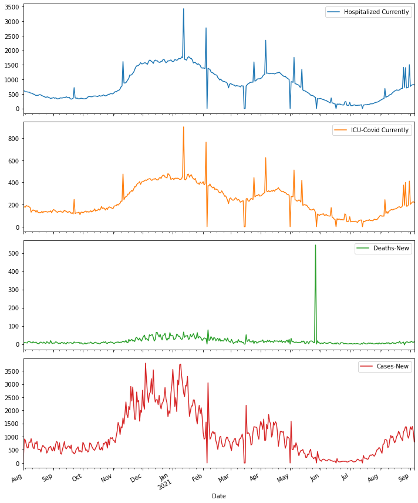
    


#### Data Quality Issues
- There are strong spikes +/- that are not likely to be real values.

### MD - Cases-New


```python
col = 'Cases-New'
ts = df_state[col].copy()
ax = ts.plot(title=f"{state}-{col}");
ax.set_ylabel(col)
```


    Text(0, 0.5, 'Cases-New')


    
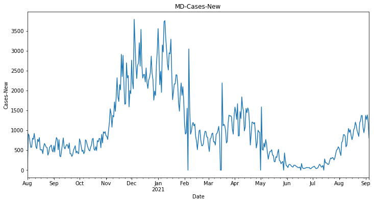
    


#### Train Test Split


```python
train,test = fn.modeling.train_test_split_ts(ts,split_index=-30)
```

    Using a cutoff index of -30, which = 08-07-2021


    
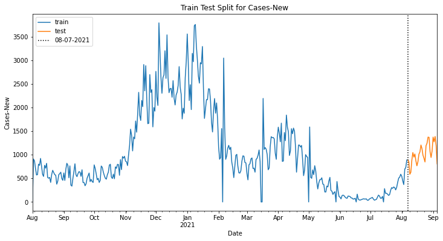
    


#### Checking Seasonal Decompose for Seasonality to Use


```python
## Get Decomposed time sereis
decomp = tsa.seasonal_decompose(train)
decomp.plot();
```


    
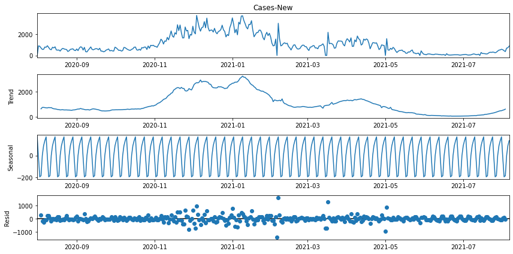
    


```python
ax = decomp.seasonal.loc['01-2021'].plot(figsize=(12,5))
ax.grid(which='both')
```


    
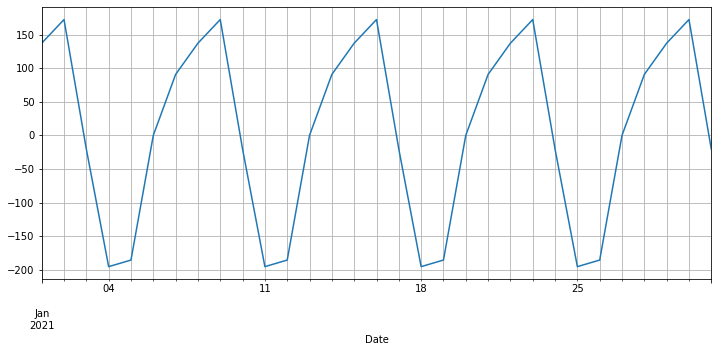
    


- Seasonality appears to be ~7 days


```python
fn.modeling.stationarity_check(train.diff(7).dropna(),window=4);
```


<div>
<style scoped>
    .dataframe tbody tr th:only-of-type {
        vertical-align: middle;
    }

    .dataframe tbody tr th {
        vertical-align: top;
    }

    .dataframe thead th {
        text-align: right;
    }
</style>
<table border="1" class="dataframe">
  <thead>
    <tr style="text-align: right;">
      <th></th>
      <th>Test Statistic</th>
      <th>#Lags Used</th>
      <th># of Observations Used</th>
      <th>p-value</th>
      <th>p&lt;.05</th>
      <th>Stationary?</th>
    </tr>
  </thead>
  <tbody>
    <tr>
      <th>AD Fuller Results</th>
      <td>-2.781987</td>
      <td>16</td>
      <td>347</td>
      <td>0.060893</td>
      <td>False</td>
      <td>False</td>
    </tr>
  </tbody>
</table>
</div>


    
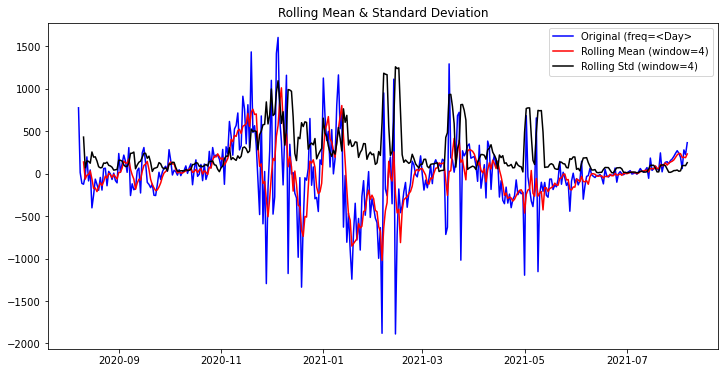
    


```python
fn.modeling.plot_acf_pacf(train,);
```


    
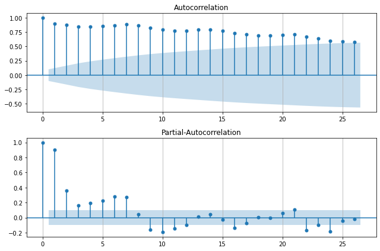
    


```python
fn.modeling.plot_acf_pacf(train,diff=7);
```


    
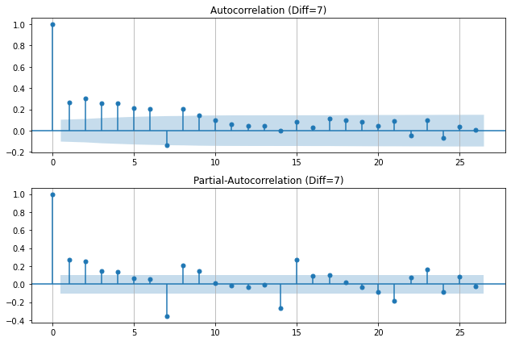
    


> Add notes about COVID insights from acf/pacf

#### GridSearch SARIMA Orders


```python
from pmdarima import auto_arima

auto_model = auto_arima(train,m=7,trace=True,D=1,
                        start_p=0, start_q=0,
                        start_P=0, start_Q=0)
auto_model.summary()
```

    Performing stepwise search to minimize aic
     ARIMA(0,0,0)(0,1,0)[7] intercept   : AIC=5431.532, Time=0.03 sec
     ARIMA(1,0,0)(1,1,0)[7] intercept   : AIC=5367.990, Time=0.56 sec
     ARIMA(0,0,1)(0,1,1)[7] intercept   : AIC=5393.775, Time=0.47 sec
     ARIMA(0,0,0)(0,1,0)[7]             : AIC=5429.533, Time=0.03 sec
     ARIMA(1,0,0)(0,1,0)[7] intercept   : AIC=5405.818, Time=0.13 sec
     ARIMA(1,0,0)(2,1,0)[7] intercept   : AIC=5343.886, Time=0.90 sec
     ARIMA(1,0,0)(2,1,1)[7] intercept   : AIC=5341.252, Time=2.21 sec
     ARIMA(1,0,0)(1,1,1)[7] intercept   : AIC=5341.259, Time=1.10 sec
     ARIMA(1,0,0)(2,1,2)[7] intercept   : AIC=5342.156, Time=2.33 sec
     ARIMA(1,0,0)(1,1,2)[7] intercept   : AIC=5342.308, Time=2.43 sec
     ARIMA(0,0,0)(2,1,1)[7] intercept   : AIC=5430.095, Time=1.15 sec
     ARIMA(2,0,0)(2,1,1)[7] intercept   : AIC=5262.783, Time=2.73 sec
     ARIMA(2,0,0)(1,1,1)[7] intercept   : AIC=5262.271, Time=1.34 sec
     ARIMA(2,0,0)(0,1,1)[7] intercept   : AIC=5260.272, Time=1.19 sec
     ARIMA(2,0,0)(0,1,0)[7] intercept   : AIC=5383.919, Time=0.08 sec
     ARIMA(2,0,0)(0,1,2)[7] intercept   : AIC=5262.271, Time=1.71 sec
     ARIMA(2,0,0)(1,1,0)[7] intercept   : AIC=5325.817, Time=0.50 sec
     ARIMA(2,0,0)(1,1,2)[7] intercept   : AIC=inf, Time=2.34 sec
     ARIMA(1,0,0)(0,1,1)[7] intercept   : AIC=5339.260, Time=0.76 sec
     ARIMA(3,0,0)(0,1,1)[7] intercept   : AIC=5243.424, Time=1.39 sec
     ARIMA(3,0,0)(0,1,0)[7] intercept   : AIC=5377.813, Time=0.11 sec
     ARIMA(3,0,0)(1,1,1)[7] intercept   : AIC=5245.291, Time=1.72 sec
     ARIMA(3,0,0)(0,1,2)[7] intercept   : AIC=5245.267, Time=2.40 sec
     ARIMA(3,0,0)(1,1,0)[7] intercept   : AIC=5315.720, Time=0.84 sec
     ARIMA(3,0,0)(1,1,2)[7] intercept   : AIC=inf, Time=2.98 sec
     ARIMA(4,0,0)(0,1,1)[7] intercept   : AIC=5235.692, Time=1.67 sec
     ARIMA(4,0,0)(0,1,0)[7] intercept   : AIC=5373.654, Time=0.16 sec
     ARIMA(4,0,0)(1,1,1)[7] intercept   : AIC=5237.167, Time=2.06 sec
     ARIMA(4,0,0)(0,1,2)[7] intercept   : AIC=5237.074, Time=2.31 sec
     ARIMA(4,0,0)(1,1,0)[7] intercept   : AIC=5311.404, Time=1.04 sec
     ARIMA(4,0,0)(1,1,2)[7] intercept   : AIC=inf, Time=4.08 sec
     ARIMA(5,0,0)(0,1,1)[7] intercept   : AIC=5233.150, Time=2.36 sec
     ARIMA(5,0,0)(0,1,0)[7] intercept   : AIC=5374.166, Time=0.25 sec
     ARIMA(5,0,0)(1,1,1)[7] intercept   : AIC=5234.704, Time=3.27 sec
     ARIMA(5,0,0)(0,1,2)[7] intercept   : AIC=5234.309, Time=3.41 sec
     ARIMA(5,0,0)(1,1,0)[7] intercept   : AIC=5311.634, Time=1.52 sec
     ARIMA(5,0,0)(1,1,2)[7] intercept   : AIC=5236.094, Time=4.80 sec
     ARIMA(5,0,1)(0,1,1)[7] intercept   : AIC=5252.516, Time=2.48 sec
     ARIMA(4,0,1)(0,1,1)[7] intercept   : AIC=5251.922, Time=2.13 sec
     ARIMA(5,0,0)(0,1,1)[7]             : AIC=5231.152, Time=1.29 sec
     ARIMA(5,0,0)(0,1,0)[7]             : AIC=5372.167, Time=0.12 sec
     ARIMA(5,0,0)(1,1,1)[7]             : AIC=5232.437, Time=2.12 sec
     ARIMA(5,0,0)(0,1,2)[7]             : AIC=5232.310, Time=2.31 sec
     ARIMA(5,0,0)(1,1,0)[7]             : AIC=5309.636, Time=0.73 sec
     ARIMA(5,0,0)(1,1,2)[7]             : AIC=5233.322, Time=3.32 sec
     ARIMA(4,0,0)(0,1,1)[7]             : AIC=5233.695, Time=1.10 sec
     ARIMA(5,0,1)(0,1,1)[7]             : AIC=5236.260, Time=1.99 sec
     ARIMA(4,0,1)(0,1,1)[7]             : AIC=5234.893, Time=1.66 sec
    
    Best model:  ARIMA(5,0,0)(0,1,1)[7]          
    Total fit time: 77.647 seconds


<table class="simpletable">
<caption>SARIMAX Results</caption>
<tr>
  <th>Dep. Variable:</th>                  <td>y</td>                <th>  No. Observations:  </th>    <td>371</td>   
</tr>
<tr>
  <th>Model:</th>           <td>SARIMAX(5, 0, 0)x(0, 1, [1], 7)</td> <th>  Log Likelihood     </th> <td>-2608.576</td>
</tr>
<tr>
  <th>Date:</th>                   <td>Mon, 06 Sep 2021</td>         <th>  AIC                </th> <td>5231.152</td> 
</tr>
<tr>
  <th>Time:</th>                       <td>19:01:38</td>             <th>  BIC                </th> <td>5258.432</td> 
</tr>
<tr>
  <th>Sample:</th>                         <td>0</td>                <th>  HQIC               </th> <td>5241.995</td> 
</tr>
<tr>
  <th></th>                             <td> - 371</td>              <th>                     </th>     <td> </td>    
</tr>
<tr>
  <th>Covariance Type:</th>               <td>opg</td>               <th>                     </th>     <td> </td>    
</tr>
</table>
<table class="simpletable">
<tr>
     <td></td>        <th>coef</th>     <th>std err</th>      <th>z</th>      <th>P>|z|</th>  <th>[0.025</th>    <th>0.975]</th>  
</tr>
<tr>
  <th>ar.L1</th>   <td>    0.2858</td> <td>    0.035</td> <td>    8.264</td> <td> 0.000</td> <td>    0.218</td> <td>    0.354</td>
</tr>
<tr>
  <th>ar.L2</th>   <td>    0.2780</td> <td>    0.044</td> <td>    6.250</td> <td> 0.000</td> <td>    0.191</td> <td>    0.365</td>
</tr>
<tr>
  <th>ar.L3</th>   <td>    0.1367</td> <td>    0.045</td> <td>    3.017</td> <td> 0.003</td> <td>    0.048</td> <td>    0.226</td>
</tr>
<tr>
  <th>ar.L4</th>   <td>    0.1286</td> <td>    0.066</td> <td>    1.938</td> <td> 0.053</td> <td>   -0.001</td> <td>    0.259</td>
</tr>
<tr>
  <th>ar.L5</th>   <td>    0.1127</td> <td>    0.057</td> <td>    1.975</td> <td> 0.048</td> <td>    0.001</td> <td>    0.224</td>
</tr>
<tr>
  <th>ma.S.L7</th> <td>   -0.8075</td> <td>    0.033</td> <td>  -24.412</td> <td> 0.000</td> <td>   -0.872</td> <td>   -0.743</td>
</tr>
<tr>
  <th>sigma2</th>  <td> 9.671e+04</td> <td> 3807.408</td> <td>   25.400</td> <td> 0.000</td> <td> 8.92e+04</td> <td> 1.04e+05</td>
</tr>
</table>
<table class="simpletable">
<tr>
  <th>Ljung-Box (L1) (Q):</th>     <td>0.03</td> <th>  Jarque-Bera (JB):  </th> <td>1290.18</td>
</tr>
<tr>
  <th>Prob(Q):</th>                <td>0.87</td> <th>  Prob(JB):          </th>  <td>0.00</td>  
</tr>
<tr>
  <th>Heteroskedasticity (H):</th> <td>0.49</td> <th>  Skew:              </th>  <td>0.90</td>  
</tr>
<tr>
  <th>Prob(H) (two-sided):</th>    <td>0.00</td> <th>  Kurtosis:          </th>  <td>12.05</td> 
</tr>
</table><br/><br/>Warnings:<br/>[1] Covariance matrix calculated using the outer product of gradients (complex-step).


#### Use Best Params for new SARIMAX


```python
model = tsa.SARIMAX(train, order=auto_model.order, 
                    seasonal_order =auto_model.seasonal_order,
                    enforce_invertibility=False,
                    enforce_stationarity=False, 
                    freq='D').fit()

fn.modeling.evaluate_model(model,train,test,last_n_lags=180)
```


<table class="simpletable">
<caption>SARIMAX Results</caption>
<tr>
  <th>Dep. Variable:</th>              <td>Cases-New</td>            <th>  No. Observations:  </th>    <td>371</td>   
</tr>
<tr>
  <th>Model:</th>           <td>SARIMAX(5, 0, 0)x(0, 1, [1], 7)</td> <th>  Log Likelihood     </th> <td>-2550.641</td>
</tr>
<tr>
  <th>Date:</th>                   <td>Mon, 06 Sep 2021</td>         <th>  AIC                </th> <td>5115.282</td> 
</tr>
<tr>
  <th>Time:</th>                       <td>19:01:39</td>             <th>  BIC                </th> <td>5142.407</td> 
</tr>
<tr>
  <th>Sample:</th>                    <td>08-01-2020</td>            <th>  HQIC               </th> <td>5126.072</td> 
</tr>
<tr>
  <th></th>                          <td>- 08-06-2021</td>           <th>                     </th>     <td> </td>    
</tr>
<tr>
  <th>Covariance Type:</th>               <td>opg</td>               <th>                     </th>     <td> </td>    
</tr>
</table>
<table class="simpletable">
<tr>
     <td></td>        <th>coef</th>     <th>std err</th>      <th>z</th>      <th>P>|z|</th>  <th>[0.025</th>    <th>0.975]</th>  
</tr>
<tr>
  <th>ar.L1</th>   <td>    0.2825</td> <td>    0.034</td> <td>    8.222</td> <td> 0.000</td> <td>    0.215</td> <td>    0.350</td>
</tr>
<tr>
  <th>ar.L2</th>   <td>    0.2808</td> <td>    0.044</td> <td>    6.342</td> <td> 0.000</td> <td>    0.194</td> <td>    0.368</td>
</tr>
<tr>
  <th>ar.L3</th>   <td>    0.1434</td> <td>    0.045</td> <td>    3.185</td> <td> 0.001</td> <td>    0.055</td> <td>    0.232</td>
</tr>
<tr>
  <th>ar.L4</th>   <td>    0.1308</td> <td>    0.066</td> <td>    1.988</td> <td> 0.047</td> <td>    0.002</td> <td>    0.260</td>
</tr>
<tr>
  <th>ar.L5</th>   <td>    0.1070</td> <td>    0.057</td> <td>    1.884</td> <td> 0.060</td> <td>   -0.004</td> <td>    0.218</td>
</tr>
<tr>
  <th>ma.S.L7</th> <td>   -0.8114</td> <td>    0.033</td> <td>  -24.300</td> <td> 0.000</td> <td>   -0.877</td> <td>   -0.746</td>
</tr>
<tr>
  <th>sigma2</th>  <td> 9.634e+04</td> <td> 3780.386</td> <td>   25.484</td> <td> 0.000</td> <td> 8.89e+04</td> <td> 1.04e+05</td>
</tr>
</table>
<table class="simpletable">
<tr>
  <th>Ljung-Box (L1) (Q):</th>     <td>0.00</td> <th>  Jarque-Bera (JB):  </th> <td>1303.82</td>
</tr>
<tr>
  <th>Prob(Q):</th>                <td>0.98</td> <th>  Prob(JB):          </th>  <td>0.00</td>  
</tr>
<tr>
  <th>Heteroskedasticity (H):</th> <td>0.45</td> <th>  Skew:              </th>  <td>0.92</td>  
</tr>
<tr>
  <th>Prob(H) (two-sided):</th>    <td>0.00</td> <th>  Kurtosis:          </th>  <td>12.19</td> 
</tr>
</table><br/><br/>Warnings:<br/>[1] Covariance matrix calculated using the outer product of gradients (complex-step).


    (<Figure size 720x288 with 1 Axes>,
     <AxesSubplot:title={'center':'Forecasted Cases-New'}, xlabel='Date'>)


    
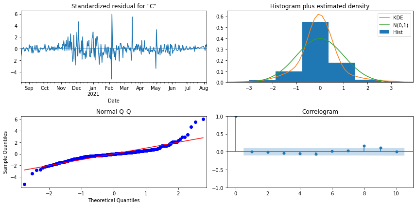
    


    
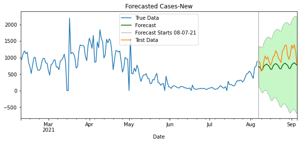
    


#### Next: if happy with forecast, train on entire ts


```python
model = tsa.SARIMAX(ts,order=auto_model.order, 
                    seasonal_order =auto_model.seasonal_order,
                    enforce_invertibility=False,
                    enforce_stationarity=False, 
                    freq='D').fit()
fn.modeling.diagnose_model(model)
fn.modeling.plot_forecast(model, ts)
```


<table class="simpletable">
<caption>SARIMAX Results</caption>
<tr>
  <th>Dep. Variable:</th>              <td>Cases-New</td>            <th>  No. Observations:  </th>    <td>401</td>   
</tr>
<tr>
  <th>Model:</th>           <td>SARIMAX(5, 0, 0)x(0, 1, [1], 7)</td> <th>  Log Likelihood     </th> <td>-2752.522</td>
</tr>
<tr>
  <th>Date:</th>                   <td>Mon, 06 Sep 2021</td>         <th>  AIC                </th> <td>5519.045</td> 
</tr>
<tr>
  <th>Time:</th>                       <td>19:01:42</td>             <th>  BIC                </th> <td>5546.736</td> 
</tr>
<tr>
  <th>Sample:</th>                    <td>08-01-2020</td>            <th>  HQIC               </th> <td>5530.026</td> 
</tr>
<tr>
  <th></th>                          <td>- 09-05-2021</td>           <th>                     </th>     <td> </td>    
</tr>
<tr>
  <th>Covariance Type:</th>               <td>opg</td>               <th>                     </th>     <td> </td>    
</tr>
</table>
<table class="simpletable">
<tr>
     <td></td>        <th>coef</th>     <th>std err</th>      <th>z</th>      <th>P>|z|</th>  <th>[0.025</th>    <th>0.975]</th>  
</tr>
<tr>
  <th>ar.L1</th>   <td>    0.2879</td> <td>    0.032</td> <td>    8.944</td> <td> 0.000</td> <td>    0.225</td> <td>    0.351</td>
</tr>
<tr>
  <th>ar.L2</th>   <td>    0.2792</td> <td>    0.042</td> <td>    6.727</td> <td> 0.000</td> <td>    0.198</td> <td>    0.361</td>
</tr>
<tr>
  <th>ar.L3</th>   <td>    0.1413</td> <td>    0.042</td> <td>    3.352</td> <td> 0.001</td> <td>    0.059</td> <td>    0.224</td>
</tr>
<tr>
  <th>ar.L4</th>   <td>    0.1287</td> <td>    0.062</td> <td>    2.083</td> <td> 0.037</td> <td>    0.008</td> <td>    0.250</td>
</tr>
<tr>
  <th>ar.L5</th>   <td>    0.1096</td> <td>    0.053</td> <td>    2.057</td> <td> 0.040</td> <td>    0.005</td> <td>    0.214</td>
</tr>
<tr>
  <th>ma.S.L7</th> <td>   -0.8106</td> <td>    0.031</td> <td>  -25.895</td> <td> 0.000</td> <td>   -0.872</td> <td>   -0.749</td>
</tr>
<tr>
  <th>sigma2</th>  <td> 9.013e+04</td> <td> 3300.246</td> <td>   27.310</td> <td> 0.000</td> <td> 8.37e+04</td> <td> 9.66e+04</td>
</tr>
</table>
<table class="simpletable">
<tr>
  <th>Ljung-Box (L1) (Q):</th>     <td>0.00</td> <th>  Jarque-Bera (JB):  </th> <td>1639.01</td>
</tr>
<tr>
  <th>Prob(Q):</th>                <td>0.99</td> <th>  Prob(JB):          </th>  <td>0.00</td>  
</tr>
<tr>
  <th>Heteroskedasticity (H):</th> <td>0.43</td> <th>  Skew:              </th>  <td>0.93</td>  
</tr>
<tr>
  <th>Prob(H) (two-sided):</th>    <td>0.00</td> <th>  Kurtosis:          </th>  <td>12.92</td> 
</tr>
</table><br/><br/>Warnings:<br/>[1] Covariance matrix calculated using the outer product of gradients (complex-step).


    (<Figure size 720x288 with 1 Axes>,
     <AxesSubplot:title={'center':'Forecasted Cases-New'}, xlabel='Date'>)


    
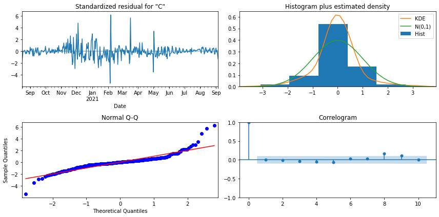
    


    
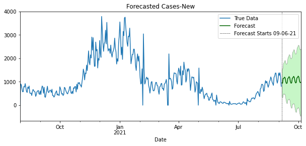
    


### MD - Hospitalized Currently


```python
# df_state['Hospitalized Currently']
```


```python
col = 'Hospitalized Currently'
ts = df_state[col].copy()
ax = ts.plot(title=f"{state}-{col}");
ax.set_ylabel(col)
```


    Text(0, 0.5, 'Hospitalized Currently')


    
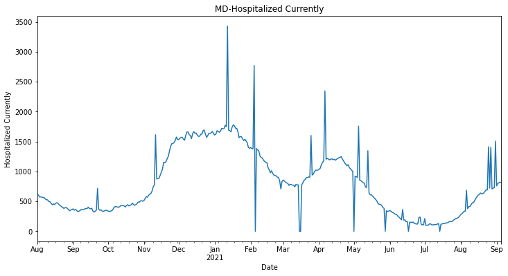
    


#### Train Test Split


```python
train,test = fn.modeling.train_test_split_ts(ts,split_index=-30)
```

    Using a cutoff index of -30, which = 08-07-2021


    
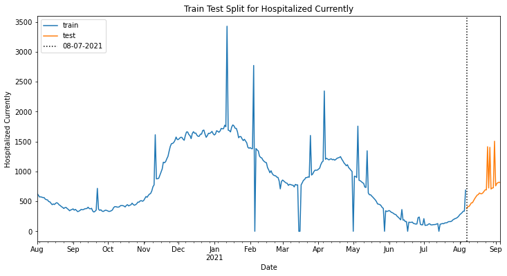
    


#### Checking Seasonal Decompose for Seasonality to Use


```python
## Get Decomposed time sereis
decomp = tsa.seasonal_decompose(train)
decomp.plot();
```


    
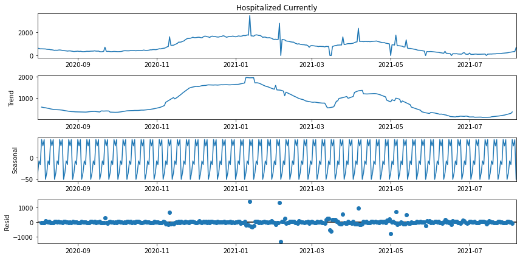
    


```python
ax = decomp.seasonal.loc['01-2021'].plot()
ax.grid(which='both')
```


    
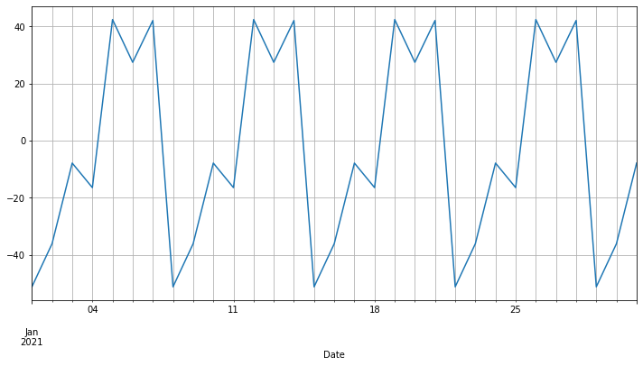
    


- Seasonality appears to be ~7 days


```python
fn.modeling.stationarity_check(train.diff(7).dropna(),window=4);
```


<div>
<style scoped>
    .dataframe tbody tr th:only-of-type {
        vertical-align: middle;
    }

    .dataframe tbody tr th {
        vertical-align: top;
    }

    .dataframe thead th {
        text-align: right;
    }
</style>
<table border="1" class="dataframe">
  <thead>
    <tr style="text-align: right;">
      <th></th>
      <th>Test Statistic</th>
      <th>#Lags Used</th>
      <th># of Observations Used</th>
      <th>p-value</th>
      <th>p&lt;.05</th>
      <th>Stationary?</th>
    </tr>
  </thead>
  <tbody>
    <tr>
      <th>AD Fuller Results</th>
      <td>-2.407928</td>
      <td>16</td>
      <td>347</td>
      <td>0.139511</td>
      <td>False</td>
      <td>False</td>
    </tr>
  </tbody>
</table>
</div>


    
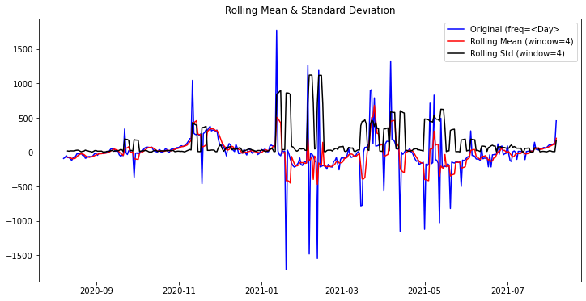
    


```python
fn.modeling.plot_acf_pacf(train,);
```


    
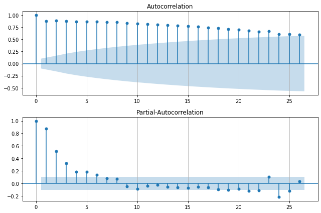
    


```python
fn.modeling.plot_acf_pacf(train,diff=7);
```


    
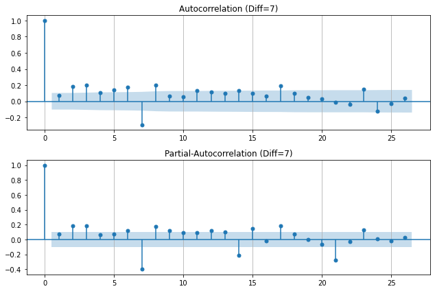
    


> Add notes about COVID insights from acf/pacf

#### GridSearch SARIMA Orders


```python
from pmdarima import auto_arima

auto_model = auto_arima(train,m=7,trace=True,D=1,
                        start_p=0, start_q=0,
                        start_P=0, start_Q=0)
auto_model.summary()
```

    Performing stepwise search to minimize aic
     ARIMA(0,0,0)(0,1,0)[7] intercept   : AIC=5176.764, Time=0.02 sec
     ARIMA(1,0,0)(1,1,0)[7] intercept   : AIC=5130.598, Time=0.44 sec
     ARIMA(0,0,1)(0,1,1)[7] intercept   : AIC=5141.576, Time=0.39 sec
     ARIMA(0,0,0)(0,1,0)[7]             : AIC=5174.844, Time=0.02 sec
     ARIMA(1,0,0)(0,1,0)[7] intercept   : AIC=5176.957, Time=0.05 sec
     ARIMA(1,0,0)(2,1,0)[7] intercept   : AIC=5129.365, Time=0.80 sec
     ARIMA(1,0,0)(2,1,1)[7] intercept   : AIC=5131.156, Time=2.36 sec
     ARIMA(1,0,0)(1,1,1)[7] intercept   : AIC=5129.076, Time=0.67 sec
     ARIMA(1,0,0)(0,1,1)[7] intercept   : AIC=5129.095, Time=0.43 sec
     ARIMA(1,0,0)(1,1,2)[7] intercept   : AIC=5131.068, Time=1.38 sec
     ARIMA(1,0,0)(0,1,2)[7] intercept   : AIC=5129.106, Time=0.89 sec
     ARIMA(1,0,0)(2,1,2)[7] intercept   : AIC=inf, Time=2.29 sec
     ARIMA(0,0,0)(1,1,1)[7] intercept   : AIC=5148.223, Time=0.59 sec
     ARIMA(2,0,0)(1,1,1)[7] intercept   : AIC=inf, Time=1.50 sec
     ARIMA(1,0,1)(1,1,1)[7] intercept   : AIC=inf, Time=2.27 sec
     ARIMA(0,0,1)(1,1,1)[7] intercept   : AIC=5139.315, Time=0.89 sec
     ARIMA(2,0,1)(1,1,1)[7] intercept   : AIC=inf, Time=1.98 sec
     ARIMA(1,0,0)(1,1,1)[7]             : AIC=5127.193, Time=0.55 sec
     ARIMA(1,0,0)(0,1,1)[7]             : AIC=5127.218, Time=0.32 sec
     ARIMA(1,0,0)(1,1,0)[7]             : AIC=5128.698, Time=0.28 sec
     ARIMA(1,0,0)(2,1,1)[7]             : AIC=inf, Time=1.17 sec
     ARIMA(1,0,0)(1,1,2)[7]             : AIC=5129.184, Time=0.92 sec
     ARIMA(1,0,0)(0,1,0)[7]             : AIC=5175.024, Time=0.03 sec
     ARIMA(1,0,0)(0,1,2)[7]             : AIC=5127.219, Time=0.55 sec
     ARIMA(1,0,0)(2,1,0)[7]             : AIC=5127.473, Time=0.44 sec
     ARIMA(1,0,0)(2,1,2)[7]             : AIC=inf, Time=1.96 sec
     ARIMA(0,0,0)(1,1,1)[7]             : AIC=5146.365, Time=0.42 sec
     ARIMA(2,0,0)(1,1,1)[7]             : AIC=inf, Time=0.83 sec
     ARIMA(1,0,1)(1,1,1)[7]             : AIC=inf, Time=1.93 sec
     ARIMA(0,0,1)(1,1,1)[7]             : AIC=5137.444, Time=0.46 sec
     ARIMA(2,0,1)(1,1,1)[7]             : AIC=inf, Time=0.93 sec
    
    Best model:  ARIMA(1,0,0)(1,1,1)[7]          
    Total fit time: 27.789 seconds


<table class="simpletable">
<caption>SARIMAX Results</caption>
<tr>
  <th>Dep. Variable:</th>                  <td>y</td>                <th>  No. Observations:  </th>    <td>371</td>   
</tr>
<tr>
  <th>Model:</th>           <td>SARIMAX(1, 0, 0)x(1, 1, [1], 7)</td> <th>  Log Likelihood     </th> <td>-2559.597</td>
</tr>
<tr>
  <th>Date:</th>                   <td>Mon, 06 Sep 2021</td>         <th>  AIC                </th> <td>5127.193</td> 
</tr>
<tr>
  <th>Time:</th>                       <td>19:02:15</td>             <th>  BIC                </th> <td>5142.782</td> 
</tr>
<tr>
  <th>Sample:</th>                         <td>0</td>                <th>  HQIC               </th> <td>5133.389</td> 
</tr>
<tr>
  <th></th>                             <td> - 371</td>              <th>                     </th>     <td> </td>    
</tr>
<tr>
  <th>Covariance Type:</th>               <td>opg</td>               <th>                     </th>     <td> </td>    
</tr>
</table>
<table class="simpletable">
<tr>
     <td></td>        <th>coef</th>     <th>std err</th>      <th>z</th>      <th>P>|z|</th>  <th>[0.025</th>    <th>0.975]</th>  
</tr>
<tr>
  <th>ar.L1</th>   <td>    0.3368</td> <td>    0.027</td> <td>   12.360</td> <td> 0.000</td> <td>    0.283</td> <td>    0.390</td>
</tr>
<tr>
  <th>ar.S.L7</th> <td>   -0.1742</td> <td>    0.076</td> <td>   -2.283</td> <td> 0.022</td> <td>   -0.324</td> <td>   -0.025</td>
</tr>
<tr>
  <th>ma.S.L7</th> <td>   -0.3014</td> <td>    0.081</td> <td>   -3.715</td> <td> 0.000</td> <td>   -0.460</td> <td>   -0.142</td>
</tr>
<tr>
  <th>sigma2</th>  <td> 7.478e+04</td> <td> 2114.808</td> <td>   35.358</td> <td> 0.000</td> <td> 7.06e+04</td> <td> 7.89e+04</td>
</tr>
</table>
<table class="simpletable">
<tr>
  <th>Ljung-Box (L1) (Q):</th>     <td>4.18</td> <th>  Jarque-Bera (JB):  </th> <td>3385.70</td>
</tr>
<tr>
  <th>Prob(Q):</th>                <td>0.04</td> <th>  Prob(JB):          </th>  <td>0.00</td>  
</tr>
<tr>
  <th>Heteroskedasticity (H):</th> <td>1.83</td> <th>  Skew:              </th>  <td>0.16</td>  
</tr>
<tr>
  <th>Prob(H) (two-sided):</th>    <td>0.00</td> <th>  Kurtosis:          </th>  <td>17.94</td> 
</tr>
</table><br/><br/>Warnings:<br/>[1] Covariance matrix calculated using the outer product of gradients (complex-step).


#### Use Best Params for new SARIMAX


```python
model = tsa.SARIMAX(train, order=auto_model.order, 
                    seasonal_order =auto_model.seasonal_order,
                    enforce_invertibility=False,
                    enforce_stationarity=False, 
                    freq='D').fit()

fn.modeling.evaluate_model(model,train,test,last_n_lags=180)
```


<table class="simpletable">
<caption>SARIMAX Results</caption>
<tr>
  <th>Dep. Variable:</th>       <td>Hospitalized Currently</td>      <th>  No. Observations:  </th>    <td>371</td>   
</tr>
<tr>
  <th>Model:</th>           <td>SARIMAX(1, 0, 0)x(1, 1, [1], 7)</td> <th>  Log Likelihood     </th> <td>-2506.415</td>
</tr>
<tr>
  <th>Date:</th>                   <td>Mon, 06 Sep 2021</td>         <th>  AIC                </th> <td>5020.830</td> 
</tr>
<tr>
  <th>Time:</th>                       <td>19:02:16</td>             <th>  BIC                </th> <td>5036.330</td> 
</tr>
<tr>
  <th>Sample:</th>                    <td>08-01-2020</td>            <th>  HQIC               </th> <td>5026.995</td> 
</tr>
<tr>
  <th></th>                          <td>- 08-06-2021</td>           <th>                     </th>     <td> </td>    
</tr>
<tr>
  <th>Covariance Type:</th>               <td>opg</td>               <th>                     </th>     <td> </td>    
</tr>
</table>
<table class="simpletable">
<tr>
     <td></td>        <th>coef</th>     <th>std err</th>      <th>z</th>      <th>P>|z|</th>  <th>[0.025</th>    <th>0.975]</th>  
</tr>
<tr>
  <th>ar.L1</th>   <td>    0.3478</td> <td>    0.028</td> <td>   12.568</td> <td> 0.000</td> <td>    0.294</td> <td>    0.402</td>
</tr>
<tr>
  <th>ar.S.L7</th> <td>   -0.1733</td> <td>    0.075</td> <td>   -2.308</td> <td> 0.021</td> <td>   -0.320</td> <td>   -0.026</td>
</tr>
<tr>
  <th>ma.S.L7</th> <td>   -0.3169</td> <td>    0.080</td> <td>   -3.962</td> <td> 0.000</td> <td>   -0.474</td> <td>   -0.160</td>
</tr>
<tr>
  <th>sigma2</th>  <td> 7.633e+04</td> <td> 2202.097</td> <td>   34.663</td> <td> 0.000</td> <td>  7.2e+04</td> <td> 8.06e+04</td>
</tr>
</table>
<table class="simpletable">
<tr>
  <th>Ljung-Box (L1) (Q):</th>     <td>4.54</td> <th>  Jarque-Bera (JB):  </th> <td>3207.72</td>
</tr>
<tr>
  <th>Prob(Q):</th>                <td>0.03</td> <th>  Prob(JB):          </th>  <td>0.00</td>  
</tr>
<tr>
  <th>Heteroskedasticity (H):</th> <td>1.77</td> <th>  Skew:              </th>  <td>0.13</td>  
</tr>
<tr>
  <th>Prob(H) (two-sided):</th>    <td>0.00</td> <th>  Kurtosis:          </th>  <td>17.70</td> 
</tr>
</table><br/><br/>Warnings:<br/>[1] Covariance matrix calculated using the outer product of gradients (complex-step).


    (<Figure size 720x288 with 1 Axes>,
     <AxesSubplot:title={'center':'Forecasted Hospitalized Currently'}, xlabel='Date'>)


    

    


    
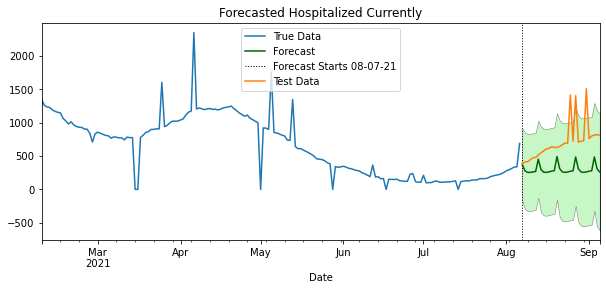
    


#### Next: if happy with forecast, train on entire ts


```python
model = tsa.SARIMAX(ts,order=auto_model.order, 
                    seasonal_order =auto_model.seasonal_order,
                    enforce_invertibility=False,
                    enforce_stationarity=False, 
                    freq='D').fit()
fn.modeling.diagnose_model(model)
fn.modeling.plot_forecast(model, ts)
```


<table class="simpletable">
<caption>SARIMAX Results</caption>
<tr>
  <th>Dep. Variable:</th>       <td>Hospitalized Currently</td>      <th>  No. Observations:  </th>    <td>401</td>   
</tr>
<tr>
  <th>Model:</th>           <td>SARIMAX(1, 0, 0)x(1, 1, [1], 7)</td> <th>  Log Likelihood     </th> <td>-2721.174</td>
</tr>
<tr>
  <th>Date:</th>                   <td>Mon, 06 Sep 2021</td>         <th>  AIC                </th> <td>5450.348</td> 
</tr>
<tr>
  <th>Time:</th>                       <td>19:02:17</td>             <th>  BIC                </th> <td>5466.171</td> 
</tr>
<tr>
  <th>Sample:</th>                    <td>08-01-2020</td>            <th>  HQIC               </th> <td>5456.622</td> 
</tr>
<tr>
  <th></th>                          <td>- 09-05-2021</td>           <th>                     </th>     <td> </td>    
</tr>
<tr>
  <th>Covariance Type:</th>               <td>opg</td>               <th>                     </th>     <td> </td>    
</tr>
</table>
<table class="simpletable">
<tr>
     <td></td>        <th>coef</th>     <th>std err</th>      <th>z</th>      <th>P>|z|</th>  <th>[0.025</th>    <th>0.975]</th>  
</tr>
<tr>
  <th>ar.L1</th>   <td>    0.3390</td> <td>    0.028</td> <td>   12.207</td> <td> 0.000</td> <td>    0.285</td> <td>    0.393</td>
</tr>
<tr>
  <th>ar.S.L7</th> <td>   -0.2159</td> <td>    0.073</td> <td>   -2.977</td> <td> 0.003</td> <td>   -0.358</td> <td>   -0.074</td>
</tr>
<tr>
  <th>ma.S.L7</th> <td>   -0.2738</td> <td>    0.078</td> <td>   -3.498</td> <td> 0.000</td> <td>   -0.427</td> <td>   -0.120</td>
</tr>
<tr>
  <th>sigma2</th>  <td> 7.775e+04</td> <td> 2228.513</td> <td>   34.890</td> <td> 0.000</td> <td> 7.34e+04</td> <td> 8.21e+04</td>
</tr>
</table>
<table class="simpletable">
<tr>
  <th>Ljung-Box (L1) (Q):</th>     <td>5.33</td> <th>  Jarque-Bera (JB):  </th> <td>2804.57</td>
</tr>
<tr>
  <th>Prob(Q):</th>                <td>0.02</td> <th>  Prob(JB):          </th>  <td>0.00</td>  
</tr>
<tr>
  <th>Heteroskedasticity (H):</th> <td>2.44</td> <th>  Skew:              </th>  <td>0.18</td>  
</tr>
<tr>
  <th>Prob(H) (two-sided):</th>    <td>0.00</td> <th>  Kurtosis:          </th>  <td>16.20</td> 
</tr>
</table><br/><br/>Warnings:<br/>[1] Covariance matrix calculated using the outer product of gradients (complex-step).


    (<Figure size 720x288 with 1 Axes>,
     <AxesSubplot:title={'center':'Forecasted Hospitalized Currently'}, xlabel='Date'>)


    
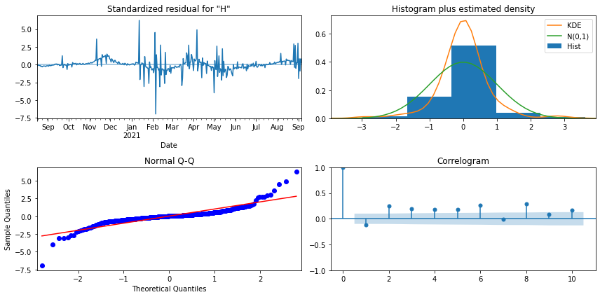
    


    
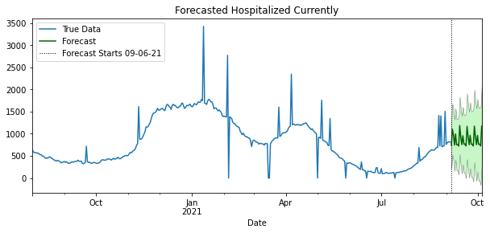
    


## 🚨 BOOKMARK: Data Quality Issue - Deaths

- To Do: Remove outliers.
    - Try using .diff() and a high threshold for deterining outliers

### MD - Deaths-New


```python
col = 'Deaths-New'
ts = df_state[col].copy()
ax = ts.plot(title=f"{state}-{col}");
ax.set_ylabel(col)
```


    Text(0, 0.5, 'Deaths-New')


    
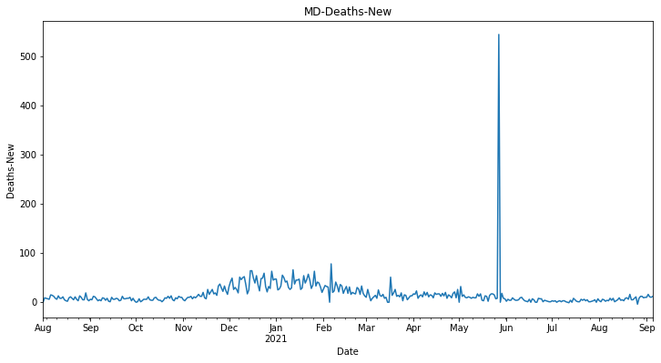
    


```python
## saving deltas 
deltas  = ts.diff()

## SSaving outleirs
threshold=100
outliers = deltas[deltas.abs()>threshold]
outliers
```


    Date
    2021-05-27    536.0
    2021-05-28   -544.0
    Freq: D, Name: Deaths-New, dtype: float64


```python
# outliers= deltas[deltas.abs()>threshold]
# outliers
```


```python
## saving deltas 
fig, axes = plt.subplots(nrows=2,figsize=(12,9))
ax0 = ts.hist(bins='auto',ax=axes[0])
ax0.set(title='Original time series')

## saving deltas 
ax1 = deltas.hist(bins='auto',ax=axes[1])
ax1.set(title='Daily Change in # of deaths ');

for ax in axes:
    ax.axvline(threshold,ls=':',c='red')
    ax.axvline(-threshold,ls=':',c='red')
```


    
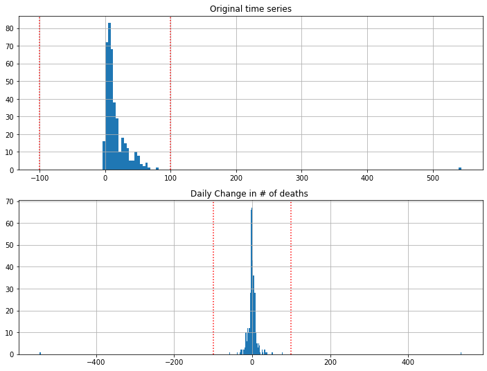
    


```python
## Plotting High Deltas on original time seires

## saving deltas 
fig, axes = plt.subplots(nrows=2,figsize=(12,9))

ax =axes[0]
ts.plot(ax = ax)
ax.set(title='Original Time Series ')

deltas.plot(ax=axes[1])
for ax in axes:
    [ax.axvline(x_val,label=x_val,lw=0.5,ls = ':',color='red') for x_val in outliers.index]
    ax.legend()


```


    
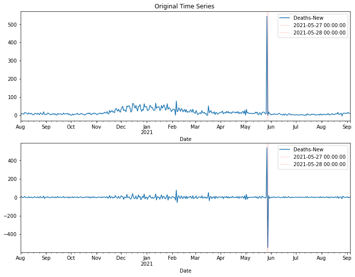
    


> The issues seem to be entirely in the deltas and therefore 


```python
## saving deltas 
deltas  = ts.diff()

## SSaving outleirs
threshold=100
outliers = deltas[deltas.abs()>threshold]


## Filling in outliers
ts.loc[outliers.index] = np.nan
ts.interpolate(inplace=True)
ts.plot()
```


```python

## Filling in outliers
ts.loc[outliers.index] = np.nan
ts.interpolate(inplace=True)
ts.plot()
```


```python
# raise Exception('Deal with the data quality issue above')
```

#### Train Test Split


```python
train,test = fn.modeling.train_test_split_ts(ts,split_index=-30)
```

    Using a cutoff index of -30, which = 08-07-2021


    
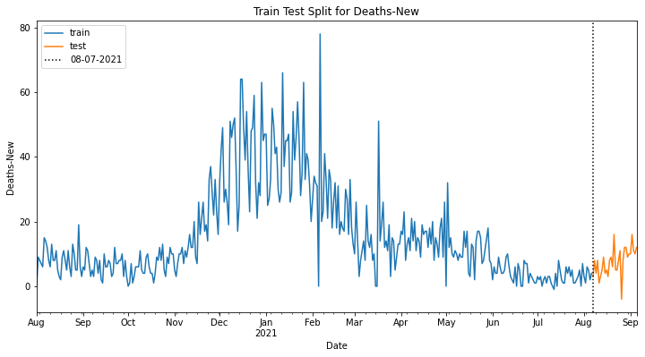
    


#### Checking Seasonal Decompose for Seasonality to Use


```python
## Get Decomposed time sereis
decomp = tsa.seasonal_decompose(train)
decomp.plot();
```


    
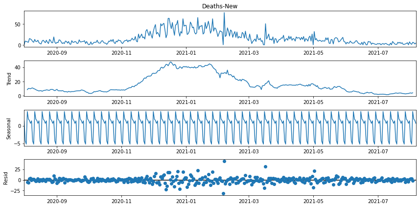
    


```python
ax = decomp.seasonal.loc['01-2021'].plot()
ax.grid(which='both')
```


    
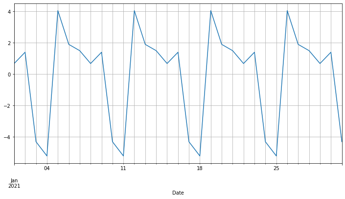
    


- Seasonality appears to be ~7 days


```python
fn.modeling.stationarity_check(train.diff(7).dropna(),window=4);
```


<div>
<style scoped>
    .dataframe tbody tr th:only-of-type {
        vertical-align: middle;
    }

    .dataframe tbody tr th {
        vertical-align: top;
    }

    .dataframe thead th {
        text-align: right;
    }
</style>
<table border="1" class="dataframe">
  <thead>
    <tr style="text-align: right;">
      <th></th>
      <th>Test Statistic</th>
      <th>#Lags Used</th>
      <th># of Observations Used</th>
      <th>p-value</th>
      <th>p&lt;.05</th>
      <th>Stationary?</th>
    </tr>
  </thead>
  <tbody>
    <tr>
      <th>AD Fuller Results</th>
      <td>-3.34597</td>
      <td>15</td>
      <td>348</td>
      <td>0.012945</td>
      <td>True</td>
      <td>True</td>
    </tr>
  </tbody>
</table>
</div>


    
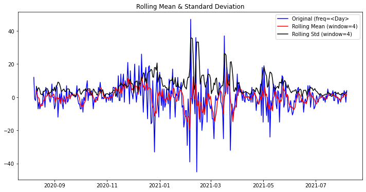
    


```python
fn.modeling.plot_acf_pacf(train,);
```


    
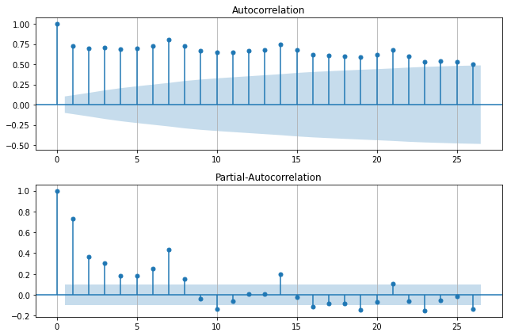
    


```python
fn.modeling.plot_acf_pacf(train,diff=7);
```


    
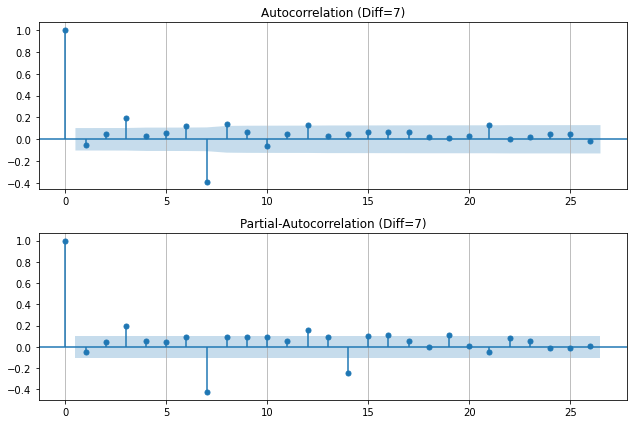
    


> Add notes about COVID insights from acf/pacf

#### GridSearch SARIMA Orders


```python
from pmdarima import auto_arima

auto_model = auto_arima(train,m=7,trace=True,D=1,
                        start_p=0, start_q=0,
                        start_P=0, start_Q=0)
auto_model.summary()
```

    Performing stepwise search to minimize aic
     ARIMA(0,0,0)(0,1,0)[7] intercept   : AIC=2652.999, Time=0.02 sec
     ARIMA(1,0,0)(1,1,0)[7] intercept   : AIC=2597.275, Time=0.18 sec
     ARIMA(0,0,1)(0,1,1)[7] intercept   : AIC=2597.346, Time=0.21 sec
     ARIMA(0,0,0)(0,1,0)[7]             : AIC=2651.030, Time=0.02 sec
     ARIMA(1,0,0)(0,1,0)[7] intercept   : AIC=2654.093, Time=0.05 sec
     ARIMA(1,0,0)(2,1,0)[7] intercept   : AIC=2590.788, Time=0.43 sec
     ARIMA(1,0,0)(2,1,1)[7] intercept   : AIC=2591.290, Time=0.85 sec
     ARIMA(1,0,0)(1,1,1)[7] intercept   : AIC=2594.066, Time=0.26 sec
     ARIMA(0,0,0)(2,1,0)[7] intercept   : AIC=2593.000, Time=0.36 sec
     ARIMA(2,0,0)(2,1,0)[7] intercept   : AIC=2577.995, Time=0.49 sec
     ARIMA(2,0,0)(1,1,0)[7] intercept   : AIC=2593.681, Time=0.23 sec
     ARIMA(2,0,0)(2,1,1)[7] intercept   : AIC=2579.980, Time=1.34 sec
     ARIMA(2,0,0)(1,1,1)[7] intercept   : AIC=2582.150, Time=0.54 sec
     ARIMA(3,0,0)(2,1,0)[7] intercept   : AIC=2552.302, Time=0.94 sec
     ARIMA(3,0,0)(1,1,0)[7] intercept   : AIC=2574.121, Time=0.41 sec
     ARIMA(3,0,0)(2,1,1)[7] intercept   : AIC=2553.852, Time=1.36 sec
     ARIMA(3,0,0)(1,1,1)[7] intercept   : AIC=2552.395, Time=0.60 sec
     ARIMA(4,0,0)(2,1,0)[7] intercept   : AIC=2546.268, Time=0.95 sec
     ARIMA(4,0,0)(1,1,0)[7] intercept   : AIC=2568.845, Time=0.50 sec
     ARIMA(4,0,0)(2,1,1)[7] intercept   : AIC=inf, Time=2.65 sec
     ARIMA(4,0,0)(1,1,1)[7] intercept   : AIC=2544.843, Time=0.81 sec
     ARIMA(4,0,0)(0,1,1)[7] intercept   : AIC=2543.032, Time=0.49 sec
     ARIMA(4,0,0)(0,1,0)[7] intercept   : AIC=2644.115, Time=0.23 sec
     ARIMA(4,0,0)(0,1,2)[7] intercept   : AIC=2544.868, Time=0.92 sec
     ARIMA(4,0,0)(1,1,2)[7] intercept   : AIC=2546.826, Time=1.71 sec
     ARIMA(3,0,0)(0,1,1)[7] intercept   : AIC=2550.550, Time=0.44 sec
     ARIMA(5,0,0)(0,1,1)[7] intercept   : AIC=2534.626, Time=0.56 sec
     ARIMA(5,0,0)(0,1,0)[7] intercept   : AIC=2645.386, Time=0.28 sec
     ARIMA(5,0,0)(1,1,1)[7] intercept   : AIC=2536.443, Time=0.96 sec
     ARIMA(5,0,0)(0,1,2)[7] intercept   : AIC=2536.472, Time=0.92 sec
     ARIMA(5,0,0)(1,1,0)[7] intercept   : AIC=2565.377, Time=0.66 sec
     ARIMA(5,0,0)(1,1,2)[7] intercept   : AIC=2538.408, Time=1.65 sec
     ARIMA(5,0,1)(0,1,1)[7] intercept   : AIC=2521.925, Time=0.80 sec
     ARIMA(5,0,1)(0,1,0)[7] intercept   : AIC=2647.228, Time=0.36 sec
     ARIMA(5,0,1)(1,1,1)[7] intercept   : AIC=2523.924, Time=1.66 sec
     ARIMA(5,0,1)(0,1,2)[7] intercept   : AIC=2523.924, Time=1.77 sec
     ARIMA(5,0,1)(1,1,0)[7] intercept   : AIC=2564.644, Time=1.60 sec
     ARIMA(5,0,1)(1,1,2)[7] intercept   : AIC=2525.913, Time=1.95 sec
     ARIMA(4,0,1)(0,1,1)[7] intercept   : AIC=2521.215, Time=0.85 sec
     ARIMA(4,0,1)(0,1,0)[7] intercept   : AIC=2645.756, Time=0.45 sec
     ARIMA(4,0,1)(1,1,1)[7] intercept   : AIC=2523.212, Time=1.34 sec
     ARIMA(4,0,1)(0,1,2)[7] intercept   : AIC=2523.213, Time=1.70 sec
     ARIMA(4,0,1)(1,1,0)[7] intercept   : AIC=2563.059, Time=0.89 sec
     ARIMA(4,0,1)(1,1,2)[7] intercept   : AIC=2525.206, Time=2.84 sec
     ARIMA(3,0,1)(0,1,1)[7] intercept   : AIC=2519.354, Time=0.75 sec
     ARIMA(3,0,1)(0,1,0)[7] intercept   : AIC=2643.769, Time=0.27 sec
     ARIMA(3,0,1)(1,1,1)[7] intercept   : AIC=2521.354, Time=1.05 sec
     ARIMA(3,0,1)(0,1,2)[7] intercept   : AIC=2521.354, Time=1.70 sec
     ARIMA(3,0,1)(1,1,0)[7] intercept   : AIC=2561.526, Time=0.76 sec
     ARIMA(3,0,1)(1,1,2)[7] intercept   : AIC=inf, Time=3.03 sec
     ARIMA(2,0,1)(0,1,1)[7] intercept   : AIC=2519.236, Time=0.60 sec
     ARIMA(2,0,1)(0,1,0)[7] intercept   : AIC=2650.536, Time=0.31 sec
     ARIMA(2,0,1)(1,1,1)[7] intercept   : AIC=2521.228, Time=0.99 sec
     ARIMA(2,0,1)(0,1,2)[7] intercept   : AIC=2521.229, Time=1.61 sec
     ARIMA(2,0,1)(1,1,0)[7] intercept   : AIC=2563.806, Time=0.66 sec
     ARIMA(2,0,1)(1,1,2)[7] intercept   : AIC=inf, Time=3.81 sec
     ARIMA(1,0,1)(0,1,1)[7] intercept   : AIC=2522.409, Time=1.03 sec
     ARIMA(2,0,0)(0,1,1)[7] intercept   : AIC=2581.893, Time=0.56 sec
     ARIMA(2,0,2)(0,1,1)[7] intercept   : AIC=2516.952, Time=3.54 sec
     ARIMA(2,0,2)(0,1,0)[7] intercept   : AIC=2618.552, Time=0.93 sec
     ARIMA(2,0,2)(1,1,1)[7] intercept   : AIC=2520.351, Time=3.40 sec
     ARIMA(2,0,2)(0,1,2)[7] intercept   : AIC=2519.105, Time=5.55 sec
     ARIMA(2,0,2)(1,1,0)[7] intercept   : AIC=2564.109, Time=1.56 sec
     ARIMA(2,0,2)(1,1,2)[7] intercept   : AIC=inf, Time=6.16 sec
     ARIMA(1,0,2)(0,1,1)[7] intercept   : AIC=2518.411, Time=1.46 sec
     ARIMA(3,0,2)(0,1,1)[7] intercept   : AIC=2520.839, Time=2.35 sec
     ARIMA(2,0,3)(0,1,1)[7] intercept   : AIC=2520.849, Time=3.05 sec
     ARIMA(1,0,3)(0,1,1)[7] intercept   : AIC=2519.379, Time=2.23 sec
     ARIMA(3,0,3)(0,1,1)[7] intercept   : AIC=inf, Time=3.56 sec
     ARIMA(2,0,2)(0,1,1)[7]             : AIC=2514.252, Time=2.23 sec
     ARIMA(2,0,2)(0,1,0)[7]             : AIC=2616.575, Time=0.68 sec
     ARIMA(2,0,2)(1,1,1)[7]             : AIC=2515.743, Time=3.00 sec
     ARIMA(2,0,2)(0,1,2)[7]             : AIC=2515.839, Time=4.11 sec
     ARIMA(2,0,2)(1,1,0)[7]             : AIC=2562.121, Time=0.68 sec
     ARIMA(2,0,2)(1,1,2)[7]             : AIC=inf, Time=4.17 sec
     ARIMA(1,0,2)(0,1,1)[7]             : AIC=2516.417, Time=0.62 sec
     ARIMA(2,0,1)(0,1,1)[7]             : AIC=2517.243, Time=0.66 sec
     ARIMA(3,0,2)(0,1,1)[7]             : AIC=2518.846, Time=1.31 sec
     ARIMA(2,0,3)(0,1,1)[7]             : AIC=2518.855, Time=1.45 sec
     ARIMA(1,0,1)(0,1,1)[7]             : AIC=2520.416, Time=0.50 sec
     ARIMA(1,0,3)(0,1,1)[7]             : AIC=2517.386, Time=1.10 sec
     ARIMA(3,0,1)(0,1,1)[7]             : AIC=2517.360, Time=0.69 sec
     ARIMA(3,0,3)(0,1,1)[7]             : AIC=inf, Time=2.63 sec
    
    Best model:  ARIMA(2,0,2)(0,1,1)[7]          
    Total fit time: 113.012 seconds


<table class="simpletable">
<caption>SARIMAX Results</caption>
<tr>
  <th>Dep. Variable:</th>                  <td>y</td>                <th>  No. Observations:  </th>    <td>371</td>   
</tr>
<tr>
  <th>Model:</th>           <td>SARIMAX(2, 0, 2)x(0, 1, [1], 7)</td> <th>  Log Likelihood     </th> <td>-1251.126</td>
</tr>
<tr>
  <th>Date:</th>                   <td>Mon, 06 Sep 2021</td>         <th>  AIC                </th> <td>2514.252</td> 
</tr>
<tr>
  <th>Time:</th>                       <td>19:20:40</td>             <th>  BIC                </th> <td>2537.635</td> 
</tr>
<tr>
  <th>Sample:</th>                         <td>0</td>                <th>  HQIC               </th> <td>2523.546</td> 
</tr>
<tr>
  <th></th>                             <td> - 371</td>              <th>                     </th>     <td> </td>    
</tr>
<tr>
  <th>Covariance Type:</th>               <td>opg</td>               <th>                     </th>     <td> </td>    
</tr>
</table>
<table class="simpletable">
<tr>
     <td></td>        <th>coef</th>     <th>std err</th>      <th>z</th>      <th>P>|z|</th>  <th>[0.025</th>    <th>0.975]</th>  
</tr>
<tr>
  <th>ar.L1</th>   <td>    1.9652</td> <td>    0.020</td> <td>   97.556</td> <td> 0.000</td> <td>    1.926</td> <td>    2.005</td>
</tr>
<tr>
  <th>ar.L2</th>   <td>   -0.9669</td> <td>    0.020</td> <td>  -48.287</td> <td> 0.000</td> <td>   -1.006</td> <td>   -0.928</td>
</tr>
<tr>
  <th>ma.L1</th>   <td>   -1.8726</td> <td>    0.029</td> <td>  -63.555</td> <td> 0.000</td> <td>   -1.930</td> <td>   -1.815</td>
</tr>
<tr>
  <th>ma.L2</th>   <td>    0.8831</td> <td>    0.027</td> <td>   32.849</td> <td> 0.000</td> <td>    0.830</td> <td>    0.936</td>
</tr>
<tr>
  <th>ma.S.L7</th> <td>   -0.7668</td> <td>    0.036</td> <td>  -21.363</td> <td> 0.000</td> <td>   -0.837</td> <td>   -0.696</td>
</tr>
<tr>
  <th>sigma2</th>  <td>   55.7093</td> <td>    1.997</td> <td>   27.899</td> <td> 0.000</td> <td>   51.796</td> <td>   59.623</td>
</tr>
</table>
<table class="simpletable">
<tr>
  <th>Ljung-Box (L1) (Q):</th>     <td>1.88</td> <th>  Jarque-Bera (JB):  </th> <td>1679.06</td>
</tr>
<tr>
  <th>Prob(Q):</th>                <td>0.17</td> <th>  Prob(JB):          </th>  <td>0.00</td>  
</tr>
<tr>
  <th>Heteroskedasticity (H):</th> <td>1.09</td> <th>  Skew:              </th>  <td>1.03</td>  
</tr>
<tr>
  <th>Prob(H) (two-sided):</th>    <td>0.63</td> <th>  Kurtosis:          </th>  <td>13.32</td> 
</tr>
</table><br/><br/>Warnings:<br/>[1] Covariance matrix calculated using the outer product of gradients (complex-step).


#### Use Best Params for new SARIMAX


```python
model = tsa.SARIMAX(train, order=auto_model.order, 
                    seasonal_order =auto_model.seasonal_order,
                    enforce_invertibility=False,
                    enforce_stationarity=False, 
                    freq='D').fit()

fn.modeling.evaluate_model(model,train,test,last_n_lags=180)
```


<table class="simpletable">
<caption>SARIMAX Results</caption>
<tr>
  <th>Dep. Variable:</th>             <td>Deaths-New</td>            <th>  No. Observations:  </th>    <td>371</td>   
</tr>
<tr>
  <th>Model:</th>           <td>SARIMAX(2, 0, 2)x(0, 1, [1], 7)</td> <th>  Log Likelihood     </th> <td>-1219.999</td>
</tr>
<tr>
  <th>Date:</th>                   <td>Mon, 06 Sep 2021</td>         <th>  AIC                </th> <td>2451.997</td> 
</tr>
<tr>
  <th>Time:</th>                       <td>19:20:42</td>             <th>  BIC                </th> <td>2475.213</td> 
</tr>
<tr>
  <th>Sample:</th>                    <td>08-01-2020</td>            <th>  HQIC               </th> <td>2461.234</td> 
</tr>
<tr>
  <th></th>                          <td>- 08-06-2021</td>           <th>                     </th>     <td> </td>    
</tr>
<tr>
  <th>Covariance Type:</th>               <td>opg</td>               <th>                     </th>     <td> </td>    
</tr>
</table>
<table class="simpletable">
<tr>
     <td></td>        <th>coef</th>     <th>std err</th>      <th>z</th>      <th>P>|z|</th>  <th>[0.025</th>    <th>0.975]</th>  
</tr>
<tr>
  <th>ar.L1</th>   <td>    1.4241</td> <td>    0.306</td> <td>    4.660</td> <td> 0.000</td> <td>    0.825</td> <td>    2.023</td>
</tr>
<tr>
  <th>ar.L2</th>   <td>   -0.4345</td> <td>    0.301</td> <td>   -1.444</td> <td> 0.149</td> <td>   -1.024</td> <td>    0.155</td>
</tr>
<tr>
  <th>ma.L1</th>   <td>   -1.3940</td> <td>    0.298</td> <td>   -4.685</td> <td> 0.000</td> <td>   -1.977</td> <td>   -0.811</td>
</tr>
<tr>
  <th>ma.L2</th>   <td>    0.4990</td> <td>    0.248</td> <td>    2.008</td> <td> 0.045</td> <td>    0.012</td> <td>    0.986</td>
</tr>
<tr>
  <th>ma.S.L7</th> <td>   -0.7378</td> <td>    0.041</td> <td>  -18.188</td> <td> 0.000</td> <td>   -0.817</td> <td>   -0.658</td>
</tr>
<tr>
  <th>sigma2</th>  <td>   57.1973</td> <td>    2.521</td> <td>   22.691</td> <td> 0.000</td> <td>   52.257</td> <td>   62.138</td>
</tr>
</table>
<table class="simpletable">
<tr>
  <th>Ljung-Box (L1) (Q):</th>     <td>0.00</td> <th>  Jarque-Bera (JB):  </th> <td>1223.91</td>
</tr>
<tr>
  <th>Prob(Q):</th>                <td>0.99</td> <th>  Prob(JB):          </th>  <td>0.00</td>  
</tr>
<tr>
  <th>Heteroskedasticity (H):</th> <td>0.80</td> <th>  Skew:              </th>  <td>0.82</td>  
</tr>
<tr>
  <th>Prob(H) (two-sided):</th>    <td>0.22</td> <th>  Kurtosis:          </th>  <td>11.96</td> 
</tr>
</table><br/><br/>Warnings:<br/>[1] Covariance matrix calculated using the outer product of gradients (complex-step).


    (<Figure size 720x288 with 1 Axes>,
     <AxesSubplot:title={'center':'Forecasted Deaths-New'}, xlabel='Date'>)


    
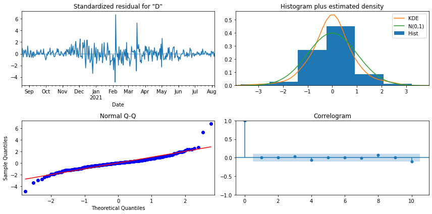
    


    
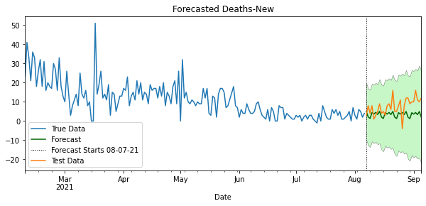
    


#### Next: if happy with forecast, train on entire ts


```python
model = tsa.SARIMAX(ts,order=auto_model.order, 
                    seasonal_order =auto_model.seasonal_order,
                    enforce_invertibility=False,
                    enforce_stationarity=False, 
                    freq='D').fit()
fn.modeling.diagnose_model(model)
fn.modeling.plot_forecast(model, ts)
```


<table class="simpletable">
<caption>SARIMAX Results</caption>
<tr>
  <th>Dep. Variable:</th>             <td>Deaths-New</td>            <th>  No. Observations:  </th>    <td>401</td>   
</tr>
<tr>
  <th>Model:</th>           <td>SARIMAX(2, 0, 2)x(0, 1, [1], 7)</td> <th>  Log Likelihood     </th> <td>-1312.831</td>
</tr>
<tr>
  <th>Date:</th>                   <td>Mon, 06 Sep 2021</td>         <th>  AIC                </th> <td>2637.661</td> 
</tr>
<tr>
  <th>Time:</th>                       <td>19:20:44</td>             <th>  BIC                </th> <td>2661.365</td> 
</tr>
<tr>
  <th>Sample:</th>                    <td>08-01-2020</td>            <th>  HQIC               </th> <td>2647.063</td> 
</tr>
<tr>
  <th></th>                          <td>- 09-05-2021</td>           <th>                     </th>     <td> </td>    
</tr>
<tr>
  <th>Covariance Type:</th>               <td>opg</td>               <th>                     </th>     <td> </td>    
</tr>
</table>
<table class="simpletable">
<tr>
     <td></td>        <th>coef</th>     <th>std err</th>      <th>z</th>      <th>P>|z|</th>  <th>[0.025</th>    <th>0.975]</th>  
</tr>
<tr>
  <th>ar.L1</th>   <td>    1.4948</td> <td>    0.273</td> <td>    5.478</td> <td> 0.000</td> <td>    0.960</td> <td>    2.030</td>
</tr>
<tr>
  <th>ar.L2</th>   <td>   -0.5036</td> <td>    0.269</td> <td>   -1.870</td> <td> 0.061</td> <td>   -1.031</td> <td>    0.024</td>
</tr>
<tr>
  <th>ma.L1</th>   <td>   -1.4591</td> <td>    0.263</td> <td>   -5.547</td> <td> 0.000</td> <td>   -1.975</td> <td>   -0.944</td>
</tr>
<tr>
  <th>ma.L2</th>   <td>    0.5527</td> <td>    0.220</td> <td>    2.513</td> <td> 0.012</td> <td>    0.122</td> <td>    0.984</td>
</tr>
<tr>
  <th>ma.S.L7</th> <td>   -0.7488</td> <td>    0.038</td> <td>  -19.804</td> <td> 0.000</td> <td>   -0.823</td> <td>   -0.675</td>
</tr>
<tr>
  <th>sigma2</th>  <td>   54.1430</td> <td>    2.248</td> <td>   24.085</td> <td> 0.000</td> <td>   49.737</td> <td>   58.549</td>
</tr>
</table>
<table class="simpletable">
<tr>
  <th>Ljung-Box (L1) (Q):</th>     <td>0.00</td> <th>  Jarque-Bera (JB):  </th> <td>1453.37</td>
</tr>
<tr>
  <th>Prob(Q):</th>                <td>0.95</td> <th>  Prob(JB):          </th>  <td>0.00</td>  
</tr>
<tr>
  <th>Heteroskedasticity (H):</th> <td>0.60</td> <th>  Skew:              </th>  <td>0.80</td>  
</tr>
<tr>
  <th>Prob(H) (two-sided):</th>    <td>0.00</td> <th>  Kurtosis:          </th>  <td>12.40</td> 
</tr>
</table><br/><br/>Warnings:<br/>[1] Covariance matrix calculated using the outer product of gradients (complex-step).


    (<Figure size 720x288 with 1 Axes>,
     <AxesSubplot:title={'center':'Forecasted Deaths-New'}, xlabel='Date'>)


    

    


    
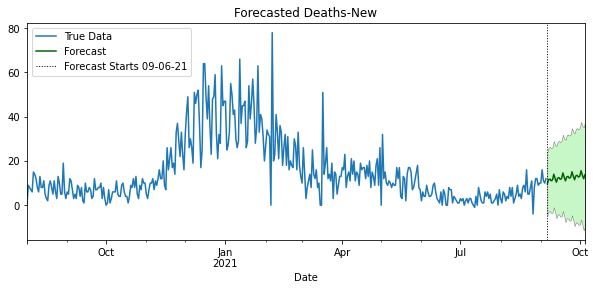
    


# Function For Any Given State/ Column


```python

```


```python
state = "NY"
col = 'Deaths'#'Hospitalized Currently'
start_date='08-2020'
remove_outliers=True
threshold=100
plot=True


df_state = STATES[state].loc[start_date:].copy()
df_state = df_state.resample('D').sum()
ts = df_state[col].copy()
ts.index.name='Datetime'

# ts = ts.resample('D').asfreq()
ts
```


    Datetime
    2020-08-01    32517
    2020-08-02    32530
    2020-08-03    32530
    2020-08-04    32536
    2020-08-05    32569
                  ...  
    2021-09-01    54282
    2021-09-02    54333
    2021-09-03    54361
    2021-09-04    54378
    2021-09-05    54420
    Freq: D, Name: Deaths, Length: 401, dtype: int64


```python

```


```python
def make_timeseries_model(STATES,state = "MD",col = 'Cases-New',
                          start_date='08-2020',
                         remove_outliers=True,threshold=100,
                         plot=True):

    df_state = STATES[state].loc[start_date:].copy()
    df_state = df_state.resample('D').sum()

    ts = df_state[col].copy()


    if remove_outliers:
        ## saving deltas 
        deltas  = ts.diff()

        ## SSaving outleirs
        outliers = deltas[deltas.abs()>threshold]


        ## Filling in outliers
        ts.loc[outliers.index] = np.nan
        ts.interpolate(inplace=True)
    
    if plot:
        ax = ts.plot(title=f"{state}-{col}");
        ax.set_ylabel(col)
        display(ax.get_figure())
        
        
        
        
    from pmdarima import auto_arima
    train,test = fn.modeling.train_test_split_ts(ts,split_index=-30)
    
    auto_model = auto_arima(train,m=7,trace=True,D=1,
                            start_p=0, start_q=0,
                            start_P=0, start_Q=0)
    display(auto_model.summary())
        
    model = tsa.SARIMAX(train, order=auto_model.order, 
                    seasonal_order =auto_model.seasonal_order,
                    enforce_invertibility=False,
                    enforce_stationarity=False, 
                    freq='D').fit()

    fn.modeling.evaluate_model(model,train,test,last_n_lags=180)
    
    
    model = tsa.SARIMAX(ts,order=auto_model.order, 
                    seasonal_order =auto_model.seasonal_order,
                    enforce_invertibility=False,
                    enforce_stationarity=False, 
                    freq='D').fit()
    fn.modeling.diagnose_model(model)
    fn.modeling.plot_forecast(model, ts)
    
    return ts, model
    
```


```python
STATES['NY']
```


<div>
<style scoped>
    .dataframe tbody tr th:only-of-type {
        vertical-align: middle;
    }

    .dataframe tbody tr th {
        vertical-align: top;
    }

    .dataframe thead th {
        text-align: right;
    }
</style>
<table border="1" class="dataframe">
  <thead>
    <tr style="text-align: right;">
      <th></th>
      <th>Deaths</th>
      <th>Cases</th>
      <th>Hospitalized Currently</th>
      <th>ICU-Covid Currently</th>
      <th>Deaths-New</th>
      <th>Cases-New</th>
    </tr>
    <tr>
      <th>Date</th>
      <th></th>
      <th></th>
      <th></th>
      <th></th>
      <th></th>
      <th></th>
    </tr>
  </thead>
  <tbody>
    <tr>
      <th>2020-03-14</th>
      <td>5</td>
      <td>557</td>
      <td>0.0</td>
      <td>0.0</td>
      <td>0.0</td>
      <td>0.0</td>
    </tr>
    <tr>
      <th>2020-03-15</th>
      <td>10</td>
      <td>633</td>
      <td>0.0</td>
      <td>0.0</td>
      <td>5.0</td>
      <td>76.0</td>
    </tr>
    <tr>
      <th>2020-03-16</th>
      <td>21</td>
      <td>961</td>
      <td>0.0</td>
      <td>0.0</td>
      <td>11.0</td>
      <td>328.0</td>
    </tr>
    <tr>
      <th>2020-03-17</th>
      <td>35</td>
      <td>1407</td>
      <td>0.0</td>
      <td>0.0</td>
      <td>14.0</td>
      <td>446.0</td>
    </tr>
    <tr>
      <th>2020-03-18</th>
      <td>60</td>
      <td>2507</td>
      <td>0.0</td>
      <td>0.0</td>
      <td>25.0</td>
      <td>1100.0</td>
    </tr>
    <tr>
      <th>...</th>
      <td>...</td>
      <td>...</td>
      <td>...</td>
      <td>...</td>
      <td>...</td>
      <td>...</td>
    </tr>
    <tr>
      <th>2021-09-01</th>
      <td>54282</td>
      <td>2282836</td>
      <td>2349.0</td>
      <td>545.0</td>
      <td>28.0</td>
      <td>4246.0</td>
    </tr>
    <tr>
      <th>2021-09-02</th>
      <td>54333</td>
      <td>2288001</td>
      <td>2347.0</td>
      <td>563.0</td>
      <td>51.0</td>
      <td>5165.0</td>
    </tr>
    <tr>
      <th>2021-09-03</th>
      <td>54361</td>
      <td>2293966</td>
      <td>2312.0</td>
      <td>575.0</td>
      <td>28.0</td>
      <td>5965.0</td>
    </tr>
    <tr>
      <th>2021-09-04</th>
      <td>54378</td>
      <td>2297642</td>
      <td>2272.0</td>
      <td>562.0</td>
      <td>17.0</td>
      <td>3676.0</td>
    </tr>
    <tr>
      <th>2021-09-05</th>
      <td>54420</td>
      <td>2303739</td>
      <td>2274.0</td>
      <td>562.0</td>
      <td>42.0</td>
      <td>6097.0</td>
    </tr>
  </tbody>
</table>
<p>543 rows × 6 columns</p>
</div>


```python
ts,model = make_timeseries_model(STATES,'NY','Hospitalized Currently')
```


    
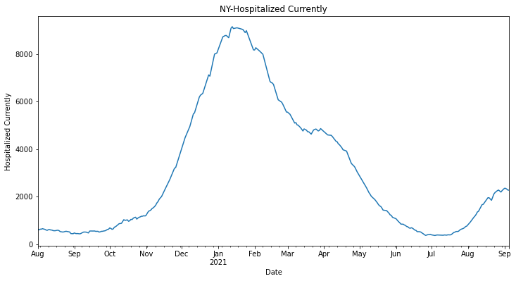
    


    Using a cutoff index of -30, which = 08-07-2021
    Performing stepwise search to minimize aic
     ARIMA(0,1,0)(0,1,0)[7]             : AIC=3986.600, Time=0.02 sec
     ARIMA(1,1,0)(1,1,0)[7]             : AIC=3844.853, Time=0.14 sec
     ARIMA(0,1,1)(0,1,1)[7]             : AIC=3858.206, Time=0.17 sec
     ARIMA(1,1,0)(0,1,0)[7]             : AIC=3935.668, Time=0.04 sec
     ARIMA(1,1,0)(2,1,0)[7]             : AIC=3830.343, Time=0.25 sec
     ARIMA(1,1,0)(2,1,1)[7]             : AIC=inf, Time=0.84 sec
     ARIMA(1,1,0)(1,1,1)[7]             : AIC=3816.939, Time=0.40 sec
     ARIMA(1,1,0)(0,1,1)[7]             : AIC=3814.961, Time=0.20 sec
     ARIMA(1,1,0)(0,1,2)[7]             : AIC=3816.944, Time=0.73 sec
     ARIMA(1,1,0)(1,1,2)[7]             : AIC=inf, Time=1.84 sec
     ARIMA(0,1,0)(0,1,1)[7]             : AIC=3930.948, Time=0.11 sec
     ARIMA(2,1,0)(0,1,1)[7]             : AIC=3801.466, Time=0.62 sec
     ARIMA(2,1,0)(0,1,0)[7]             : AIC=3937.412, Time=0.13 sec
     ARIMA(2,1,0)(1,1,1)[7]             : AIC=3803.451, Time=1.31 sec
     ARIMA(2,1,0)(0,1,2)[7]             : AIC=3803.454, Time=1.31 sec
     ARIMA(2,1,0)(1,1,0)[7]             : AIC=3846.204, Time=0.22 sec
     ARIMA(2,1,0)(1,1,2)[7]             : AIC=3805.279, Time=1.55 sec
     ARIMA(3,1,0)(0,1,1)[7]             : AIC=3788.216, Time=0.85 sec
     ARIMA(3,1,0)(0,1,0)[7]             : AIC=3939.225, Time=0.09 sec
     ARIMA(3,1,0)(1,1,1)[7]             : AIC=inf, Time=0.64 sec
     ARIMA(3,1,0)(0,1,2)[7]             : AIC=3790.079, Time=1.67 sec
     ARIMA(3,1,0)(1,1,0)[7]             : AIC=3843.751, Time=0.25 sec
     ARIMA(3,1,0)(1,1,2)[7]             : AIC=3791.713, Time=2.44 sec
     ARIMA(4,1,0)(0,1,1)[7]             : AIC=3776.838, Time=1.32 sec
     ARIMA(4,1,0)(0,1,0)[7]             : AIC=3938.518, Time=0.17 sec
     ARIMA(4,1,0)(1,1,1)[7]             : AIC=inf, Time=1.06 sec
     ARIMA(4,1,0)(0,1,2)[7]             : AIC=inf, Time=1.80 sec
     ARIMA(4,1,0)(1,1,0)[7]             : AIC=3842.095, Time=0.28 sec
     ARIMA(4,1,0)(1,1,2)[7]             : AIC=inf, Time=2.95 sec
     ARIMA(5,1,0)(0,1,1)[7]             : AIC=inf, Time=1.28 sec
     ARIMA(4,1,1)(0,1,1)[7]             : AIC=inf, Time=1.79 sec
     ARIMA(3,1,1)(0,1,1)[7]             : AIC=inf, Time=0.94 sec
     ARIMA(5,1,1)(0,1,1)[7]             : AIC=inf, Time=1.35 sec
     ARIMA(4,1,0)(0,1,1)[7] intercept   : AIC=3778.820, Time=1.25 sec
    
    Best model:  ARIMA(4,1,0)(0,1,1)[7]          
    Total fit time: 30.039 seconds


<table class="simpletable">
<caption>SARIMAX Results</caption>
<tr>
  <th>Dep. Variable:</th>                  <td>y</td>                <th>  No. Observations:  </th>    <td>371</td>   
</tr>
<tr>
  <th>Model:</th>           <td>SARIMAX(4, 1, 0)x(0, 1, [1], 7)</td> <th>  Log Likelihood     </th> <td>-1882.419</td>
</tr>
<tr>
  <th>Date:</th>                   <td>Mon, 06 Sep 2021</td>         <th>  AIC                </th> <td>3776.838</td> 
</tr>
<tr>
  <th>Time:</th>                       <td>19:39:28</td>             <th>  BIC                </th> <td>3800.204</td> 
</tr>
<tr>
  <th>Sample:</th>                         <td>0</td>                <th>  HQIC               </th> <td>3786.126</td> 
</tr>
<tr>
  <th></th>                             <td> - 371</td>              <th>                     </th>     <td> </td>    
</tr>
<tr>
  <th>Covariance Type:</th>               <td>opg</td>               <th>                     </th>     <td> </td>    
</tr>
</table>
<table class="simpletable">
<tr>
     <td></td>        <th>coef</th>     <th>std err</th>      <th>z</th>      <th>P>|z|</th>  <th>[0.025</th>    <th>0.975]</th>  
</tr>
<tr>
  <th>ar.L1</th>   <td>    0.4972</td> <td>    0.034</td> <td>   14.476</td> <td> 0.000</td> <td>    0.430</td> <td>    0.564</td>
</tr>
<tr>
  <th>ar.L2</th>   <td>    0.0912</td> <td>    0.054</td> <td>    1.700</td> <td> 0.089</td> <td>   -0.014</td> <td>    0.196</td>
</tr>
<tr>
  <th>ar.L3</th>   <td>    0.1040</td> <td>    0.062</td> <td>    1.676</td> <td> 0.094</td> <td>   -0.018</td> <td>    0.226</td>
</tr>
<tr>
  <th>ar.L4</th>   <td>    0.1894</td> <td>    0.042</td> <td>    4.555</td> <td> 0.000</td> <td>    0.108</td> <td>    0.271</td>
</tr>
<tr>
  <th>ma.S.L7</th> <td>   -0.8685</td> <td>    0.029</td> <td>  -29.643</td> <td> 0.000</td> <td>   -0.926</td> <td>   -0.811</td>
</tr>
<tr>
  <th>sigma2</th>  <td> 1821.5503</td> <td>   82.501</td> <td>   22.079</td> <td> 0.000</td> <td> 1659.851</td> <td> 1983.249</td>
</tr>
</table>
<table class="simpletable">
<tr>
  <th>Ljung-Box (L1) (Q):</th>     <td>0.29</td> <th>  Jarque-Bera (JB):  </th> <td>642.92</td>
</tr>
<tr>
  <th>Prob(Q):</th>                <td>0.59</td> <th>  Prob(JB):          </th>  <td>0.00</td> 
</tr>
<tr>
  <th>Heteroskedasticity (H):</th> <td>0.79</td> <th>  Skew:              </th>  <td>-0.38</td>
</tr>
<tr>
  <th>Prob(H) (two-sided):</th>    <td>0.19</td> <th>  Kurtosis:          </th>  <td>9.47</td> 
</tr>
</table><br/><br/>Warnings:<br/>[1] Covariance matrix calculated using the outer product of gradients (complex-step).


<table class="simpletable">
<caption>SARIMAX Results</caption>
<tr>
  <th>Dep. Variable:</th>       <td>Hospitalized Currently</td>      <th>  No. Observations:  </th>    <td>371</td>   
</tr>
<tr>
  <th>Model:</th>           <td>SARIMAX(4, 1, 0)x(0, 1, [1], 7)</td> <th>  Log Likelihood     </th> <td>-1842.872</td>
</tr>
<tr>
  <th>Date:</th>                   <td>Mon, 06 Sep 2021</td>         <th>  AIC                </th> <td>3697.745</td> 
</tr>
<tr>
  <th>Time:</th>                       <td>19:39:29</td>             <th>  BIC                </th> <td>3720.978</td> 
</tr>
<tr>
  <th>Sample:</th>                    <td>08-01-2020</td>            <th>  HQIC               </th> <td>3706.987</td> 
</tr>
<tr>
  <th></th>                          <td>- 08-06-2021</td>           <th>                     </th>     <td> </td>    
</tr>
<tr>
  <th>Covariance Type:</th>               <td>opg</td>               <th>                     </th>     <td> </td>    
</tr>
</table>
<table class="simpletable">
<tr>
     <td></td>        <th>coef</th>     <th>std err</th>      <th>z</th>      <th>P>|z|</th>  <th>[0.025</th>    <th>0.975]</th>  
</tr>
<tr>
  <th>ar.L1</th>   <td>    0.5009</td> <td>    0.035</td> <td>   14.283</td> <td> 0.000</td> <td>    0.432</td> <td>    0.570</td>
</tr>
<tr>
  <th>ar.L2</th>   <td>    0.0884</td> <td>    0.055</td> <td>    1.619</td> <td> 0.106</td> <td>   -0.019</td> <td>    0.195</td>
</tr>
<tr>
  <th>ar.L3</th>   <td>    0.1046</td> <td>    0.063</td> <td>    1.666</td> <td> 0.096</td> <td>   -0.018</td> <td>    0.228</td>
</tr>
<tr>
  <th>ar.L4</th>   <td>    0.1852</td> <td>    0.042</td> <td>    4.372</td> <td> 0.000</td> <td>    0.102</td> <td>    0.268</td>
</tr>
<tr>
  <th>ma.S.L7</th> <td>   -0.8684</td> <td>    0.030</td> <td>  -28.919</td> <td> 0.000</td> <td>   -0.927</td> <td>   -0.810</td>
</tr>
<tr>
  <th>sigma2</th>  <td> 1853.8313</td> <td>   85.451</td> <td>   21.695</td> <td> 0.000</td> <td> 1686.350</td> <td> 2021.313</td>
</tr>
</table>
<table class="simpletable">
<tr>
  <th>Ljung-Box (L1) (Q):</th>     <td>0.30</td> <th>  Jarque-Bera (JB):  </th> <td>610.60</td>
</tr>
<tr>
  <th>Prob(Q):</th>                <td>0.58</td> <th>  Prob(JB):          </th>  <td>0.00</td> 
</tr>
<tr>
  <th>Heteroskedasticity (H):</th> <td>0.71</td> <th>  Skew:              </th>  <td>-0.37</td>
</tr>
<tr>
  <th>Prob(H) (two-sided):</th>    <td>0.07</td> <th>  Kurtosis:          </th>  <td>9.38</td> 
</tr>
</table><br/><br/>Warnings:<br/>[1] Covariance matrix calculated using the outer product of gradients (complex-step).


<table class="simpletable">
<caption>SARIMAX Results</caption>
<tr>
  <th>Dep. Variable:</th>       <td>Hospitalized Currently</td>      <th>  No. Observations:  </th>    <td>401</td>   
</tr>
<tr>
  <th>Model:</th>           <td>SARIMAX(4, 1, 0)x(0, 1, [1], 7)</td> <th>  Log Likelihood     </th> <td>-1997.354</td>
</tr>
<tr>
  <th>Date:</th>                   <td>Mon, 06 Sep 2021</td>         <th>  AIC                </th> <td>4006.709</td> 
</tr>
<tr>
  <th>Time:</th>                       <td>19:39:30</td>             <th>  BIC                </th> <td>4030.428</td> 
</tr>
<tr>
  <th>Sample:</th>                    <td>08-01-2020</td>            <th>  HQIC               </th> <td>4016.116</td> 
</tr>
<tr>
  <th></th>                          <td>- 09-05-2021</td>           <th>                     </th>     <td> </td>    
</tr>
<tr>
  <th>Covariance Type:</th>               <td>opg</td>               <th>                     </th>     <td> </td>    
</tr>
</table>
<table class="simpletable">
<tr>
     <td></td>        <th>coef</th>     <th>std err</th>      <th>z</th>      <th>P>|z|</th>  <th>[0.025</th>    <th>0.975]</th>  
</tr>
<tr>
  <th>ar.L1</th>   <td>    0.5218</td> <td>    0.035</td> <td>   14.881</td> <td> 0.000</td> <td>    0.453</td> <td>    0.591</td>
</tr>
<tr>
  <th>ar.L2</th>   <td>    0.0690</td> <td>    0.054</td> <td>    1.273</td> <td> 0.203</td> <td>   -0.037</td> <td>    0.175</td>
</tr>
<tr>
  <th>ar.L3</th>   <td>    0.0819</td> <td>    0.062</td> <td>    1.313</td> <td> 0.189</td> <td>   -0.040</td> <td>    0.204</td>
</tr>
<tr>
  <th>ar.L4</th>   <td>    0.2062</td> <td>    0.041</td> <td>    5.067</td> <td> 0.000</td> <td>    0.126</td> <td>    0.286</td>
</tr>
<tr>
  <th>ma.S.L7</th> <td>   -0.8874</td> <td>    0.027</td> <td>  -32.575</td> <td> 0.000</td> <td>   -0.941</td> <td>   -0.834</td>
</tr>
<tr>
  <th>sigma2</th>  <td> 1839.7581</td> <td>   83.976</td> <td>   21.908</td> <td> 0.000</td> <td> 1675.169</td> <td> 2004.347</td>
</tr>
</table>
<table class="simpletable">
<tr>
  <th>Ljung-Box (L1) (Q):</th>     <td>0.41</td> <th>  Jarque-Bera (JB):  </th> <td>598.41</td>
</tr>
<tr>
  <th>Prob(Q):</th>                <td>0.52</td> <th>  Prob(JB):          </th>  <td>0.00</td> 
</tr>
<tr>
  <th>Heteroskedasticity (H):</th> <td>0.79</td> <th>  Skew:              </th>  <td>-0.25</td>
</tr>
<tr>
  <th>Prob(H) (two-sided):</th>    <td>0.17</td> <th>  Kurtosis:          </th>  <td>9.09</td> 
</tr>
</table><br/><br/>Warnings:<br/>[1] Covariance matrix calculated using the outer product of gradients (complex-step).


    

    


    
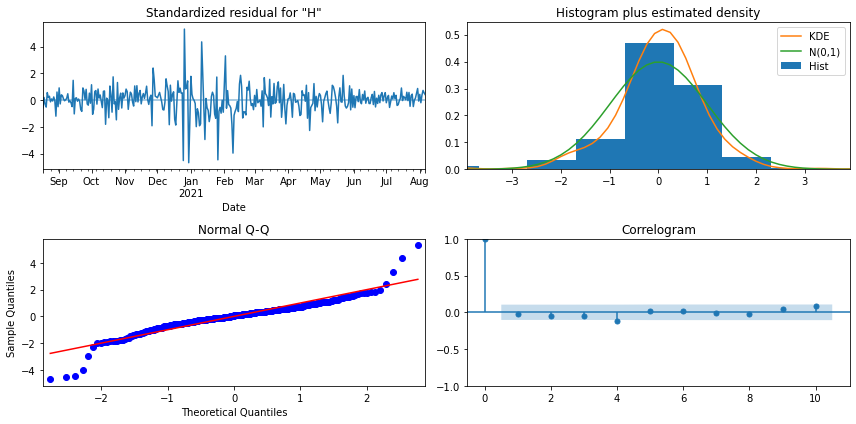
    


    
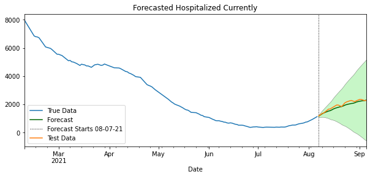
    


    
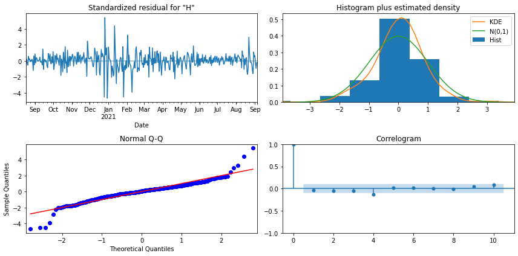
    


    
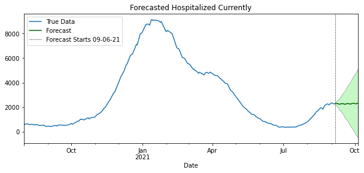
    


# `@interact`


```python
from ipywidgets import interact
import datetime as dt

@interact
def get_model(state=list(STATES.keys()),
             col=list(STATES['NY'].columns),model=False):
    if model:
        start = dt.datetime.now()
        ts,model = make_timeseries_model(STATES,state,col)
        end = dt.datetime.now()
        print(f'Modeling Process took {end-start} sec.')
```


    interactive(children=(Dropdown(description='state', options=('AK', 'AL', 'AR', 'AZ', 'CA', 'CO', 'CT', 'DC', '…


# APPENDIX

### `def` modeling functions


```python
# def train_test_split_ts(ts,test_size=0.9,split_index=None):
#     """Uses test size by default, split_index overrides it"""
#     if split_index is not None:
#         tts_cutoff = split_index
#     else:
#         tts_cutoff = round(ts.shape[0]*0.9)
#     fmt = "%m-%d-%Y"
#     cutoff_time = ts.index[tts_cutoff]
#     print(f"Using a cutoff index of {tts_cutoff}, which = {cutoff_time.strftime(fmt)}")
    
#       ## Use the tts cutoff to do Train test split and plot
#     train = ts.iloc[:tts_cutoff]
#     test = ts.iloc[tts_cutoff:]

#     ## Plot
#     ax = train.plot(label='train')
#     test.plot(label='test')
#     ax.legend()
#     ax.set(ylabel=ts.name)
#     ax.axvline(cutoff_time,color='k',ls=':',label=cutoff_time.strftime(fmt))
#     ax.legend()
#     ax.set_title(f"Train Test Split for {ts.name}")
#     return train, test

```


```python
# ## funtionize diagnosing
# def diagnose_model(model): #keep
#     """Takes a fit statsmodels model and displays the .summary 
#     and plots the built-in plot.diagnostics()"""
#     display(model.summary())
#     model.plot_diagnostics()
#     plt.tight_layout()
    
    
# def get_forecast(model,steps=14): #keep
#     forecast = model.get_forecast(steps=steps)
#     forecast_df = forecast.conf_int()
#     forecast_df['Forecast'] = forecast.predicted_mean
#     forecast_df.columns = ['Lower CI','Upper CI','Forecast']
#     return forecast_df


# def plot_forecast(forecast_df,ts,orig_label='True Data',
#                   forecast_label='Forecast',
#                   forecast_steps=30,
#                   last_n_lags=None,figsize=(10,4)):
#     """Takes a forecast_df from get_df_from_pred and optionally 
#     the training/original time series.
    
#     Plots the original ts, the predicted mean and the 
#     confidence invtervals (using fill between)"""
#     if not isinstance(forecast_df,pd.DataFrame):
#         forecast_df = get_forecast(forecast_df,steps=forecast_steps)
        
#     fig,ax = plt.subplots(figsize=figsize)

#     if last_n_lags is None:
#         last_n_lags = len(ts)
        
#     ts.iloc[-last_n_lags:].plot(label='True Data')

    
#     forecast_df['Forecast'].plot(ax=ax,color='darkgreen',label=forecast_label)
#     ax.fill_between(forecast_df.index,
#                     forecast_df['Lower CI'], 
#                     forecast_df['Upper CI'],
#                     color='lightgreen',alpha=0.5,lw=0.5,edgecolor='k')
#     ax.set(title=f'Forecasted {ts.name}')
#     sep = forecast_df.index[0]
#     ax.axvline(sep,label=f"Forecast Starts {sep.strftime('%m-%d-%y')}",lw=1,ls=':',c='k')
#     ax.legend()

#     return fig,ax

    
# def evaluate_model(model,train,test,steps=None,last_n_lags=None):
#     diagnose_model(model)
    
#     if steps is None:
#         steps=len(test)
        
#     forecast_df = get_forecast(model,steps=len(test))
#     fig, ax = plot_forecast(forecast_df,train,last_n_lags=last_n_lags)
    
#     test.plot(ax=ax,label='Test Data')
#     ax.legend()
#     return fig,ax
           
 

```
