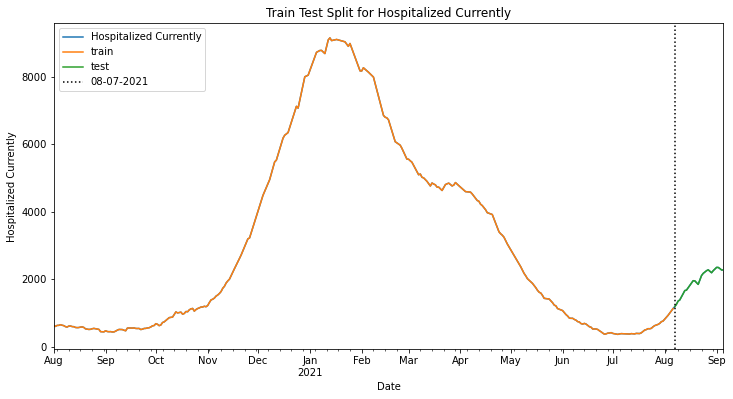

# Coronavirus/COVID-19 Timseries Forecasting

# Business Problem

- Covid-19 and the various strains that have since emerged has upended modern life and fundamental changed how we function as a society.
- Part of what has made it difficult to tackle the pandemic is due to differences between states, state laws/policies, and a lack of public understanding about the predictability of the surges in cases. 


### Goal

- The goal of this notebook is to produce a workflow for producing forecasts of the following metrics at least 1 week ahead of time. 
    - Confirmed Cases
    - Number of Deaths
    - ICU Capacity
    
- The stretch goal for the project is to create a streamlit dashboard for getting state-level forecasts for any state in the US, using fresh daily data.
    

### Methodology

- To select 3-5 prototypical states representing very different time courses/
- Initial Thoughts:
    - NY
    - TX
    - FL
    - MD
    - LA

- See `data_acquisition.py`> `FULL_WORKFLOW()` and `1_Replacing Covid Tracking Project - Simplified Workflow.ipynb` for details (for now)


# OBTAIN

## Imports


```python
# !pip install fsds
# !pip install pmdarima

from fsds.imports import *

import os,glob,sys,joblib,zipfile,json
import re

import plotly.express as px
import plotly.graph_objects as go
import plotly.io as pio
pio.templates.default = "plotly_dark"

plt.rcParams['figure.figsize'] = (12,6)
pd.set_option('display.max_columns',0)


```python
### FORECAST SPECIFIC FUNCTIONS
import statsmodels.api as sms
import statsmodels.tsa.api as tsa
from pmdarima import auto_arima
```


```python
import statsmodels
print(f"Statsmodels version: {statsmodels.__version__}")

import pmdarima
print(f"pmdarima version: {pmdarima.__version__}")
```

    Statsmodels version: 0.12.2
    pmdarima version: 1.8.2


```python
## Custom Functions and Classes
%load_ext autoreload
%autoreload 2
import project_functions as fn
```


<script type="text/javascript">
window.PlotlyConfig = {MathJaxConfig: 'local'};
if (window.MathJax) {MathJax.Hub.Config({SVG: {font: "STIX-Web"}});}
if (typeof require !== 'undefined') {
require.undef("plotly");
requirejs.config({
    paths: {
        'plotly': ['https://cdn.plot.ly/plotly-2.4.2.min']
    }
});
require(['plotly'], function(Plotly) {
    window._Plotly = Plotly;
});
}
</script>


<script type="text/javascript">
window.PlotlyConfig = {MathJaxConfig: 'local'};
if (window.MathJax) {MathJax.Hub.Config({SVG: {font: "STIX-Web"}});}
if (typeof require !== 'undefined') {
require.undef("plotly");
requirejs.config({
    paths: {
        'plotly': ['https://cdn.plot.ly/plotly-2.4.2.min']
    }
});
require(['plotly'], function(Plotly) {
    window._Plotly = Plotly;
});
}
</script>


<script type="text/javascript">
window.PlotlyConfig = {MathJaxConfig: 'local'};
if (window.MathJax) {MathJax.Hub.Config({SVG: {font: "STIX-Web"}});}
if (typeof require !== 'undefined') {
require.undef("plotly");
requirejs.config({
    paths: {
        'plotly': ['https://cdn.plot.ly/plotly-2.4.2.min']
    }
});
require(['plotly'], function(Plotly) {
    window._Plotly = Plotly;
});
}
</script>


## Data


```python
## Using new savedd FILE_DIRECTORIES
import os,json,glob

with open("FILE_DIRECTORY.json") as f:
    FPATHS = json.load(f)
FPATHS
```


    {'fpath_raw': './data_raw/',
     'fpath_clean': './data/',
     'fpath_reference': './reference_data/',
     'fpath_state_data': './data/state_data/',
     'fpath_final_df_csv': './data/FINAL_STATES.csv.gz',
     'fpath_final_df_pickle': './data/FINAL_STATES.pickle',
     'name_of_fpath_vars': ['fpath_raw',
      'fpath_clean',
      'fpath_reference',
      'fpath_state_data',
      'fpath_final_df_csv',
      'fpath_final_df_pickle',
      'name_of_fpath_vars',
      'fpath_final_states'],
     'fpath_final_states': './data/FINAL_STATES.joblib'}


```python
for path_name,fpath in FPATHS.items():
    try:
        
        found_files =  sorted(os.listdir(fpath))
        print(f"\n[i] Files stored in {path_name}:")
        [print("\t",i,x) for i,x in enumerate(found_files)]
    except:
        pass

```

    
    [i] Files stored in fpath_raw:
    	 0 .ipynb_checkpoints
    	 1 CONVENIENT_us_metadata.csv
    	 2 RAW_us_confirmed_cases.csv
    	 3 RAW_us_deaths.csv
    	 4 covid19-data-from-john-hopkins-university.zip
    	 5 hospital_data.csv
    
    [i] Files stored in fpath_clean:
    	 0 COLUMNS.joblib
    	 1 FINAL_STATES.csv.gz
    	 2 FINAL_STATES.joblib
    	 3 FINAL_STATES.pickle
    	 4 STATE_DICT.joblib
    	 5 combined_us_states_full_data.csv
    	 6 state_data
    	 7 us_states_cases_deaths.csv
    	 8 us_states_daily_cases_deaths.csv
    
    [i] Files stored in fpath_reference:
    	 0 COLUMNS.joblib
    	 1 population-by-country-2020.zip
    	 2 state_codes_to_names_map.joblib
    	 3 state_names_to_codes_map.joblib
    	 4 united_states_abbreviations.csv
    	 5 us_metadata_counties.csv
    	 6 us_metadata_states.csv
    
    [i] Files stored in fpath_state_data:


### Project Control Booleans


```python
RUN_FULL_WORKFLOW=True
```


```python
# ## making mapper dict to rename new columns
# new_to_match_old_map = {
#     'Deaths':'death',
#     'Cases':'positive',
#     'total_adult_patients_hospitalized_confirmed_covid':'hospitalizedCurrently',
# 'adult_icu_bed_covid_utilization_numerator':'inIcuCurrently'}
# ## making mapper dict to rename new columns
# new_to_final_names = {
#     'Deaths':'Deaths',
#     'Cases':'Cases',
#     'total_adult_patients_hospitalized_confirmed_covid':'Hospitalized Currently',
# 'adult_icu_bed_covid_utilization_numerator':'ICU-Covid Currently'}
# list(new_to_final_names.keys())
```


```python
FPATHS
```


    {'fpath_raw': './data_raw/',
     'fpath_clean': './data/',
     'fpath_reference': './reference_data/',
     'fpath_state_data': './data/state_data/',
     'fpath_final_df_csv': './data/FINAL_STATES.csv.gz',
     'fpath_final_df_pickle': './data/FINAL_STATES.pickle',
     'name_of_fpath_vars': ['fpath_raw',
      'fpath_clean',
      'fpath_reference',
      'fpath_state_data',
      'fpath_final_df_csv',
      'fpath_final_df_pickle',
      'name_of_fpath_vars',
      'fpath_final_states'],
     'fpath_final_states': './data/FINAL_STATES.joblib'}


```python
os.listdir(FPATHS['fpath_clean'])
```


    ['us_states_daily_cases_deaths.csv',
     'state_data',
     'combined_us_states_full_data.csv',
     'us_states_cases_deaths.csv',
     'STATE_DICT.joblib',
     'FINAL_STATES.joblib',
     'FINAL_STATES.csv.gz',
     'COLUMNS.joblib',
     'FINAL_STATES.pickle']


```python
## temporary override
RUN_FULL_WORKFLOW=False
```


```python
## Uncomment Cell to acquire new data
if RUN_FULL_WORKFLOW:
    df_states,STATES = fn.data.FULL_WORKFLOW(merge_hospital_data=True)
    ## renaming since merge_hofspital_data=True
#     DF = df_states.copy()
#     print(STATES.keys())    
    
else:
    print(f"[i] Using previously downloaded data...")
    df_states = pd.read_pickle(FPATHS['fpath_final_df_pickle'])
    
#     with open(FPATHS['fpath_final_states']) as f:
    STATES = joblib.load(FPATHS['fpath_final_states'])
#     df_states = pd.read_csv(os.path.join(fpath_clean,
#                                          'combined_us_states_full_data.csv'))
#     STATES = joblib.load(os.path.join(fpath_clean,'STATE_DICT.joblib'))

display(df_states.head())
print(STATES.keys())
```

    [i] Using previously downloaded data...


<div>
<style scoped>
    .dataframe tbody tr th:only-of-type {
        vertical-align: middle;
    }

    .dataframe tbody tr th {
        vertical-align: top;
    }

    .dataframe thead th {
        text-align: right;
    }
</style>
<table border="1" class="dataframe">
  <thead>
    <tr style="text-align: right;">
      <th></th>
      <th></th>
      <th>Deaths</th>
      <th>Cases</th>
      <th>Hospitalized Currently</th>
      <th>ICU-Covid Currently</th>
      <th>Deaths-New</th>
      <th>Cases-New</th>
    </tr>
    <tr>
      <th></th>
      <th>Date</th>
      <th></th>
      <th></th>
      <th></th>
      <th></th>
      <th></th>
      <th></th>
    </tr>
  </thead>
  <tbody>
    <tr>
      <th rowspan="5" valign="top">AK</th>
      <th>2020-03-23</th>
      <td>0</td>
      <td>39</td>
      <td>0.0</td>
      <td>0.0</td>
      <td>0.0</td>
      <td>0.0</td>
    </tr>
    <tr>
      <th>2020-03-24</th>
      <td>0</td>
      <td>43</td>
      <td>0.0</td>
      <td>0.0</td>
      <td>0.0</td>
      <td>4.0</td>
    </tr>
    <tr>
      <th>2020-03-25</th>
      <td>1</td>
      <td>50</td>
      <td>0.0</td>
      <td>0.0</td>
      <td>1.0</td>
      <td>7.0</td>
    </tr>
    <tr>
      <th>2020-03-26</th>
      <td>1</td>
      <td>64</td>
      <td>0.0</td>
      <td>0.0</td>
      <td>0.0</td>
      <td>14.0</td>
    </tr>
    <tr>
      <th>2020-03-27</th>
      <td>1</td>
      <td>75</td>
      <td>0.0</td>
      <td>0.0</td>
      <td>0.0</td>
      <td>11.0</td>
    </tr>
  </tbody>
</table>
</div>


    dict_keys(['AK', 'AL', 'AR', 'AZ', 'CA', 'CO', 'CT', 'DC', 'DE', 'FL', 'GA', 'HI', 'IA', 'ID', 'IL', 'IN', 'KS', 'KY', 'LA', 'MA', 'MD', 'ME', 'MI', 'MN', 'MO', 'MS', 'MT', 'NC', 'ND', 'NE', 'NH', 'NJ', 'NM', 'NV', 'NY', 'OH', 'OK', 'OR', 'PA', 'PR', 'RI', 'SC', 'SD', 'TN', 'TX', 'UT', 'VA', 'VT', 'WA', 'WI', 'WV', 'WY'])


# [To Be Updated] COPIED legacy book 2 on  09/06/21

# EDA - Comparing States

## FL


```python
FL = STATES['FL'].copy()
FL
```


<div>
<style scoped>
    .dataframe tbody tr th:only-of-type {
        vertical-align: middle;
    }

    .dataframe tbody tr th {
        vertical-align: top;
    }

    .dataframe thead th {
        text-align: right;
    }
</style>
<table border="1" class="dataframe">
  <thead>
    <tr style="text-align: right;">
      <th></th>
      <th>Deaths</th>
      <th>Cases</th>
      <th>Hospitalized Currently</th>
      <th>ICU-Covid Currently</th>
      <th>Deaths-New</th>
      <th>Cases-New</th>
    </tr>
    <tr>
      <th>Date</th>
      <th></th>
      <th></th>
      <th></th>
      <th></th>
      <th></th>
      <th></th>
    </tr>
  </thead>
  <tbody>
    <tr>
      <th>2020-03-12</th>
      <td>2</td>
      <td>30</td>
      <td>0.0</td>
      <td>0.0</td>
      <td>0.0</td>
      <td>0.0</td>
    </tr>
    <tr>
      <th>2020-03-13</th>
      <td>2</td>
      <td>50</td>
      <td>0.0</td>
      <td>0.0</td>
      <td>0.0</td>
      <td>20.0</td>
    </tr>
    <tr>
      <th>2020-03-14</th>
      <td>2</td>
      <td>76</td>
      <td>0.0</td>
      <td>0.0</td>
      <td>0.0</td>
      <td>26.0</td>
    </tr>
    <tr>
      <th>2020-03-15</th>
      <td>3</td>
      <td>100</td>
      <td>0.0</td>
      <td>0.0</td>
      <td>1.0</td>
      <td>24.0</td>
    </tr>
    <tr>
      <th>2020-03-16</th>
      <td>3</td>
      <td>101</td>
      <td>0.0</td>
      <td>0.0</td>
      <td>0.0</td>
      <td>1.0</td>
    </tr>
    <tr>
      <th>...</th>
      <td>...</td>
      <td>...</td>
      <td>...</td>
      <td>...</td>
      <td>...</td>
      <td>...</td>
    </tr>
    <tr>
      <th>2021-08-31</th>
      <td>43979</td>
      <td>3223249</td>
      <td>14995.0</td>
      <td>3375.0</td>
      <td>0.0</td>
      <td>0.0</td>
    </tr>
    <tr>
      <th>2021-09-02</th>
      <td>43979</td>
      <td>3223249</td>
      <td>14267.0</td>
      <td>3281.0</td>
      <td>0.0</td>
      <td>0.0</td>
    </tr>
    <tr>
      <th>2021-09-03</th>
      <td>46324</td>
      <td>3352451</td>
      <td>13666.0</td>
      <td>3230.0</td>
      <td>2345.0</td>
      <td>129202.0</td>
    </tr>
    <tr>
      <th>2021-09-04</th>
      <td>46324</td>
      <td>3352451</td>
      <td>13329.0</td>
      <td>3195.0</td>
      <td>0.0</td>
      <td>0.0</td>
    </tr>
    <tr>
      <th>2021-09-05</th>
      <td>46324</td>
      <td>3352451</td>
      <td>13346.0</td>
      <td>3185.0</td>
      <td>0.0</td>
      <td>0.0</td>
    </tr>
  </tbody>
</table>
<p>546 rows × 6 columns</p>
</div>


```python
## first non-null hospital timestamps
first_ts = FL[FL['Hospitalized Currently'].notna()].index[0]
first_ts
```


    Timestamp('2020-03-12 00:00:00')


### Calc Delta Cases/Deaths


```python
FL.columns
```


    Index(['Deaths', 'Cases', 'Hospitalized Currently', 'ICU-Covid Currently',
           'Deaths-New', 'Cases-New'],
          dtype='object')


```python
## Plot deaths/cases
cumulative_cols = [c for c in FL.columns for name in ['Daths','Cases']if name in c]
FL[cumulative_cols].plot(subplots=True)
```


    array([<AxesSubplot:xlabel='Date'>, <AxesSubplot:xlabel='Date'>],
          dtype=object)


    

    


```python
import plotly
plotly.__version__
```


    '5.3.1'


```python
import missingno
missingno.matrix(FL)
```


    <AxesSubplot:>


    

    


```python
# px.imshow(FL.isna(),template='plotly_dark',color_continuous_scale="Reds")
```


```python
plot_cols = FL.drop(columns=cumulative_cols).columns
plot_cols
```


    Index(['Deaths', 'Hospitalized Currently', 'ICU-Covid Currently',
           'Deaths-New'],
          dtype='object')


```python
pfig = px.line(FL,y=plot_cols,width=1000,title="FL Data")
pfig.add_vline(first_ts,line_width=3,line_dash="dash",name='Start')
pfig.show()
```


```python
# raise Exception('end of 09/01/21, though below code is still good.')
```

# Time Series Modeling


```python
### FORECAST SPECIFIC FUNCTIONS
from statsmodels.tsa.statespace.sarimax import SARIMAX
import statsmodels.api as sms
import statsmodels.tsa.api as tsa
from pmdarima import auto_arima
```

## MD


```python
state = "MD"
df_state = STATES[state].loc['08-2020':].copy()
# df_state = df_state.interpolate('time')
# df_state['Deaths-New'] = df_state['Deaths'].diff()
# df_state['Cases-New'] = df_state['Cases'].diff()
df_state = df_state.resample('D').sum()

print(df_state.isna().sum())
df_state
```

    Deaths                    0
    Cases                     0
    Hospitalized Currently    0
    ICU-Covid Currently       0
    Deaths-New                0
    Cases-New                 0
    dtype: int64


<div>
<style scoped>
    .dataframe tbody tr th:only-of-type {
        vertical-align: middle;
    }

    .dataframe tbody tr th {
        vertical-align: top;
    }

    .dataframe thead th {
        text-align: right;
    }
</style>
<table border="1" class="dataframe">
  <thead>
    <tr style="text-align: right;">
      <th></th>
      <th>Deaths</th>
      <th>Cases</th>
      <th>Hospitalized Currently</th>
      <th>ICU-Covid Currently</th>
      <th>Deaths-New</th>
      <th>Cases-New</th>
    </tr>
    <tr>
      <th>Date</th>
      <th></th>
      <th></th>
      <th></th>
      <th></th>
      <th></th>
      <th></th>
    </tr>
  </thead>
  <tbody>
    <tr>
      <th>2020-08-01</th>
      <td>3506</td>
      <td>89365</td>
      <td>629.0</td>
      <td>171.0</td>
      <td>0.0</td>
      <td>0.0</td>
    </tr>
    <tr>
      <th>2020-08-02</th>
      <td>3515</td>
      <td>90274</td>
      <td>606.0</td>
      <td>180.0</td>
      <td>9.0</td>
      <td>909.0</td>
    </tr>
    <tr>
      <th>2020-08-03</th>
      <td>3523</td>
      <td>91144</td>
      <td>574.0</td>
      <td>176.0</td>
      <td>8.0</td>
      <td>870.0</td>
    </tr>
    <tr>
      <th>2020-08-04</th>
      <td>3530</td>
      <td>91854</td>
      <td>576.0</td>
      <td>191.0</td>
      <td>7.0</td>
      <td>710.0</td>
    </tr>
    <tr>
      <th>2020-08-05</th>
      <td>3536</td>
      <td>92426</td>
      <td>571.0</td>
      <td>186.0</td>
      <td>6.0</td>
      <td>572.0</td>
    </tr>
    <tr>
      <th>...</th>
      <td>...</td>
      <td>...</td>
      <td>...</td>
      <td>...</td>
      <td>...</td>
      <td>...</td>
    </tr>
    <tr>
      <th>2021-09-01</th>
      <td>10024</td>
      <td>498376</td>
      <td>759.0</td>
      <td>202.0</td>
      <td>10.0</td>
      <td>1374.0</td>
    </tr>
    <tr>
      <th>2021-09-02</th>
      <td>10040</td>
      <td>499648</td>
      <td>799.0</td>
      <td>212.0</td>
      <td>16.0</td>
      <td>1272.0</td>
    </tr>
    <tr>
      <th>2021-09-03</th>
      <td>10051</td>
      <td>501035</td>
      <td>813.0</td>
      <td>222.0</td>
      <td>11.0</td>
      <td>1387.0</td>
    </tr>
    <tr>
      <th>2021-09-04</th>
      <td>10061</td>
      <td>502229</td>
      <td>821.0</td>
      <td>225.0</td>
      <td>10.0</td>
      <td>1194.0</td>
    </tr>
    <tr>
      <th>2021-09-05</th>
      <td>10073</td>
      <td>503034</td>
      <td>813.0</td>
      <td>220.0</td>
      <td>12.0</td>
      <td>805.0</td>
    </tr>
  </tbody>
</table>
<p>401 rows × 6 columns</p>
</div>


```python
model_cols = ['Hospitalized Currently','ICU-Covid Currently',
              'Deaths-New','Cases-New'
             ]

## visualize
ax = df_state[model_cols].plot(subplots=True, figsize=(10,12))
plt.tight_layout();
```


    

    


#### Data Quality Issues
- There are strong spikes +/- that are not likely to be real values.

### MD - Cases-New


```python
col = 'Cases-New'
ts = df_state[col].copy()
ax = ts.plot(title=f"{state}-{col}");
ax.set_ylabel(col)
```


    Text(0, 0.5, 'Cases-New')


    

    


#### Train Test Split


```python
train,test = fn.modeling.train_test_split_ts(ts,split_index=-30)
```

    Using a cutoff index of -30, which = 08-07-2021


    

    


#### Checking Seasonal Decompose for Seasonality to Use


```python
## Get Decomposed time sereis
decomp = tsa.seasonal_decompose(train)
decomp.plot();
```


    

    


```python
ax = decomp.seasonal.loc['01-2021'].plot(figsize=(12,5))
ax.grid(which='both')
```


    

    


- Seasonality appears to be ~7 days


```python
fn.modeling.stationarity_check(train.diff(7).dropna(),window=4);
```


<div>
<style scoped>
    .dataframe tbody tr th:only-of-type {
        vertical-align: middle;
    }

    .dataframe tbody tr th {
        vertical-align: top;
    }

    .dataframe thead th {
        text-align: right;
    }
</style>
<table border="1" class="dataframe">
  <thead>
    <tr style="text-align: right;">
      <th></th>
      <th>Test Statistic</th>
      <th>#Lags Used</th>
      <th># of Observations Used</th>
      <th>p-value</th>
      <th>p&lt;.05</th>
      <th>Stationary?</th>
    </tr>
  </thead>
  <tbody>
    <tr>
      <th>AD Fuller Results</th>
      <td>-2.781987</td>
      <td>16</td>
      <td>347</td>
      <td>0.060893</td>
      <td>False</td>
      <td>False</td>
    </tr>
  </tbody>
</table>
</div>


    

    


```python
fn.modeling.plot_acf_pacf(train,);
```


    

    


```python
fn.modeling.plot_acf_pacf(train,diff=7);
```


    

    


> Add notes about COVID insights from acf/pacf

#### GridSearch SARIMA Orders


```python
from pmdarima import auto_arima

auto_model = auto_arima(train,m=7,trace=True,D=1,
                        start_p=0, start_q=0,
                        start_P=0, start_Q=0)
auto_model.summary()
```

    Performing stepwise search to minimize aic
     ARIMA(0,0,0)(0,1,0)[7] intercept   : AIC=5431.532, Time=0.03 sec
     ARIMA(1,0,0)(1,1,0)[7] intercept   : AIC=5367.990, Time=0.56 sec
     ARIMA(0,0,1)(0,1,1)[7] intercept   : AIC=5393.775, Time=0.47 sec
     ARIMA(0,0,0)(0,1,0)[7]             : AIC=5429.533, Time=0.03 sec
     ARIMA(1,0,0)(0,1,0)[7] intercept   : AIC=5405.818, Time=0.13 sec
     ARIMA(1,0,0)(2,1,0)[7] intercept   : AIC=5343.886, Time=0.90 sec
     ARIMA(1,0,0)(2,1,1)[7] intercept   : AIC=5341.252, Time=2.21 sec
     ARIMA(1,0,0)(1,1,1)[7] intercept   : AIC=5341.259, Time=1.10 sec
     ARIMA(1,0,0)(2,1,2)[7] intercept   : AIC=5342.156, Time=2.33 sec
     ARIMA(1,0,0)(1,1,2)[7] intercept   : AIC=5342.308, Time=2.43 sec
     ARIMA(0,0,0)(2,1,1)[7] intercept   : AIC=5430.095, Time=1.15 sec
     ARIMA(2,0,0)(2,1,1)[7] intercept   : AIC=5262.783, Time=2.73 sec
     ARIMA(2,0,0)(1,1,1)[7] intercept   : AIC=5262.271, Time=1.34 sec
     ARIMA(2,0,0)(0,1,1)[7] intercept   : AIC=5260.272, Time=1.19 sec
     ARIMA(2,0,0)(0,1,0)[7] intercept   : AIC=5383.919, Time=0.08 sec
     ARIMA(2,0,0)(0,1,2)[7] intercept   : AIC=5262.271, Time=1.71 sec
     ARIMA(2,0,0)(1,1,0)[7] intercept   : AIC=5325.817, Time=0.50 sec
     ARIMA(2,0,0)(1,1,2)[7] intercept   : AIC=inf, Time=2.34 sec
     ARIMA(1,0,0)(0,1,1)[7] intercept   : AIC=5339.260, Time=0.76 sec
     ARIMA(3,0,0)(0,1,1)[7] intercept   : AIC=5243.424, Time=1.39 sec
     ARIMA(3,0,0)(0,1,0)[7] intercept   : AIC=5377.813, Time=0.11 sec
     ARIMA(3,0,0)(1,1,1)[7] intercept   : AIC=5245.291, Time=1.72 sec
     ARIMA(3,0,0)(0,1,2)[7] intercept   : AIC=5245.267, Time=2.40 sec
     ARIMA(3,0,0)(1,1,0)[7] intercept   : AIC=5315.720, Time=0.84 sec
     ARIMA(3,0,0)(1,1,2)[7] intercept   : AIC=inf, Time=2.98 sec
     ARIMA(4,0,0)(0,1,1)[7] intercept   : AIC=5235.692, Time=1.67 sec
     ARIMA(4,0,0)(0,1,0)[7] intercept   : AIC=5373.654, Time=0.16 sec
     ARIMA(4,0,0)(1,1,1)[7] intercept   : AIC=5237.167, Time=2.06 sec
     ARIMA(4,0,0)(0,1,2)[7] intercept   : AIC=5237.074, Time=2.31 sec
     ARIMA(4,0,0)(1,1,0)[7] intercept   : AIC=5311.404, Time=1.04 sec
     ARIMA(4,0,0)(1,1,2)[7] intercept   : AIC=inf, Time=4.08 sec
     ARIMA(5,0,0)(0,1,1)[7] intercept   : AIC=5233.150, Time=2.36 sec
     ARIMA(5,0,0)(0,1,0)[7] intercept   : AIC=5374.166, Time=0.25 sec
     ARIMA(5,0,0)(1,1,1)[7] intercept   : AIC=5234.704, Time=3.27 sec
     ARIMA(5,0,0)(0,1,2)[7] intercept   : AIC=5234.309, Time=3.41 sec
     ARIMA(5,0,0)(1,1,0)[7] intercept   : AIC=5311.634, Time=1.52 sec
     ARIMA(5,0,0)(1,1,2)[7] intercept   : AIC=5236.094, Time=4.80 sec
     ARIMA(5,0,1)(0,1,1)[7] intercept   : AIC=5252.516, Time=2.48 sec
     ARIMA(4,0,1)(0,1,1)[7] intercept   : AIC=5251.922, Time=2.13 sec
     ARIMA(5,0,0)(0,1,1)[7]             : AIC=5231.152, Time=1.29 sec
     ARIMA(5,0,0)(0,1,0)[7]             : AIC=5372.167, Time=0.12 sec
     ARIMA(5,0,0)(1,1,1)[7]             : AIC=5232.437, Time=2.12 sec
     ARIMA(5,0,0)(0,1,2)[7]             : AIC=5232.310, Time=2.31 sec
     ARIMA(5,0,0)(1,1,0)[7]             : AIC=5309.636, Time=0.73 sec
     ARIMA(5,0,0)(1,1,2)[7]             : AIC=5233.322, Time=3.32 sec
     ARIMA(4,0,0)(0,1,1)[7]             : AIC=5233.695, Time=1.10 sec
     ARIMA(5,0,1)(0,1,1)[7]             : AIC=5236.260, Time=1.99 sec
     ARIMA(4,0,1)(0,1,1)[7]             : AIC=5234.893, Time=1.66 sec
    
    Best model:  ARIMA(5,0,0)(0,1,1)[7]          
    Total fit time: 77.647 seconds


<table class="simpletable">
<caption>SARIMAX Results</caption>
<tr>
  <th>Dep. Variable:</th>                  <td>y</td>                <th>  No. Observations:  </th>    <td>371</td>   
</tr>
<tr>
  <th>Model:</th>           <td>SARIMAX(5, 0, 0)x(0, 1, [1], 7)</td> <th>  Log Likelihood     </th> <td>-2608.576</td>
</tr>
<tr>
  <th>Date:</th>                   <td>Mon, 06 Sep 2021</td>         <th>  AIC                </th> <td>5231.152</td> 
</tr>
<tr>
  <th>Time:</th>                       <td>19:01:38</td>             <th>  BIC                </th> <td>5258.432</td> 
</tr>
<tr>
  <th>Sample:</th>                         <td>0</td>                <th>  HQIC               </th> <td>5241.995</td> 
</tr>
<tr>
  <th></th>                             <td> - 371</td>              <th>                     </th>     <td> </td>    
</tr>
<tr>
  <th>Covariance Type:</th>               <td>opg</td>               <th>                     </th>     <td> </td>    
</tr>
</table>
<table class="simpletable">
<tr>
     <td></td>        <th>coef</th>     <th>std err</th>      <th>z</th>      <th>P>|z|</th>  <th>[0.025</th>    <th>0.975]</th>  
</tr>
<tr>
  <th>ar.L1</th>   <td>    0.2858</td> <td>    0.035</td> <td>    8.264</td> <td> 0.000</td> <td>    0.218</td> <td>    0.354</td>
</tr>
<tr>
  <th>ar.L2</th>   <td>    0.2780</td> <td>    0.044</td> <td>    6.250</td> <td> 0.000</td> <td>    0.191</td> <td>    0.365</td>
</tr>
<tr>
  <th>ar.L3</th>   <td>    0.1367</td> <td>    0.045</td> <td>    3.017</td> <td> 0.003</td> <td>    0.048</td> <td>    0.226</td>
</tr>
<tr>
  <th>ar.L4</th>   <td>    0.1286</td> <td>    0.066</td> <td>    1.938</td> <td> 0.053</td> <td>   -0.001</td> <td>    0.259</td>
</tr>
<tr>
  <th>ar.L5</th>   <td>    0.1127</td> <td>    0.057</td> <td>    1.975</td> <td> 0.048</td> <td>    0.001</td> <td>    0.224</td>
</tr>
<tr>
  <th>ma.S.L7</th> <td>   -0.8075</td> <td>    0.033</td> <td>  -24.412</td> <td> 0.000</td> <td>   -0.872</td> <td>   -0.743</td>
</tr>
<tr>
  <th>sigma2</th>  <td> 9.671e+04</td> <td> 3807.408</td> <td>   25.400</td> <td> 0.000</td> <td> 8.92e+04</td> <td> 1.04e+05</td>
</tr>
</table>
<table class="simpletable">
<tr>
  <th>Ljung-Box (L1) (Q):</th>     <td>0.03</td> <th>  Jarque-Bera (JB):  </th> <td>1290.18</td>
</tr>
<tr>
  <th>Prob(Q):</th>                <td>0.87</td> <th>  Prob(JB):          </th>  <td>0.00</td>  
</tr>
<tr>
  <th>Heteroskedasticity (H):</th> <td>0.49</td> <th>  Skew:              </th>  <td>0.90</td>  
</tr>
<tr>
  <th>Prob(H) (two-sided):</th>    <td>0.00</td> <th>  Kurtosis:          </th>  <td>12.05</td> 
</tr>
</table><br/><br/>Warnings:<br/>[1] Covariance matrix calculated using the outer product of gradients (complex-step).


#### Use Best Params for new SARIMAX


```python
model = tsa.SARIMAX(train, order=auto_model.order, 
                    seasonal_order =auto_model.seasonal_order,
                    enforce_invertibility=False,
                    enforce_stationarity=False, 
                    freq='D').fit()

fn.modeling.evaluate_model(model,train,test,last_n_lags=180)
```


<table class="simpletable">
<caption>SARIMAX Results</caption>
<tr>
  <th>Dep. Variable:</th>              <td>Cases-New</td>            <th>  No. Observations:  </th>    <td>371</td>   
</tr>
<tr>
  <th>Model:</th>           <td>SARIMAX(5, 0, 0)x(0, 1, [1], 7)</td> <th>  Log Likelihood     </th> <td>-2550.641</td>
</tr>
<tr>
  <th>Date:</th>                   <td>Mon, 06 Sep 2021</td>         <th>  AIC                </th> <td>5115.282</td> 
</tr>
<tr>
  <th>Time:</th>                       <td>19:01:39</td>             <th>  BIC                </th> <td>5142.407</td> 
</tr>
<tr>
  <th>Sample:</th>                    <td>08-01-2020</td>            <th>  HQIC               </th> <td>5126.072</td> 
</tr>
<tr>
  <th></th>                          <td>- 08-06-2021</td>           <th>                     </th>     <td> </td>    
</tr>
<tr>
  <th>Covariance Type:</th>               <td>opg</td>               <th>                     </th>     <td> </td>    
</tr>
</table>
<table class="simpletable">
<tr>
     <td></td>        <th>coef</th>     <th>std err</th>      <th>z</th>      <th>P>|z|</th>  <th>[0.025</th>    <th>0.975]</th>  
</tr>
<tr>
  <th>ar.L1</th>   <td>    0.2825</td> <td>    0.034</td> <td>    8.222</td> <td> 0.000</td> <td>    0.215</td> <td>    0.350</td>
</tr>
<tr>
  <th>ar.L2</th>   <td>    0.2808</td> <td>    0.044</td> <td>    6.342</td> <td> 0.000</td> <td>    0.194</td> <td>    0.368</td>
</tr>
<tr>
  <th>ar.L3</th>   <td>    0.1434</td> <td>    0.045</td> <td>    3.185</td> <td> 0.001</td> <td>    0.055</td> <td>    0.232</td>
</tr>
<tr>
  <th>ar.L4</th>   <td>    0.1308</td> <td>    0.066</td> <td>    1.988</td> <td> 0.047</td> <td>    0.002</td> <td>    0.260</td>
</tr>
<tr>
  <th>ar.L5</th>   <td>    0.1070</td> <td>    0.057</td> <td>    1.884</td> <td> 0.060</td> <td>   -0.004</td> <td>    0.218</td>
</tr>
<tr>
  <th>ma.S.L7</th> <td>   -0.8114</td> <td>    0.033</td> <td>  -24.300</td> <td> 0.000</td> <td>   -0.877</td> <td>   -0.746</td>
</tr>
<tr>
  <th>sigma2</th>  <td> 9.634e+04</td> <td> 3780.386</td> <td>   25.484</td> <td> 0.000</td> <td> 8.89e+04</td> <td> 1.04e+05</td>
</tr>
</table>
<table class="simpletable">
<tr>
  <th>Ljung-Box (L1) (Q):</th>     <td>0.00</td> <th>  Jarque-Bera (JB):  </th> <td>1303.82</td>
</tr>
<tr>
  <th>Prob(Q):</th>                <td>0.98</td> <th>  Prob(JB):          </th>  <td>0.00</td>  
</tr>
<tr>
  <th>Heteroskedasticity (H):</th> <td>0.45</td> <th>  Skew:              </th>  <td>0.92</td>  
</tr>
<tr>
  <th>Prob(H) (two-sided):</th>    <td>0.00</td> <th>  Kurtosis:          </th>  <td>12.19</td> 
</tr>
</table><br/><br/>Warnings:<br/>[1] Covariance matrix calculated using the outer product of gradients (complex-step).


    (<Figure size 720x288 with 1 Axes>,
     <AxesSubplot:title={'center':'Forecasted Cases-New'}, xlabel='Date'>)


    

    


    

    


#### Next: if happy with forecast, train on entire ts


```python
model = tsa.SARIMAX(ts,order=auto_model.order, 
                    seasonal_order =auto_model.seasonal_order,
                    enforce_invertibility=False,
                    enforce_stationarity=False, 
                    freq='D').fit()
fn.modeling.diagnose_model(model)
fn.modeling.plot_forecast(model, ts)
```


<table class="simpletable">
<caption>SARIMAX Results</caption>
<tr>
  <th>Dep. Variable:</th>              <td>Cases-New</td>            <th>  No. Observations:  </th>    <td>401</td>   
</tr>
<tr>
  <th>Model:</th>           <td>SARIMAX(5, 0, 0)x(0, 1, [1], 7)</td> <th>  Log Likelihood     </th> <td>-2752.522</td>
</tr>
<tr>
  <th>Date:</th>                   <td>Mon, 06 Sep 2021</td>         <th>  AIC                </th> <td>5519.045</td> 
</tr>
<tr>
  <th>Time:</th>                       <td>19:01:42</td>             <th>  BIC                </th> <td>5546.736</td> 
</tr>
<tr>
  <th>Sample:</th>                    <td>08-01-2020</td>            <th>  HQIC               </th> <td>5530.026</td> 
</tr>
<tr>
  <th></th>                          <td>- 09-05-2021</td>           <th>                     </th>     <td> </td>    
</tr>
<tr>
  <th>Covariance Type:</th>               <td>opg</td>               <th>                     </th>     <td> </td>    
</tr>
</table>
<table class="simpletable">
<tr>
     <td></td>        <th>coef</th>     <th>std err</th>      <th>z</th>      <th>P>|z|</th>  <th>[0.025</th>    <th>0.975]</th>  
</tr>
<tr>
  <th>ar.L1</th>   <td>    0.2879</td> <td>    0.032</td> <td>    8.944</td> <td> 0.000</td> <td>    0.225</td> <td>    0.351</td>
</tr>
<tr>
  <th>ar.L2</th>   <td>    0.2792</td> <td>    0.042</td> <td>    6.727</td> <td> 0.000</td> <td>    0.198</td> <td>    0.361</td>
</tr>
<tr>
  <th>ar.L3</th>   <td>    0.1413</td> <td>    0.042</td> <td>    3.352</td> <td> 0.001</td> <td>    0.059</td> <td>    0.224</td>
</tr>
<tr>
  <th>ar.L4</th>   <td>    0.1287</td> <td>    0.062</td> <td>    2.083</td> <td> 0.037</td> <td>    0.008</td> <td>    0.250</td>
</tr>
<tr>
  <th>ar.L5</th>   <td>    0.1096</td> <td>    0.053</td> <td>    2.057</td> <td> 0.040</td> <td>    0.005</td> <td>    0.214</td>
</tr>
<tr>
  <th>ma.S.L7</th> <td>   -0.8106</td> <td>    0.031</td> <td>  -25.895</td> <td> 0.000</td> <td>   -0.872</td> <td>   -0.749</td>
</tr>
<tr>
  <th>sigma2</th>  <td> 9.013e+04</td> <td> 3300.246</td> <td>   27.310</td> <td> 0.000</td> <td> 8.37e+04</td> <td> 9.66e+04</td>
</tr>
</table>
<table class="simpletable">
<tr>
  <th>Ljung-Box (L1) (Q):</th>     <td>0.00</td> <th>  Jarque-Bera (JB):  </th> <td>1639.01</td>
</tr>
<tr>
  <th>Prob(Q):</th>                <td>0.99</td> <th>  Prob(JB):          </th>  <td>0.00</td>  
</tr>
<tr>
  <th>Heteroskedasticity (H):</th> <td>0.43</td> <th>  Skew:              </th>  <td>0.93</td>  
</tr>
<tr>
  <th>Prob(H) (two-sided):</th>    <td>0.00</td> <th>  Kurtosis:          </th>  <td>12.92</td> 
</tr>
</table><br/><br/>Warnings:<br/>[1] Covariance matrix calculated using the outer product of gradients (complex-step).


    (<Figure size 720x288 with 1 Axes>,
     <AxesSubplot:title={'center':'Forecasted Cases-New'}, xlabel='Date'>)


    

    


    

    


### MD - Hospitalized Currently


```python
# df_state['Hospitalized Currently']
```


```python
col = 'Hospitalized Currently'
ts = df_state[col].copy()
ax = ts.plot(title=f"{state}-{col}");
ax.set_ylabel(col)
```


    Text(0, 0.5, 'Hospitalized Currently')


    

    


#### Train Test Split


```python
train,test = fn.modeling.train_test_split_ts(ts,split_index=-30)
```

    Using a cutoff index of -30, which = 08-07-2021


    

    


#### Checking Seasonal Decompose for Seasonality to Use


```python
## Get Decomposed time sereis
decomp = tsa.seasonal_decompose(train)
decomp.plot();
```


    

    


```python
ax = decomp.seasonal.loc['01-2021'].plot()
ax.grid(which='both')
```


    

    


- Seasonality appears to be ~7 days


```python
fn.modeling.stationarity_check(train.diff(7).dropna(),window=4);
```


<div>
<style scoped>
    .dataframe tbody tr th:only-of-type {
        vertical-align: middle;
    }

    .dataframe tbody tr th {
        vertical-align: top;
    }

    .dataframe thead th {
        text-align: right;
    }
</style>
<table border="1" class="dataframe">
  <thead>
    <tr style="text-align: right;">
      <th></th>
      <th>Test Statistic</th>
      <th>#Lags Used</th>
      <th># of Observations Used</th>
      <th>p-value</th>
      <th>p&lt;.05</th>
      <th>Stationary?</th>
    </tr>
  </thead>
  <tbody>
    <tr>
      <th>AD Fuller Results</th>
      <td>-2.407928</td>
      <td>16</td>
      <td>347</td>
      <td>0.139511</td>
      <td>False</td>
      <td>False</td>
    </tr>
  </tbody>
</table>
</div>


    

    


```python
fn.modeling.plot_acf_pacf(train,);
```


    

    


```python
fn.modeling.plot_acf_pacf(train,diff=7);
```


    

    


> Add notes about COVID insights from acf/pacf

#### GridSearch SARIMA Orders


```python
from pmdarima import auto_arima

auto_model = auto_arima(train,m=7,trace=True,D=1,
                        start_p=0, start_q=0,
                        start_P=0, start_Q=0)
auto_model.summary()
```

    Performing stepwise search to minimize aic
     ARIMA(0,0,0)(0,1,0)[7] intercept   : AIC=5176.764, Time=0.02 sec
     ARIMA(1,0,0)(1,1,0)[7] intercept   : AIC=5130.598, Time=0.44 sec
     ARIMA(0,0,1)(0,1,1)[7] intercept   : AIC=5141.576, Time=0.39 sec
     ARIMA(0,0,0)(0,1,0)[7]             : AIC=5174.844, Time=0.02 sec
     ARIMA(1,0,0)(0,1,0)[7] intercept   : AIC=5176.957, Time=0.05 sec
     ARIMA(1,0,0)(2,1,0)[7] intercept   : AIC=5129.365, Time=0.80 sec
     ARIMA(1,0,0)(2,1,1)[7] intercept   : AIC=5131.156, Time=2.36 sec
     ARIMA(1,0,0)(1,1,1)[7] intercept   : AIC=5129.076, Time=0.67 sec
     ARIMA(1,0,0)(0,1,1)[7] intercept   : AIC=5129.095, Time=0.43 sec
     ARIMA(1,0,0)(1,1,2)[7] intercept   : AIC=5131.068, Time=1.38 sec
     ARIMA(1,0,0)(0,1,2)[7] intercept   : AIC=5129.106, Time=0.89 sec
     ARIMA(1,0,0)(2,1,2)[7] intercept   : AIC=inf, Time=2.29 sec
     ARIMA(0,0,0)(1,1,1)[7] intercept   : AIC=5148.223, Time=0.59 sec
     ARIMA(2,0,0)(1,1,1)[7] intercept   : AIC=inf, Time=1.50 sec
     ARIMA(1,0,1)(1,1,1)[7] intercept   : AIC=inf, Time=2.27 sec
     ARIMA(0,0,1)(1,1,1)[7] intercept   : AIC=5139.315, Time=0.89 sec
     ARIMA(2,0,1)(1,1,1)[7] intercept   : AIC=inf, Time=1.98 sec
     ARIMA(1,0,0)(1,1,1)[7]             : AIC=5127.193, Time=0.55 sec
     ARIMA(1,0,0)(0,1,1)[7]             : AIC=5127.218, Time=0.32 sec
     ARIMA(1,0,0)(1,1,0)[7]             : AIC=5128.698, Time=0.28 sec
     ARIMA(1,0,0)(2,1,1)[7]             : AIC=inf, Time=1.17 sec
     ARIMA(1,0,0)(1,1,2)[7]             : AIC=5129.184, Time=0.92 sec
     ARIMA(1,0,0)(0,1,0)[7]             : AIC=5175.024, Time=0.03 sec
     ARIMA(1,0,0)(0,1,2)[7]             : AIC=5127.219, Time=0.55 sec
     ARIMA(1,0,0)(2,1,0)[7]             : AIC=5127.473, Time=0.44 sec
     ARIMA(1,0,0)(2,1,2)[7]             : AIC=inf, Time=1.96 sec
     ARIMA(0,0,0)(1,1,1)[7]             : AIC=5146.365, Time=0.42 sec
     ARIMA(2,0,0)(1,1,1)[7]             : AIC=inf, Time=0.83 sec
     ARIMA(1,0,1)(1,1,1)[7]             : AIC=inf, Time=1.93 sec
     ARIMA(0,0,1)(1,1,1)[7]             : AIC=5137.444, Time=0.46 sec
     ARIMA(2,0,1)(1,1,1)[7]             : AIC=inf, Time=0.93 sec
    
    Best model:  ARIMA(1,0,0)(1,1,1)[7]          
    Total fit time: 27.789 seconds


<table class="simpletable">
<caption>SARIMAX Results</caption>
<tr>
  <th>Dep. Variable:</th>                  <td>y</td>                <th>  No. Observations:  </th>    <td>371</td>   
</tr>
<tr>
  <th>Model:</th>           <td>SARIMAX(1, 0, 0)x(1, 1, [1], 7)</td> <th>  Log Likelihood     </th> <td>-2559.597</td>
</tr>
<tr>
  <th>Date:</th>                   <td>Mon, 06 Sep 2021</td>         <th>  AIC                </th> <td>5127.193</td> 
</tr>
<tr>
  <th>Time:</th>                       <td>19:02:15</td>             <th>  BIC                </th> <td>5142.782</td> 
</tr>
<tr>
  <th>Sample:</th>                         <td>0</td>                <th>  HQIC               </th> <td>5133.389</td> 
</tr>
<tr>
  <th></th>                             <td> - 371</td>              <th>                     </th>     <td> </td>    
</tr>
<tr>
  <th>Covariance Type:</th>               <td>opg</td>               <th>                     </th>     <td> </td>    
</tr>
</table>
<table class="simpletable">
<tr>
     <td></td>        <th>coef</th>     <th>std err</th>      <th>z</th>      <th>P>|z|</th>  <th>[0.025</th>    <th>0.975]</th>  
</tr>
<tr>
  <th>ar.L1</th>   <td>    0.3368</td> <td>    0.027</td> <td>   12.360</td> <td> 0.000</td> <td>    0.283</td> <td>    0.390</td>
</tr>
<tr>
  <th>ar.S.L7</th> <td>   -0.1742</td> <td>    0.076</td> <td>   -2.283</td> <td> 0.022</td> <td>   -0.324</td> <td>   -0.025</td>
</tr>
<tr>
  <th>ma.S.L7</th> <td>   -0.3014</td> <td>    0.081</td> <td>   -3.715</td> <td> 0.000</td> <td>   -0.460</td> <td>   -0.142</td>
</tr>
<tr>
  <th>sigma2</th>  <td> 7.478e+04</td> <td> 2114.808</td> <td>   35.358</td> <td> 0.000</td> <td> 7.06e+04</td> <td> 7.89e+04</td>
</tr>
</table>
<table class="simpletable">
<tr>
  <th>Ljung-Box (L1) (Q):</th>     <td>4.18</td> <th>  Jarque-Bera (JB):  </th> <td>3385.70</td>
</tr>
<tr>
  <th>Prob(Q):</th>                <td>0.04</td> <th>  Prob(JB):          </th>  <td>0.00</td>  
</tr>
<tr>
  <th>Heteroskedasticity (H):</th> <td>1.83</td> <th>  Skew:              </th>  <td>0.16</td>  
</tr>
<tr>
  <th>Prob(H) (two-sided):</th>    <td>0.00</td> <th>  Kurtosis:          </th>  <td>17.94</td> 
</tr>
</table><br/><br/>Warnings:<br/>[1] Covariance matrix calculated using the outer product of gradients (complex-step).


#### Use Best Params for new SARIMAX


```python
model = tsa.SARIMAX(train, order=auto_model.order, 
                    seasonal_order =auto_model.seasonal_order,
                    enforce_invertibility=False,
                    enforce_stationarity=False, 
                    freq='D').fit()

fn.modeling.evaluate_model(model,train,test,last_n_lags=180)
```


<table class="simpletable">
<caption>SARIMAX Results</caption>
<tr>
  <th>Dep. Variable:</th>       <td>Hospitalized Currently</td>      <th>  No. Observations:  </th>    <td>371</td>   
</tr>
<tr>
  <th>Model:</th>           <td>SARIMAX(1, 0, 0)x(1, 1, [1], 7)</td> <th>  Log Likelihood     </th> <td>-2506.415</td>
</tr>
<tr>
  <th>Date:</th>                   <td>Mon, 06 Sep 2021</td>         <th>  AIC                </th> <td>5020.830</td> 
</tr>
<tr>
  <th>Time:</th>                       <td>19:02:16</td>             <th>  BIC                </th> <td>5036.330</td> 
</tr>
<tr>
  <th>Sample:</th>                    <td>08-01-2020</td>            <th>  HQIC               </th> <td>5026.995</td> 
</tr>
<tr>
  <th></th>                          <td>- 08-06-2021</td>           <th>                     </th>     <td> </td>    
</tr>
<tr>
  <th>Covariance Type:</th>               <td>opg</td>               <th>                     </th>     <td> </td>    
</tr>
</table>
<table class="simpletable">
<tr>
     <td></td>        <th>coef</th>     <th>std err</th>      <th>z</th>      <th>P>|z|</th>  <th>[0.025</th>    <th>0.975]</th>  
</tr>
<tr>
  <th>ar.L1</th>   <td>    0.3478</td> <td>    0.028</td> <td>   12.568</td> <td> 0.000</td> <td>    0.294</td> <td>    0.402</td>
</tr>
<tr>
  <th>ar.S.L7</th> <td>   -0.1733</td> <td>    0.075</td> <td>   -2.308</td> <td> 0.021</td> <td>   -0.320</td> <td>   -0.026</td>
</tr>
<tr>
  <th>ma.S.L7</th> <td>   -0.3169</td> <td>    0.080</td> <td>   -3.962</td> <td> 0.000</td> <td>   -0.474</td> <td>   -0.160</td>
</tr>
<tr>
  <th>sigma2</th>  <td> 7.633e+04</td> <td> 2202.097</td> <td>   34.663</td> <td> 0.000</td> <td>  7.2e+04</td> <td> 8.06e+04</td>
</tr>
</table>
<table class="simpletable">
<tr>
  <th>Ljung-Box (L1) (Q):</th>     <td>4.54</td> <th>  Jarque-Bera (JB):  </th> <td>3207.72</td>
</tr>
<tr>
  <th>Prob(Q):</th>                <td>0.03</td> <th>  Prob(JB):          </th>  <td>0.00</td>  
</tr>
<tr>
  <th>Heteroskedasticity (H):</th> <td>1.77</td> <th>  Skew:              </th>  <td>0.13</td>  
</tr>
<tr>
  <th>Prob(H) (two-sided):</th>    <td>0.00</td> <th>  Kurtosis:          </th>  <td>17.70</td> 
</tr>
</table><br/><br/>Warnings:<br/>[1] Covariance matrix calculated using the outer product of gradients (complex-step).


    (<Figure size 720x288 with 1 Axes>,
     <AxesSubplot:title={'center':'Forecasted Hospitalized Currently'}, xlabel='Date'>)


    

    


    

    


#### Next: if happy with forecast, train on entire ts


```python
model = tsa.SARIMAX(ts,order=auto_model.order, 
                    seasonal_order =auto_model.seasonal_order,
                    enforce_invertibility=False,
                    enforce_stationarity=False, 
                    freq='D').fit()
fn.modeling.diagnose_model(model)
fn.modeling.plot_forecast(model, ts)
```


<table class="simpletable">
<caption>SARIMAX Results</caption>
<tr>
  <th>Dep. Variable:</th>       <td>Hospitalized Currently</td>      <th>  No. Observations:  </th>    <td>401</td>   
</tr>
<tr>
  <th>Model:</th>           <td>SARIMAX(1, 0, 0)x(1, 1, [1], 7)</td> <th>  Log Likelihood     </th> <td>-2721.174</td>
</tr>
<tr>
  <th>Date:</th>                   <td>Mon, 06 Sep 2021</td>         <th>  AIC                </th> <td>5450.348</td> 
</tr>
<tr>
  <th>Time:</th>                       <td>19:02:17</td>             <th>  BIC                </th> <td>5466.171</td> 
</tr>
<tr>
  <th>Sample:</th>                    <td>08-01-2020</td>            <th>  HQIC               </th> <td>5456.622</td> 
</tr>
<tr>
  <th></th>                          <td>- 09-05-2021</td>           <th>                     </th>     <td> </td>    
</tr>
<tr>
  <th>Covariance Type:</th>               <td>opg</td>               <th>                     </th>     <td> </td>    
</tr>
</table>
<table class="simpletable">
<tr>
     <td></td>        <th>coef</th>     <th>std err</th>      <th>z</th>      <th>P>|z|</th>  <th>[0.025</th>    <th>0.975]</th>  
</tr>
<tr>
  <th>ar.L1</th>   <td>    0.3390</td> <td>    0.028</td> <td>   12.207</td> <td> 0.000</td> <td>    0.285</td> <td>    0.393</td>
</tr>
<tr>
  <th>ar.S.L7</th> <td>   -0.2159</td> <td>    0.073</td> <td>   -2.977</td> <td> 0.003</td> <td>   -0.358</td> <td>   -0.074</td>
</tr>
<tr>
  <th>ma.S.L7</th> <td>   -0.2738</td> <td>    0.078</td> <td>   -3.498</td> <td> 0.000</td> <td>   -0.427</td> <td>   -0.120</td>
</tr>
<tr>
  <th>sigma2</th>  <td> 7.775e+04</td> <td> 2228.513</td> <td>   34.890</td> <td> 0.000</td> <td> 7.34e+04</td> <td> 8.21e+04</td>
</tr>
</table>
<table class="simpletable">
<tr>
  <th>Ljung-Box (L1) (Q):</th>     <td>5.33</td> <th>  Jarque-Bera (JB):  </th> <td>2804.57</td>
</tr>
<tr>
  <th>Prob(Q):</th>                <td>0.02</td> <th>  Prob(JB):          </th>  <td>0.00</td>  
</tr>
<tr>
  <th>Heteroskedasticity (H):</th> <td>2.44</td> <th>  Skew:              </th>  <td>0.18</td>  
</tr>
<tr>
  <th>Prob(H) (two-sided):</th>    <td>0.00</td> <th>  Kurtosis:          </th>  <td>16.20</td> 
</tr>
</table><br/><br/>Warnings:<br/>[1] Covariance matrix calculated using the outer product of gradients (complex-step).


    (<Figure size 720x288 with 1 Axes>,
     <AxesSubplot:title={'center':'Forecasted Hospitalized Currently'}, xlabel='Date'>)


    

    


    

    


## 🚨 BOOKMARK: Data Quality Issue - Deaths

- To Do: Remove outliers.
    - Try using .diff() and a high threshold for deterining outliers

### MD - Deaths-New


```python
col = 'Deaths-New'
ts = df_state[col].copy()
ax = ts.plot(title=f"{state}-{col}");
ax.set_ylabel(col)
```


    Text(0, 0.5, 'Deaths-New')


    

    


```python
## saving deltas 
deltas  = ts.diff()

## SSaving outleirs
threshold=100
outliers = deltas[deltas.abs()>threshold]
outliers
```


    Date
    2021-05-27    536.0
    2021-05-28   -544.0
    Freq: D, Name: Deaths-New, dtype: float64


```python
# outliers= deltas[deltas.abs()>threshold]
# outliers
```


```python
## saving deltas 
fig, axes = plt.subplots(nrows=2,figsize=(12,9))
ax0 = ts.hist(bins='auto',ax=axes[0])
ax0.set(title='Original time series')

## saving deltas 
ax1 = deltas.hist(bins='auto',ax=axes[1])
ax1.set(title='Daily Change in # of deaths ');

for ax in axes:
    ax.axvline(threshold,ls=':',c='red')
    ax.axvline(-threshold,ls=':',c='red')
```


    

    


```python
## Plotting High Deltas on original time seires

## saving deltas 
fig, axes = plt.subplots(nrows=2,figsize=(12,9))

ax =axes[0]
ts.plot(ax = ax)
ax.set(title='Original Time Series ')

deltas.plot(ax=axes[1])
for ax in axes:
    [ax.axvline(x_val,label=x_val,lw=0.5,ls = ':',color='red') for x_val in outliers.index]
    ax.legend()


```


    

    


> The issues seem to be entirely in the deltas and therefore 


```python
## saving deltas 
deltas  = ts.diff()

## SSaving outleirs
threshold=100
outliers = deltas[deltas.abs()>threshold]


## Filling in outliers
ts.loc[outliers.index] = np.nan
ts.interpolate(inplace=True)
ts.plot()
```


```python

## Filling in outliers
ts.loc[outliers.index] = np.nan
ts.interpolate(inplace=True)
ts.plot()
```


```python
# raise Exception('Deal with the data quality issue above')
```

#### Train Test Split


```python
train,test = fn.modeling.train_test_split_ts(ts,split_index=-30)
```

    Using a cutoff index of -30, which = 08-07-2021


    

    


#### Checking Seasonal Decompose for Seasonality to Use


```python
## Get Decomposed time sereis
decomp = tsa.seasonal_decompose(train)
decomp.plot();
```


    

    


```python
ax = decomp.seasonal.loc['01-2021'].plot()
ax.grid(which='both')
```


    

    


- Seasonality appears to be ~7 days


```python
fn.modeling.stationarity_check(train.diff(7).dropna(),window=4);
```


<div>
<style scoped>
    .dataframe tbody tr th:only-of-type {
        vertical-align: middle;
    }

    .dataframe tbody tr th {
        vertical-align: top;
    }

    .dataframe thead th {
        text-align: right;
    }
</style>
<table border="1" class="dataframe">
  <thead>
    <tr style="text-align: right;">
      <th></th>
      <th>Test Statistic</th>
      <th>#Lags Used</th>
      <th># of Observations Used</th>
      <th>p-value</th>
      <th>p&lt;.05</th>
      <th>Stationary?</th>
    </tr>
  </thead>
  <tbody>
    <tr>
      <th>AD Fuller Results</th>
      <td>-3.34597</td>
      <td>15</td>
      <td>348</td>
      <td>0.012945</td>
      <td>True</td>
      <td>True</td>
    </tr>
  </tbody>
</table>
</div>


    

    


```python
fn.modeling.plot_acf_pacf(train,);
```


    

    


```python
fn.modeling.plot_acf_pacf(train,diff=7);
```


    

    


> Add notes about COVID insights from acf/pacf

#### GridSearch SARIMA Orders


```python
from pmdarima import auto_arima

auto_model = auto_arima(train,m=7,trace=True,D=1,
                        start_p=0, start_q=0,
                        start_P=0, start_Q=0)
auto_model.summary()
```

    Performing stepwise search to minimize aic
     ARIMA(0,0,0)(0,1,0)[7] intercept   : AIC=2652.999, Time=0.02 sec
     ARIMA(1,0,0)(1,1,0)[7] intercept   : AIC=2597.275, Time=0.18 sec
     ARIMA(0,0,1)(0,1,1)[7] intercept   : AIC=2597.346, Time=0.21 sec
     ARIMA(0,0,0)(0,1,0)[7]             : AIC=2651.030, Time=0.02 sec
     ARIMA(1,0,0)(0,1,0)[7] intercept   : AIC=2654.093, Time=0.05 sec
     ARIMA(1,0,0)(2,1,0)[7] intercept   : AIC=2590.788, Time=0.43 sec
     ARIMA(1,0,0)(2,1,1)[7] intercept   : AIC=2591.290, Time=0.85 sec
     ARIMA(1,0,0)(1,1,1)[7] intercept   : AIC=2594.066, Time=0.26 sec
     ARIMA(0,0,0)(2,1,0)[7] intercept   : AIC=2593.000, Time=0.36 sec
     ARIMA(2,0,0)(2,1,0)[7] intercept   : AIC=2577.995, Time=0.49 sec
     ARIMA(2,0,0)(1,1,0)[7] intercept   : AIC=2593.681, Time=0.23 sec
     ARIMA(2,0,0)(2,1,1)[7] intercept   : AIC=2579.980, Time=1.34 sec
     ARIMA(2,0,0)(1,1,1)[7] intercept   : AIC=2582.150, Time=0.54 sec
     ARIMA(3,0,0)(2,1,0)[7] intercept   : AIC=2552.302, Time=0.94 sec
     ARIMA(3,0,0)(1,1,0)[7] intercept   : AIC=2574.121, Time=0.41 sec
     ARIMA(3,0,0)(2,1,1)[7] intercept   : AIC=2553.852, Time=1.36 sec
     ARIMA(3,0,0)(1,1,1)[7] intercept   : AIC=2552.395, Time=0.60 sec
     ARIMA(4,0,0)(2,1,0)[7] intercept   : AIC=2546.268, Time=0.95 sec
     ARIMA(4,0,0)(1,1,0)[7] intercept   : AIC=2568.845, Time=0.50 sec
     ARIMA(4,0,0)(2,1,1)[7] intercept   : AIC=inf, Time=2.65 sec
     ARIMA(4,0,0)(1,1,1)[7] intercept   : AIC=2544.843, Time=0.81 sec
     ARIMA(4,0,0)(0,1,1)[7] intercept   : AIC=2543.032, Time=0.49 sec
     ARIMA(4,0,0)(0,1,0)[7] intercept   : AIC=2644.115, Time=0.23 sec
     ARIMA(4,0,0)(0,1,2)[7] intercept   : AIC=2544.868, Time=0.92 sec
     ARIMA(4,0,0)(1,1,2)[7] intercept   : AIC=2546.826, Time=1.71 sec
     ARIMA(3,0,0)(0,1,1)[7] intercept   : AIC=2550.550, Time=0.44 sec
     ARIMA(5,0,0)(0,1,1)[7] intercept   : AIC=2534.626, Time=0.56 sec
     ARIMA(5,0,0)(0,1,0)[7] intercept   : AIC=2645.386, Time=0.28 sec
     ARIMA(5,0,0)(1,1,1)[7] intercept   : AIC=2536.443, Time=0.96 sec
     ARIMA(5,0,0)(0,1,2)[7] intercept   : AIC=2536.472, Time=0.92 sec
     ARIMA(5,0,0)(1,1,0)[7] intercept   : AIC=2565.377, Time=0.66 sec
     ARIMA(5,0,0)(1,1,2)[7] intercept   : AIC=2538.408, Time=1.65 sec
     ARIMA(5,0,1)(0,1,1)[7] intercept   : AIC=2521.925, Time=0.80 sec
     ARIMA(5,0,1)(0,1,0)[7] intercept   : AIC=2647.228, Time=0.36 sec
     ARIMA(5,0,1)(1,1,1)[7] intercept   : AIC=2523.924, Time=1.66 sec
     ARIMA(5,0,1)(0,1,2)[7] intercept   : AIC=2523.924, Time=1.77 sec
     ARIMA(5,0,1)(1,1,0)[7] intercept   : AIC=2564.644, Time=1.60 sec
     ARIMA(5,0,1)(1,1,2)[7] intercept   : AIC=2525.913, Time=1.95 sec
     ARIMA(4,0,1)(0,1,1)[7] intercept   : AIC=2521.215, Time=0.85 sec
     ARIMA(4,0,1)(0,1,0)[7] intercept   : AIC=2645.756, Time=0.45 sec
     ARIMA(4,0,1)(1,1,1)[7] intercept   : AIC=2523.212, Time=1.34 sec
     ARIMA(4,0,1)(0,1,2)[7] intercept   : AIC=2523.213, Time=1.70 sec
     ARIMA(4,0,1)(1,1,0)[7] intercept   : AIC=2563.059, Time=0.89 sec
     ARIMA(4,0,1)(1,1,2)[7] intercept   : AIC=2525.206, Time=2.84 sec
     ARIMA(3,0,1)(0,1,1)[7] intercept   : AIC=2519.354, Time=0.75 sec
     ARIMA(3,0,1)(0,1,0)[7] intercept   : AIC=2643.769, Time=0.27 sec
     ARIMA(3,0,1)(1,1,1)[7] intercept   : AIC=2521.354, Time=1.05 sec
     ARIMA(3,0,1)(0,1,2)[7] intercept   : AIC=2521.354, Time=1.70 sec
     ARIMA(3,0,1)(1,1,0)[7] intercept   : AIC=2561.526, Time=0.76 sec
     ARIMA(3,0,1)(1,1,2)[7] intercept   : AIC=inf, Time=3.03 sec
     ARIMA(2,0,1)(0,1,1)[7] intercept   : AIC=2519.236, Time=0.60 sec
     ARIMA(2,0,1)(0,1,0)[7] intercept   : AIC=2650.536, Time=0.31 sec
     ARIMA(2,0,1)(1,1,1)[7] intercept   : AIC=2521.228, Time=0.99 sec
     ARIMA(2,0,1)(0,1,2)[7] intercept   : AIC=2521.229, Time=1.61 sec
     ARIMA(2,0,1)(1,1,0)[7] intercept   : AIC=2563.806, Time=0.66 sec
     ARIMA(2,0,1)(1,1,2)[7] intercept   : AIC=inf, Time=3.81 sec
     ARIMA(1,0,1)(0,1,1)[7] intercept   : AIC=2522.409, Time=1.03 sec
     ARIMA(2,0,0)(0,1,1)[7] intercept   : AIC=2581.893, Time=0.56 sec
     ARIMA(2,0,2)(0,1,1)[7] intercept   : AIC=2516.952, Time=3.54 sec
     ARIMA(2,0,2)(0,1,0)[7] intercept   : AIC=2618.552, Time=0.93 sec
     ARIMA(2,0,2)(1,1,1)[7] intercept   : AIC=2520.351, Time=3.40 sec
     ARIMA(2,0,2)(0,1,2)[7] intercept   : AIC=2519.105, Time=5.55 sec
     ARIMA(2,0,2)(1,1,0)[7] intercept   : AIC=2564.109, Time=1.56 sec
     ARIMA(2,0,2)(1,1,2)[7] intercept   : AIC=inf, Time=6.16 sec
     ARIMA(1,0,2)(0,1,1)[7] intercept   : AIC=2518.411, Time=1.46 sec
     ARIMA(3,0,2)(0,1,1)[7] intercept   : AIC=2520.839, Time=2.35 sec
     ARIMA(2,0,3)(0,1,1)[7] intercept   : AIC=2520.849, Time=3.05 sec
     ARIMA(1,0,3)(0,1,1)[7] intercept   : AIC=2519.379, Time=2.23 sec
     ARIMA(3,0,3)(0,1,1)[7] intercept   : AIC=inf, Time=3.56 sec
     ARIMA(2,0,2)(0,1,1)[7]             : AIC=2514.252, Time=2.23 sec
     ARIMA(2,0,2)(0,1,0)[7]             : AIC=2616.575, Time=0.68 sec
     ARIMA(2,0,2)(1,1,1)[7]             : AIC=2515.743, Time=3.00 sec
     ARIMA(2,0,2)(0,1,2)[7]             : AIC=2515.839, Time=4.11 sec
     ARIMA(2,0,2)(1,1,0)[7]             : AIC=2562.121, Time=0.68 sec
     ARIMA(2,0,2)(1,1,2)[7]             : AIC=inf, Time=4.17 sec
     ARIMA(1,0,2)(0,1,1)[7]             : AIC=2516.417, Time=0.62 sec
     ARIMA(2,0,1)(0,1,1)[7]             : AIC=2517.243, Time=0.66 sec
     ARIMA(3,0,2)(0,1,1)[7]             : AIC=2518.846, Time=1.31 sec
     ARIMA(2,0,3)(0,1,1)[7]             : AIC=2518.855, Time=1.45 sec
     ARIMA(1,0,1)(0,1,1)[7]             : AIC=2520.416, Time=0.50 sec
     ARIMA(1,0,3)(0,1,1)[7]             : AIC=2517.386, Time=1.10 sec
     ARIMA(3,0,1)(0,1,1)[7]             : AIC=2517.360, Time=0.69 sec
     ARIMA(3,0,3)(0,1,1)[7]             : AIC=inf, Time=2.63 sec
    
    Best model:  ARIMA(2,0,2)(0,1,1)[7]          
    Total fit time: 113.012 seconds


<table class="simpletable">
<caption>SARIMAX Results</caption>
<tr>
  <th>Dep. Variable:</th>                  <td>y</td>                <th>  No. Observations:  </th>    <td>371</td>   
</tr>
<tr>
  <th>Model:</th>           <td>SARIMAX(2, 0, 2)x(0, 1, [1], 7)</td> <th>  Log Likelihood     </th> <td>-1251.126</td>
</tr>
<tr>
  <th>Date:</th>                   <td>Mon, 06 Sep 2021</td>         <th>  AIC                </th> <td>2514.252</td> 
</tr>
<tr>
  <th>Time:</th>                       <td>19:20:40</td>             <th>  BIC                </th> <td>2537.635</td> 
</tr>
<tr>
  <th>Sample:</th>                         <td>0</td>                <th>  HQIC               </th> <td>2523.546</td> 
</tr>
<tr>
  <th></th>                             <td> - 371</td>              <th>                     </th>     <td> </td>    
</tr>
<tr>
  <th>Covariance Type:</th>               <td>opg</td>               <th>                     </th>     <td> </td>    
</tr>
</table>
<table class="simpletable">
<tr>
     <td></td>        <th>coef</th>     <th>std err</th>      <th>z</th>      <th>P>|z|</th>  <th>[0.025</th>    <th>0.975]</th>  
</tr>
<tr>
  <th>ar.L1</th>   <td>    1.9652</td> <td>    0.020</td> <td>   97.556</td> <td> 0.000</td> <td>    1.926</td> <td>    2.005</td>
</tr>
<tr>
  <th>ar.L2</th>   <td>   -0.9669</td> <td>    0.020</td> <td>  -48.287</td> <td> 0.000</td> <td>   -1.006</td> <td>   -0.928</td>
</tr>
<tr>
  <th>ma.L1</th>   <td>   -1.8726</td> <td>    0.029</td> <td>  -63.555</td> <td> 0.000</td> <td>   -1.930</td> <td>   -1.815</td>
</tr>
<tr>
  <th>ma.L2</th>   <td>    0.8831</td> <td>    0.027</td> <td>   32.849</td> <td> 0.000</td> <td>    0.830</td> <td>    0.936</td>
</tr>
<tr>
  <th>ma.S.L7</th> <td>   -0.7668</td> <td>    0.036</td> <td>  -21.363</td> <td> 0.000</td> <td>   -0.837</td> <td>   -0.696</td>
</tr>
<tr>
  <th>sigma2</th>  <td>   55.7093</td> <td>    1.997</td> <td>   27.899</td> <td> 0.000</td> <td>   51.796</td> <td>   59.623</td>
</tr>
</table>
<table class="simpletable">
<tr>
  <th>Ljung-Box (L1) (Q):</th>     <td>1.88</td> <th>  Jarque-Bera (JB):  </th> <td>1679.06</td>
</tr>
<tr>
  <th>Prob(Q):</th>                <td>0.17</td> <th>  Prob(JB):          </th>  <td>0.00</td>  
</tr>
<tr>
  <th>Heteroskedasticity (H):</th> <td>1.09</td> <th>  Skew:              </th>  <td>1.03</td>  
</tr>
<tr>
  <th>Prob(H) (two-sided):</th>    <td>0.63</td> <th>  Kurtosis:          </th>  <td>13.32</td> 
</tr>
</table><br/><br/>Warnings:<br/>[1] Covariance matrix calculated using the outer product of gradients (complex-step).


#### Use Best Params for new SARIMAX


```python
model = tsa.SARIMAX(train, order=auto_model.order, 
                    seasonal_order =auto_model.seasonal_order,
                    enforce_invertibility=False,
                    enforce_stationarity=False, 
                    freq='D').fit()

fn.modeling.evaluate_model(model,train,test,last_n_lags=180)
```


<table class="simpletable">
<caption>SARIMAX Results</caption>
<tr>
  <th>Dep. Variable:</th>             <td>Deaths-New</td>            <th>  No. Observations:  </th>    <td>371</td>   
</tr>
<tr>
  <th>Model:</th>           <td>SARIMAX(2, 0, 2)x(0, 1, [1], 7)</td> <th>  Log Likelihood     </th> <td>-1219.999</td>
</tr>
<tr>
  <th>Date:</th>                   <td>Mon, 06 Sep 2021</td>         <th>  AIC                </th> <td>2451.997</td> 
</tr>
<tr>
  <th>Time:</th>                       <td>19:20:42</td>             <th>  BIC                </th> <td>2475.213</td> 
</tr>
<tr>
  <th>Sample:</th>                    <td>08-01-2020</td>            <th>  HQIC               </th> <td>2461.234</td> 
</tr>
<tr>
  <th></th>                          <td>- 08-06-2021</td>           <th>                     </th>     <td> </td>    
</tr>
<tr>
  <th>Covariance Type:</th>               <td>opg</td>               <th>                     </th>     <td> </td>    
</tr>
</table>
<table class="simpletable">
<tr>
     <td></td>        <th>coef</th>     <th>std err</th>      <th>z</th>      <th>P>|z|</th>  <th>[0.025</th>    <th>0.975]</th>  
</tr>
<tr>
  <th>ar.L1</th>   <td>    1.4241</td> <td>    0.306</td> <td>    4.660</td> <td> 0.000</td> <td>    0.825</td> <td>    2.023</td>
</tr>
<tr>
  <th>ar.L2</th>   <td>   -0.4345</td> <td>    0.301</td> <td>   -1.444</td> <td> 0.149</td> <td>   -1.024</td> <td>    0.155</td>
</tr>
<tr>
  <th>ma.L1</th>   <td>   -1.3940</td> <td>    0.298</td> <td>   -4.685</td> <td> 0.000</td> <td>   -1.977</td> <td>   -0.811</td>
</tr>
<tr>
  <th>ma.L2</th>   <td>    0.4990</td> <td>    0.248</td> <td>    2.008</td> <td> 0.045</td> <td>    0.012</td> <td>    0.986</td>
</tr>
<tr>
  <th>ma.S.L7</th> <td>   -0.7378</td> <td>    0.041</td> <td>  -18.188</td> <td> 0.000</td> <td>   -0.817</td> <td>   -0.658</td>
</tr>
<tr>
  <th>sigma2</th>  <td>   57.1973</td> <td>    2.521</td> <td>   22.691</td> <td> 0.000</td> <td>   52.257</td> <td>   62.138</td>
</tr>
</table>
<table class="simpletable">
<tr>
  <th>Ljung-Box (L1) (Q):</th>     <td>0.00</td> <th>  Jarque-Bera (JB):  </th> <td>1223.91</td>
</tr>
<tr>
  <th>Prob(Q):</th>                <td>0.99</td> <th>  Prob(JB):          </th>  <td>0.00</td>  
</tr>
<tr>
  <th>Heteroskedasticity (H):</th> <td>0.80</td> <th>  Skew:              </th>  <td>0.82</td>  
</tr>
<tr>
  <th>Prob(H) (two-sided):</th>    <td>0.22</td> <th>  Kurtosis:          </th>  <td>11.96</td> 
</tr>
</table><br/><br/>Warnings:<br/>[1] Covariance matrix calculated using the outer product of gradients (complex-step).


    (<Figure size 720x288 with 1 Axes>,
     <AxesSubplot:title={'center':'Forecasted Deaths-New'}, xlabel='Date'>)


    

    


    

    


#### Next: if happy with forecast, train on entire ts


```python
model = tsa.SARIMAX(ts,order=auto_model.order, 
                    seasonal_order =auto_model.seasonal_order,
                    enforce_invertibility=False,
                    enforce_stationarity=False, 
                    freq='D').fit()
fn.modeling.diagnose_model(model)
fn.modeling.plot_forecast(model, ts)
```


<table class="simpletable">
<caption>SARIMAX Results</caption>
<tr>
  <th>Dep. Variable:</th>             <td>Deaths-New</td>            <th>  No. Observations:  </th>    <td>401</td>   
</tr>
<tr>
  <th>Model:</th>           <td>SARIMAX(2, 0, 2)x(0, 1, [1], 7)</td> <th>  Log Likelihood     </th> <td>-1312.831</td>
</tr>
<tr>
  <th>Date:</th>                   <td>Mon, 06 Sep 2021</td>         <th>  AIC                </th> <td>2637.661</td> 
</tr>
<tr>
  <th>Time:</th>                       <td>19:20:44</td>             <th>  BIC                </th> <td>2661.365</td> 
</tr>
<tr>
  <th>Sample:</th>                    <td>08-01-2020</td>            <th>  HQIC               </th> <td>2647.063</td> 
</tr>
<tr>
  <th></th>                          <td>- 09-05-2021</td>           <th>                     </th>     <td> </td>    
</tr>
<tr>
  <th>Covariance Type:</th>               <td>opg</td>               <th>                     </th>     <td> </td>    
</tr>
</table>
<table class="simpletable">
<tr>
     <td></td>        <th>coef</th>     <th>std err</th>      <th>z</th>      <th>P>|z|</th>  <th>[0.025</th>    <th>0.975]</th>  
</tr>
<tr>
  <th>ar.L1</th>   <td>    1.4948</td> <td>    0.273</td> <td>    5.478</td> <td> 0.000</td> <td>    0.960</td> <td>    2.030</td>
</tr>
<tr>
  <th>ar.L2</th>   <td>   -0.5036</td> <td>    0.269</td> <td>   -1.870</td> <td> 0.061</td> <td>   -1.031</td> <td>    0.024</td>
</tr>
<tr>
  <th>ma.L1</th>   <td>   -1.4591</td> <td>    0.263</td> <td>   -5.547</td> <td> 0.000</td> <td>   -1.975</td> <td>   -0.944</td>
</tr>
<tr>
  <th>ma.L2</th>   <td>    0.5527</td> <td>    0.220</td> <td>    2.513</td> <td> 0.012</td> <td>    0.122</td> <td>    0.984</td>
</tr>
<tr>
  <th>ma.S.L7</th> <td>   -0.7488</td> <td>    0.038</td> <td>  -19.804</td> <td> 0.000</td> <td>   -0.823</td> <td>   -0.675</td>
</tr>
<tr>
  <th>sigma2</th>  <td>   54.1430</td> <td>    2.248</td> <td>   24.085</td> <td> 0.000</td> <td>   49.737</td> <td>   58.549</td>
</tr>
</table>
<table class="simpletable">
<tr>
  <th>Ljung-Box (L1) (Q):</th>     <td>0.00</td> <th>  Jarque-Bera (JB):  </th> <td>1453.37</td>
</tr>
<tr>
  <th>Prob(Q):</th>                <td>0.95</td> <th>  Prob(JB):          </th>  <td>0.00</td>  
</tr>
<tr>
  <th>Heteroskedasticity (H):</th> <td>0.60</td> <th>  Skew:              </th>  <td>0.80</td>  
</tr>
<tr>
  <th>Prob(H) (two-sided):</th>    <td>0.00</td> <th>  Kurtosis:          </th>  <td>12.40</td> 
</tr>
</table><br/><br/>Warnings:<br/>[1] Covariance matrix calculated using the outer product of gradients (complex-step).


    (<Figure size 720x288 with 1 Axes>,
     <AxesSubplot:title={'center':'Forecasted Deaths-New'}, xlabel='Date'>)


    

    


    

    


# Function For Any Given State/ Column


```python

```


```python
state = "NY"
col = 'Deaths'#'Hospitalized Currently'
start_date='08-2020'
remove_outliers=True
threshold=100
plot=True


df_state = STATES[state].loc[start_date:].copy()
df_state = df_state.resample('D').sum()
ts = df_state[col].copy()
ts.index.name='Datetime'

# ts = ts.resample('D').asfreq()
ts
```


    Datetime
    2020-08-01    32517
    2020-08-02    32530
    2020-08-03    32530
    2020-08-04    32536
    2020-08-05    32569
                  ...  
    2021-09-01    54282
    2021-09-02    54333
    2021-09-03    54361
    2021-09-04    54378
    2021-09-05    54420
    Freq: D, Name: Deaths, Length: 401, dtype: int64


```python

```


```python
def make_timeseries_model(STATES,state = "MD",col = 'Cases-New',
                          start_date='08-2020',
                         remove_outliers=True,threshold=100,
                         plot=True):

    df_state = STATES[state].loc[start_date:].copy()
    df_state = df_state.resample('D').sum()

    ts = df_state[col].copy()


    if remove_outliers:
        ## saving deltas 
        deltas  = ts.diff()

        ## SSaving outleirs
        outliers = deltas[deltas.abs()>threshold]


        ## Filling in outliers
        ts.loc[outliers.index] = np.nan
        ts.interpolate(inplace=True)
    
    if plot:
        ax = ts.plot(title=f"{state}-{col}");
        ax.set_ylabel(col)
        display(ax.get_figure())
        
        
        
        
    from pmdarima import auto_arima
    train,test = fn.modeling.train_test_split_ts(ts,split_index=-30)
    
    auto_model = auto_arima(train,m=7,trace=True,D=1,
                            start_p=0, start_q=0,
                            start_P=0, start_Q=0)
    display(auto_model.summary())
        
    model = tsa.SARIMAX(train, order=auto_model.order, 
                    seasonal_order =auto_model.seasonal_order,
                    enforce_invertibility=False,
                    enforce_stationarity=False, 
                    freq='D').fit()

    fn.modeling.evaluate_model(model,train,test,last_n_lags=180)
    
    
    model = tsa.SARIMAX(ts,order=auto_model.order, 
                    seasonal_order =auto_model.seasonal_order,
                    enforce_invertibility=False,
                    enforce_stationarity=False, 
                    freq='D').fit()
    fn.modeling.diagnose_model(model)
    fn.modeling.plot_forecast(model, ts)
    
    return ts, model
    
```


```python
STATES['NY']
```


<div>
<style scoped>
    .dataframe tbody tr th:only-of-type {
        vertical-align: middle;
    }

    .dataframe tbody tr th {
        vertical-align: top;
    }

    .dataframe thead th {
        text-align: right;
    }
</style>
<table border="1" class="dataframe">
  <thead>
    <tr style="text-align: right;">
      <th></th>
      <th>Deaths</th>
      <th>Cases</th>
      <th>Hospitalized Currently</th>
      <th>ICU-Covid Currently</th>
      <th>Deaths-New</th>
      <th>Cases-New</th>
    </tr>
    <tr>
      <th>Date</th>
      <th></th>
      <th></th>
      <th></th>
      <th></th>
      <th></th>
      <th></th>
    </tr>
  </thead>
  <tbody>
    <tr>
      <th>2020-03-14</th>
      <td>5</td>
      <td>557</td>
      <td>0.0</td>
      <td>0.0</td>
      <td>0.0</td>
      <td>0.0</td>
    </tr>
    <tr>
      <th>2020-03-15</th>
      <td>10</td>
      <td>633</td>
      <td>0.0</td>
      <td>0.0</td>
      <td>5.0</td>
      <td>76.0</td>
    </tr>
    <tr>
      <th>2020-03-16</th>
      <td>21</td>
      <td>961</td>
      <td>0.0</td>
      <td>0.0</td>
      <td>11.0</td>
      <td>328.0</td>
    </tr>
    <tr>
      <th>2020-03-17</th>
      <td>35</td>
      <td>1407</td>
      <td>0.0</td>
      <td>0.0</td>
      <td>14.0</td>
      <td>446.0</td>
    </tr>
    <tr>
      <th>2020-03-18</th>
      <td>60</td>
      <td>2507</td>
      <td>0.0</td>
      <td>0.0</td>
      <td>25.0</td>
      <td>1100.0</td>
    </tr>
    <tr>
      <th>...</th>
      <td>...</td>
      <td>...</td>
      <td>...</td>
      <td>...</td>
      <td>...</td>
      <td>...</td>
    </tr>
    <tr>
      <th>2021-09-01</th>
      <td>54282</td>
      <td>2282836</td>
      <td>2349.0</td>
      <td>545.0</td>
      <td>28.0</td>
      <td>4246.0</td>
    </tr>
    <tr>
      <th>2021-09-02</th>
      <td>54333</td>
      <td>2288001</td>
      <td>2347.0</td>
      <td>563.0</td>
      <td>51.0</td>
      <td>5165.0</td>
    </tr>
    <tr>
      <th>2021-09-03</th>
      <td>54361</td>
      <td>2293966</td>
      <td>2312.0</td>
      <td>575.0</td>
      <td>28.0</td>
      <td>5965.0</td>
    </tr>
    <tr>
      <th>2021-09-04</th>
      <td>54378</td>
      <td>2297642</td>
      <td>2272.0</td>
      <td>562.0</td>
      <td>17.0</td>
      <td>3676.0</td>
    </tr>
    <tr>
      <th>2021-09-05</th>
      <td>54420</td>
      <td>2303739</td>
      <td>2274.0</td>
      <td>562.0</td>
      <td>42.0</td>
      <td>6097.0</td>
    </tr>
  </tbody>
</table>
<p>543 rows × 6 columns</p>
</div>


```python
ts,model = make_timeseries_model(STATES,'NY','Hospitalized Currently')
```


    

    


    Using a cutoff index of -30, which = 08-07-2021
    Performing stepwise search to minimize aic
     ARIMA(0,1,0)(0,1,0)[7]             : AIC=3986.600, Time=0.02 sec
     ARIMA(1,1,0)(1,1,0)[7]             : AIC=3844.853, Time=0.14 sec
     ARIMA(0,1,1)(0,1,1)[7]             : AIC=3858.206, Time=0.17 sec
     ARIMA(1,1,0)(0,1,0)[7]             : AIC=3935.668, Time=0.04 sec
     ARIMA(1,1,0)(2,1,0)[7]             : AIC=3830.343, Time=0.25 sec
     ARIMA(1,1,0)(2,1,1)[7]             : AIC=inf, Time=0.84 sec
     ARIMA(1,1,0)(1,1,1)[7]             : AIC=3816.939, Time=0.40 sec
     ARIMA(1,1,0)(0,1,1)[7]             : AIC=3814.961, Time=0.20 sec
     ARIMA(1,1,0)(0,1,2)[7]             : AIC=3816.944, Time=0.73 sec
     ARIMA(1,1,0)(1,1,2)[7]             : AIC=inf, Time=1.84 sec
     ARIMA(0,1,0)(0,1,1)[7]             : AIC=3930.948, Time=0.11 sec
     ARIMA(2,1,0)(0,1,1)[7]             : AIC=3801.466, Time=0.62 sec
     ARIMA(2,1,0)(0,1,0)[7]             : AIC=3937.412, Time=0.13 sec
     ARIMA(2,1,0)(1,1,1)[7]             : AIC=3803.451, Time=1.31 sec
     ARIMA(2,1,0)(0,1,2)[7]             : AIC=3803.454, Time=1.31 sec
     ARIMA(2,1,0)(1,1,0)[7]             : AIC=3846.204, Time=0.22 sec
     ARIMA(2,1,0)(1,1,2)[7]             : AIC=3805.279, Time=1.55 sec
     ARIMA(3,1,0)(0,1,1)[7]             : AIC=3788.216, Time=0.85 sec
     ARIMA(3,1,0)(0,1,0)[7]             : AIC=3939.225, Time=0.09 sec
     ARIMA(3,1,0)(1,1,1)[7]             : AIC=inf, Time=0.64 sec
     ARIMA(3,1,0)(0,1,2)[7]             : AIC=3790.079, Time=1.67 sec
     ARIMA(3,1,0)(1,1,0)[7]             : AIC=3843.751, Time=0.25 sec
     ARIMA(3,1,0)(1,1,2)[7]             : AIC=3791.713, Time=2.44 sec
     ARIMA(4,1,0)(0,1,1)[7]             : AIC=3776.838, Time=1.32 sec
     ARIMA(4,1,0)(0,1,0)[7]             : AIC=3938.518, Time=0.17 sec
     ARIMA(4,1,0)(1,1,1)[7]             : AIC=inf, Time=1.06 sec
     ARIMA(4,1,0)(0,1,2)[7]             : AIC=inf, Time=1.80 sec
     ARIMA(4,1,0)(1,1,0)[7]             : AIC=3842.095, Time=0.28 sec
     ARIMA(4,1,0)(1,1,2)[7]             : AIC=inf, Time=2.95 sec
     ARIMA(5,1,0)(0,1,1)[7]             : AIC=inf, Time=1.28 sec
     ARIMA(4,1,1)(0,1,1)[7]             : AIC=inf, Time=1.79 sec
     ARIMA(3,1,1)(0,1,1)[7]             : AIC=inf, Time=0.94 sec
     ARIMA(5,1,1)(0,1,1)[7]             : AIC=inf, Time=1.35 sec
     ARIMA(4,1,0)(0,1,1)[7] intercept   : AIC=3778.820, Time=1.25 sec
    
    Best model:  ARIMA(4,1,0)(0,1,1)[7]          
    Total fit time: 30.039 seconds


<table class="simpletable">
<caption>SARIMAX Results</caption>
<tr>
  <th>Dep. Variable:</th>                  <td>y</td>                <th>  No. Observations:  </th>    <td>371</td>   
</tr>
<tr>
  <th>Model:</th>           <td>SARIMAX(4, 1, 0)x(0, 1, [1], 7)</td> <th>  Log Likelihood     </th> <td>-1882.419</td>
</tr>
<tr>
  <th>Date:</th>                   <td>Mon, 06 Sep 2021</td>         <th>  AIC                </th> <td>3776.838</td> 
</tr>
<tr>
  <th>Time:</th>                       <td>19:39:28</td>             <th>  BIC                </th> <td>3800.204</td> 
</tr>
<tr>
  <th>Sample:</th>                         <td>0</td>                <th>  HQIC               </th> <td>3786.126</td> 
</tr>
<tr>
  <th></th>                             <td> - 371</td>              <th>                     </th>     <td> </td>    
</tr>
<tr>
  <th>Covariance Type:</th>               <td>opg</td>               <th>                     </th>     <td> </td>    
</tr>
</table>
<table class="simpletable">
<tr>
     <td></td>        <th>coef</th>     <th>std err</th>      <th>z</th>      <th>P>|z|</th>  <th>[0.025</th>    <th>0.975]</th>  
</tr>
<tr>
  <th>ar.L1</th>   <td>    0.4972</td> <td>    0.034</td> <td>   14.476</td> <td> 0.000</td> <td>    0.430</td> <td>    0.564</td>
</tr>
<tr>
  <th>ar.L2</th>   <td>    0.0912</td> <td>    0.054</td> <td>    1.700</td> <td> 0.089</td> <td>   -0.014</td> <td>    0.196</td>
</tr>
<tr>
  <th>ar.L3</th>   <td>    0.1040</td> <td>    0.062</td> <td>    1.676</td> <td> 0.094</td> <td>   -0.018</td> <td>    0.226</td>
</tr>
<tr>
  <th>ar.L4</th>   <td>    0.1894</td> <td>    0.042</td> <td>    4.555</td> <td> 0.000</td> <td>    0.108</td> <td>    0.271</td>
</tr>
<tr>
  <th>ma.S.L7</th> <td>   -0.8685</td> <td>    0.029</td> <td>  -29.643</td> <td> 0.000</td> <td>   -0.926</td> <td>   -0.811</td>
</tr>
<tr>
  <th>sigma2</th>  <td> 1821.5503</td> <td>   82.501</td> <td>   22.079</td> <td> 0.000</td> <td> 1659.851</td> <td> 1983.249</td>
</tr>
</table>
<table class="simpletable">
<tr>
  <th>Ljung-Box (L1) (Q):</th>     <td>0.29</td> <th>  Jarque-Bera (JB):  </th> <td>642.92</td>
</tr>
<tr>
  <th>Prob(Q):</th>                <td>0.59</td> <th>  Prob(JB):          </th>  <td>0.00</td> 
</tr>
<tr>
  <th>Heteroskedasticity (H):</th> <td>0.79</td> <th>  Skew:              </th>  <td>-0.38</td>
</tr>
<tr>
  <th>Prob(H) (two-sided):</th>    <td>0.19</td> <th>  Kurtosis:          </th>  <td>9.47</td> 
</tr>
</table><br/><br/>Warnings:<br/>[1] Covariance matrix calculated using the outer product of gradients (complex-step).


<table class="simpletable">
<caption>SARIMAX Results</caption>
<tr>
  <th>Dep. Variable:</th>       <td>Hospitalized Currently</td>      <th>  No. Observations:  </th>    <td>371</td>   
</tr>
<tr>
  <th>Model:</th>           <td>SARIMAX(4, 1, 0)x(0, 1, [1], 7)</td> <th>  Log Likelihood     </th> <td>-1842.872</td>
</tr>
<tr>
  <th>Date:</th>                   <td>Mon, 06 Sep 2021</td>         <th>  AIC                </th> <td>3697.745</td> 
</tr>
<tr>
  <th>Time:</th>                       <td>19:39:29</td>             <th>  BIC                </th> <td>3720.978</td> 
</tr>
<tr>
  <th>Sample:</th>                    <td>08-01-2020</td>            <th>  HQIC               </th> <td>3706.987</td> 
</tr>
<tr>
  <th></th>                          <td>- 08-06-2021</td>           <th>                     </th>     <td> </td>    
</tr>
<tr>
  <th>Covariance Type:</th>               <td>opg</td>               <th>                     </th>     <td> </td>    
</tr>
</table>
<table class="simpletable">
<tr>
     <td></td>        <th>coef</th>     <th>std err</th>      <th>z</th>      <th>P>|z|</th>  <th>[0.025</th>    <th>0.975]</th>  
</tr>
<tr>
  <th>ar.L1</th>   <td>    0.5009</td> <td>    0.035</td> <td>   14.283</td> <td> 0.000</td> <td>    0.432</td> <td>    0.570</td>
</tr>
<tr>
  <th>ar.L2</th>   <td>    0.0884</td> <td>    0.055</td> <td>    1.619</td> <td> 0.106</td> <td>   -0.019</td> <td>    0.195</td>
</tr>
<tr>
  <th>ar.L3</th>   <td>    0.1046</td> <td>    0.063</td> <td>    1.666</td> <td> 0.096</td> <td>   -0.018</td> <td>    0.228</td>
</tr>
<tr>
  <th>ar.L4</th>   <td>    0.1852</td> <td>    0.042</td> <td>    4.372</td> <td> 0.000</td> <td>    0.102</td> <td>    0.268</td>
</tr>
<tr>
  <th>ma.S.L7</th> <td>   -0.8684</td> <td>    0.030</td> <td>  -28.919</td> <td> 0.000</td> <td>   -0.927</td> <td>   -0.810</td>
</tr>
<tr>
  <th>sigma2</th>  <td> 1853.8313</td> <td>   85.451</td> <td>   21.695</td> <td> 0.000</td> <td> 1686.350</td> <td> 2021.313</td>
</tr>
</table>
<table class="simpletable">
<tr>
  <th>Ljung-Box (L1) (Q):</th>     <td>0.30</td> <th>  Jarque-Bera (JB):  </th> <td>610.60</td>
</tr>
<tr>
  <th>Prob(Q):</th>                <td>0.58</td> <th>  Prob(JB):          </th>  <td>0.00</td> 
</tr>
<tr>
  <th>Heteroskedasticity (H):</th> <td>0.71</td> <th>  Skew:              </th>  <td>-0.37</td>
</tr>
<tr>
  <th>Prob(H) (two-sided):</th>    <td>0.07</td> <th>  Kurtosis:          </th>  <td>9.38</td> 
</tr>
</table><br/><br/>Warnings:<br/>[1] Covariance matrix calculated using the outer product of gradients (complex-step).


<table class="simpletable">
<caption>SARIMAX Results</caption>
<tr>
  <th>Dep. Variable:</th>       <td>Hospitalized Currently</td>      <th>  No. Observations:  </th>    <td>401</td>   
</tr>
<tr>
  <th>Model:</th>           <td>SARIMAX(4, 1, 0)x(0, 1, [1], 7)</td> <th>  Log Likelihood     </th> <td>-1997.354</td>
</tr>
<tr>
  <th>Date:</th>                   <td>Mon, 06 Sep 2021</td>         <th>  AIC                </th> <td>4006.709</td> 
</tr>
<tr>
  <th>Time:</th>                       <td>19:39:30</td>             <th>  BIC                </th> <td>4030.428</td> 
</tr>
<tr>
  <th>Sample:</th>                    <td>08-01-2020</td>            <th>  HQIC               </th> <td>4016.116</td> 
</tr>
<tr>
  <th></th>                          <td>- 09-05-2021</td>           <th>                     </th>     <td> </td>    
</tr>
<tr>
  <th>Covariance Type:</th>               <td>opg</td>               <th>                     </th>     <td> </td>    
</tr>
</table>
<table class="simpletable">
<tr>
     <td></td>        <th>coef</th>     <th>std err</th>      <th>z</th>      <th>P>|z|</th>  <th>[0.025</th>    <th>0.975]</th>  
</tr>
<tr>
  <th>ar.L1</th>   <td>    0.5218</td> <td>    0.035</td> <td>   14.881</td> <td> 0.000</td> <td>    0.453</td> <td>    0.591</td>
</tr>
<tr>
  <th>ar.L2</th>   <td>    0.0690</td> <td>    0.054</td> <td>    1.273</td> <td> 0.203</td> <td>   -0.037</td> <td>    0.175</td>
</tr>
<tr>
  <th>ar.L3</th>   <td>    0.0819</td> <td>    0.062</td> <td>    1.313</td> <td> 0.189</td> <td>   -0.040</td> <td>    0.204</td>
</tr>
<tr>
  <th>ar.L4</th>   <td>    0.2062</td> <td>    0.041</td> <td>    5.067</td> <td> 0.000</td> <td>    0.126</td> <td>    0.286</td>
</tr>
<tr>
  <th>ma.S.L7</th> <td>   -0.8874</td> <td>    0.027</td> <td>  -32.575</td> <td> 0.000</td> <td>   -0.941</td> <td>   -0.834</td>
</tr>
<tr>
  <th>sigma2</th>  <td> 1839.7581</td> <td>   83.976</td> <td>   21.908</td> <td> 0.000</td> <td> 1675.169</td> <td> 2004.347</td>
</tr>
</table>
<table class="simpletable">
<tr>
  <th>Ljung-Box (L1) (Q):</th>     <td>0.41</td> <th>  Jarque-Bera (JB):  </th> <td>598.41</td>
</tr>
<tr>
  <th>Prob(Q):</th>                <td>0.52</td> <th>  Prob(JB):          </th>  <td>0.00</td> 
</tr>
<tr>
  <th>Heteroskedasticity (H):</th> <td>0.79</td> <th>  Skew:              </th>  <td>-0.25</td>
</tr>
<tr>
  <th>Prob(H) (two-sided):</th>    <td>0.17</td> <th>  Kurtosis:          </th>  <td>9.09</td> 
</tr>
</table><br/><br/>Warnings:<br/>[1] Covariance matrix calculated using the outer product of gradients (complex-step).


    

    


    

    


    

    


    

    


    

    


# `@interact`


```python
from ipywidgets import interact
import datetime as dt

@interact
def get_model(state=list(STATES.keys()),
             col=list(STATES['NY'].columns),model=False):
    if model:
        start = dt.datetime.now()
        ts,model = make_timeseries_model(STATES,state,col)
        end = dt.datetime.now()
        print(f'Modeling Process took {end-start} sec.')
```


    interactive(children=(Dropdown(description='state', options=('AK', 'AL', 'AR', 'AZ', 'CA', 'CO', 'CT', 'DC', '…


# APPENDIX

### `def` modeling functions


```python
# def train_test_split_ts(ts,test_size=0.9,split_index=None):
#     """Uses test size by default, split_index overrides it"""
#     if split_index is not None:
#         tts_cutoff = split_index
#     else:
#         tts_cutoff = round(ts.shape[0]*0.9)
#     fmt = "%m-%d-%Y"
#     cutoff_time = ts.index[tts_cutoff]
#     print(f"Using a cutoff index of {tts_cutoff}, which = {cutoff_time.strftime(fmt)}")
    
#       ## Use the tts cutoff to do Train test split and plot
#     train = ts.iloc[:tts_cutoff]
#     test = ts.iloc[tts_cutoff:]

#     ## Plot
#     ax = train.plot(label='train')
#     test.plot(label='test')
#     ax.legend()
#     ax.set(ylabel=ts.name)
#     ax.axvline(cutoff_time,color='k',ls=':',label=cutoff_time.strftime(fmt))
#     ax.legend()
#     ax.set_title(f"Train Test Split for {ts.name}")
#     return train, test

```


```python
# ## funtionize diagnosing
# def diagnose_model(model): #keep
#     """Takes a fit statsmodels model and displays the .summary 
#     and plots the built-in plot.diagnostics()"""
#     display(model.summary())
#     model.plot_diagnostics()
#     plt.tight_layout()
    
    
# def get_forecast(model,steps=14): #keep
#     forecast = model.get_forecast(steps=steps)
#     forecast_df = forecast.conf_int()
#     forecast_df['Forecast'] = forecast.predicted_mean
#     forecast_df.columns = ['Lower CI','Upper CI','Forecast']
#     return forecast_df


# def plot_forecast(forecast_df,ts,orig_label='True Data',
#                   forecast_label='Forecast',
#                   forecast_steps=30,
#                   last_n_lags=None,figsize=(10,4)):
#     """Takes a forecast_df from get_df_from_pred and optionally 
#     the training/original time series.
    
#     Plots the original ts, the predicted mean and the 
#     confidence invtervals (using fill between)"""
#     if not isinstance(forecast_df,pd.DataFrame):
#         forecast_df = get_forecast(forecast_df,steps=forecast_steps)
        
#     fig,ax = plt.subplots(figsize=figsize)

#     if last_n_lags is None:
#         last_n_lags = len(ts)
        
#     ts.iloc[-last_n_lags:].plot(label='True Data')

    
#     forecast_df['Forecast'].plot(ax=ax,color='darkgreen',label=forecast_label)
#     ax.fill_between(forecast_df.index,
#                     forecast_df['Lower CI'], 
#                     forecast_df['Upper CI'],
#                     color='lightgreen',alpha=0.5,lw=0.5,edgecolor='k')
#     ax.set(title=f'Forecasted {ts.name}')
#     sep = forecast_df.index[0]
#     ax.axvline(sep,label=f"Forecast Starts {sep.strftime('%m-%d-%y')}",lw=1,ls=':',c='k')
#     ax.legend()

#     return fig,ax

    
# def evaluate_model(model,train,test,steps=None,last_n_lags=None):
#     diagnose_model(model)
    
#     if steps is None:
#         steps=len(test)
        
#     forecast_df = get_forecast(model,steps=len(test))
#     fig, ax = plot_forecast(forecast_df,train,last_n_lags=last_n_lags)
    
#     test.plot(ax=ax,label='Test Data')
#     ax.legend()
#     return fig,ax
           
 

```
